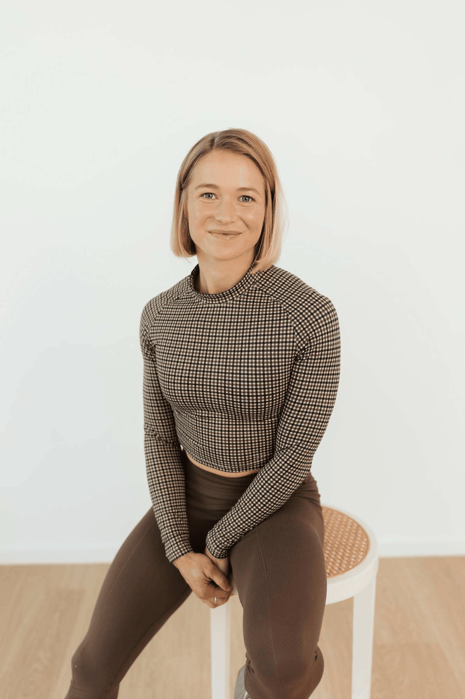

## Alumni Profile

# Abby Cadigan

-   Leaving Year: [2010](https://www.middleton.school.nz/tag/2010/)

Hi everyone,

I’m Abby Cadigan, a mum, fitness coach and previous student at Middleton Grange School, 2005-2010 (years 7-13).

My time at Middleton was spent doing as much sport as I could in as many teams as I could. I would say it was probably the most important thing for me at school, as well as enjoying time with friends and the social aspects of school life.

However, at Middleton, I always felt like I was given the opportunity to learn more. If ever I wanted to learn about anything, even outside the curriculum, teachers never hesitated to give me the time, knowledge and experience they had to help answer my questions and deepen my understanding. God instilled in me a ‘learner’ attitude which Middleton fostered, and this has served me greatly throughout my life after school.

I left Middleton, and worked in a couple of jobs before deciding to study to be a fitness instructor at Te Pukenga (CPIT) in 2014. I wanted to help people on their fitness journeys. I went straight on to contracting out of a gym, training clients one-on-one and running group fitness classes.

I loved my job very much, and quickly realised it was more than just about the physical training aspect or aesthetics; it was about listening to people and what was going on in their lives and helping them regain confidence in themselves. That was the goal.

After two good years of running my business, I decided, after a lot of encouragement from my clients, that I needed to do a bit of travel. I decided I would like to work on Superyachts overseas. I did this for 5+ years, sailing all over the world from the Mediterranean, East and West Coast of America, Alaska, Tonga & Fiji, and I worked my way up to Chief Stewardess on Michael Hills boat ‘The Beast’.

Working on superyachts taught me so, so much about seamanship, other cultures, extremely hard work, cleaning, leadership, and teamwork. I would recommend this to anyone coming out of school not knowing what they want to do because the life skills learnt are invaluable and the people you meet are just inspiring.

I ended my time on yachts as I had my beautiful son who, yes, was not planned but is the greatest God-given gift. This grounded me after living on the ocean and helped me settle and realign my passions.

I returned to my personal training qualifications and asked myself, what can I do now that I don’t quite have the same amount of time (as a mum) to train people outside of work hours?

I became a ‘learner’ and asked questions, and I found a way forward by using the internet to create a fitness tool/app for people to use, anywhere.

About a year ago, I established my business Re.FIT training, which is now online (www.refittraining.com), for people of all levels of fitness to access exercise programs/recipes/movement tutorials and motivation. I made this app from the ground up by myself because I wanted to know it inside and out. It was incredibly difficult not having had any experience in website development/design. However, the ‘learner’ in me wanted to keep going. Looking back, I can say that building Re.FIT Training was both one of my biggest challenges to date and one of my proudest achievements.

Now, I am currently balancing motherhood, running an online business, and learning how to build a sustainable tiny house for my son and I. Life is busy, and sometimes hectic, but I am in awe of how God has worked and continues to work in both my life and others’ lives. I have learnt through my journey that His direction comes when I step out in faith, trusting His providence and care, and continue to be an avid ‘learner’.

[Back to Alumni](https://www.middleton.school.nz/alumni/)

### More Alumni Profiles

### [Stephanie Hunt (née Mathieson)](https://www.middleton.school.nz/stephanie-hunt-nee-mathieson/)

### [Caleb Croker](https://www.middleton.school.nz/caleb-croker/)

### [Ellen Paynter](https://www.middleton.school.nz/ellen-paynter/)

### [Elisha Nuttall](https://www.middleton.school.nz/elisha-nuttall/)

### [Frances Watson](https://www.middleton.school.nz/frances-watson/)

### [Geoff Wallis (Primary Teacher, 2016–2022)](https://www.middleton.school.nz/geoff-wallis-primary-teacher-2016-2022/)

[See all](https://www.middleton.school.nz/alumni-profiles/)
