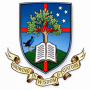
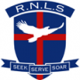

# Affiliations

-   [Principal’s Welcome](https://www.middleton.school.nz/principals-welcome/)
-   [Special Character](https://www.middleton.school.nz/special-character/)
-   [Vision & Mission Statement](https://www.middleton.school.nz/vision-mission-statement/)
-   [Motto, Crest, Verse, Hymn, Prayer, Haka](https://www.middleton.school.nz/motto-crest-verse-hymn-prayer-haka/)
-   [Annual Theme](https://www.middleton.school.nz/annual-theme/)
-   [Our History](https://www.middleton.school.nz/history/)
-   [Senior Leadership Team](https://www.middleton.school.nz/main-school-leaders/)
-   [Middleton Grange School Board](https://www.middleton.school.nz/board/)
-   [Affiliations](https://www.middleton.school.nz/affiliations/)
-   [Key Publications](https://www.middleton.school.nz/key-publications/)
-   [The Grange Theatre](https://thegrangetheatre.nz/)
-   [Venue Hire](https://www.middleton.school.nz/venue-hire/)
-   [Location & Site Map](https://www.middleton.school.nz/location-site-map/)
-   [Contact Us](https://www.middleton.school.nz/contact-us/)

Middleton Grange is a member of the [New Zealand Association for Christian Schools](http://www.nzacs.nz) (NZACS) and of the Christian Education Network, Christchurch.

The Christian Education Network (CEN) is a group of non-denominational integrated Christian schools which have agreed to work together as a network. While each school is autonomous, we all work for common goals in a spirit of partnership and cooperation at all levels – management, teaching, governance and proprietorship. We are concerned for Christian education as a whole, not just the well being of our own school and recognise that we are stronger working together than any of us are alone.

### Other schools in the Christchurch Network:

        

-   [Aidanfield Christian School](http://www.aidanfield.school.nz/Home/) – Years 1-10 in Aidanfield, near Halswell
-   [Emmanuel Christian School](http://www.emmanuelchristian.school.nz/) – Years 1-10 in Papanui
-   [Hillview Christian School](http://www.hillview.school.nz/) – Years 1-10 in St Martins
-   [Rangiora New Life School](http://www.rnls.school.nz/) – Years 1-13
-   [Rolleston Christian School](http://www.rollestonchristian.school.nz/) – Years 1-8

As part of this partnership, Year 9 & 10 students from Aidanfield, Emmanuel and Hillview attend Technology subjects (e.g. Food & Nutrition, Hard Materials) at Middleton Grange and students graduating from Emmanuel, Hillview, Aidanfield and Rolleston Christian Schools are encouraged to enrol here for the the remainder of their schooling.

The Christian Education Network also includes two [Cornerstone Christian Early Learning Centres](http://www.cornerstone.school.nz/), located in proximity to Middleton Grange and Aidanfield Christian School. Children attending these centres are not given preferential enrolment into Year 1.

Other schools in the wider Christian Education Network are Ashburton Christian School, Tasman Bay Christian School and Liberton Christian School (Dunedin).

### Community of Learning (Kahui Ako)

The following schools are part of the Christian Education Network Community of Learning (CENCOL) (Te Rōpū Whakapono o Waitaha):

-   Middleton Grange School
-   Aidanfield Christian School
-   Emmanuel Christian School
-   Hillview Christian School
-   Rolleston Christian School
-   Christchurch Adventist School
