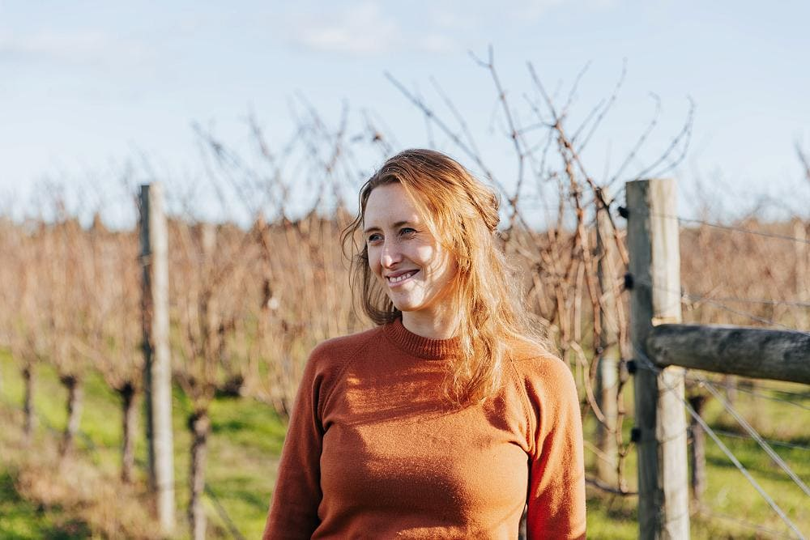

## Alumni Profile

# Alanna Chapman

-   Leaving Year: [2005](https://www.middleton.school.nz/tag/2005/)

If you had told me during my time at school, that I would go on to create a business producing and selling wine, I would have told you that my life had seriously gone off track!  
But here I am doing that just – making and selling thousands of bottles across the country, in supermarkets, liquor stores, restaurants, online and more.

I had always thought I wanted to do business and loved the idea that the business could help others. Selling alcohol was not my idea of helping others.

Leaving school, I did a Commerce degree, wanting to major in Marketing. When I found out that you had to do 2nd year statistics I quickly opted for Management instead.  
In my last year I started dating my future husband Pete. The fact he was the manager of his family vineyard, was more of a negative than a plus.  
I had preconceived ideas that he must be a bit of snob and at the time, had zilch interest in wine. I even remember saying I think you should add sugar to red wine to make it drinkable. It was all rather wasted on me!

However he had many other charms and a few years later I got married to my surfer come farmer come vineyard manager.

Fast forward a couple of years, we were visiting friends who run Freeset, a business offering alternative employment to women in prostitution in Sonnagachi, Kolkatta.  
Deciding to visit one of the women we had met, we took a shortcut through an alleyway. Standing to one side were a group of teenage girls who looked distinctly different. Asking why, we were told they had been trafficked from Nepal and sold into prostitution. In that moment, the penny dropped. We had passed modern day slaves.

It was a Christmas Eve and I remember journaling that evening about Jesus’s first sermon from Isaiah

“The Spirit of the Lord is on me,  
because he has anointed me  
to proclaim good news to the poor.  
He has sent me to proclaim freedom for the prisoners  
and recovery of sight for the blind,  
to set the oppressed free,  
to proclaim the year of the Lord’s favor”  
Luke 4.vs16-18

Good news for the poor and set the oppressed free stood out. That is what Christmas is about.

A few years after that poignant experience I went on to work for Hagar NZ. Hagar work with survivors of slavery and severe abuse overseas.  
I would often share stories with Pete about the people or projects we were fundraising for. I think Pete would feel rather helpless.

Then in 2017, the vineyard was looking to have a bummer season and it was looking like there was lots of surplus fruit. That was when we had a ‘what if” moment. Lots of people drink wine. What if we created a wine, where 100% of the profits go towards helping end slavery?  
We decided to call the wine ‘27seconds’ after a Unicef statistic. They estimate 1.2 million children are sold into slavery every year. When you break that statistic down it works out to be one every 27 seconds. We wanted to put the issue on the table, quite literally.

Our goal is simple. Make good wine and sell lots of it, then give our profits to organizations working in this area. So far we’ve donated $147,000.00. We hope it’s just the start.  
There have been some crazy stories including our own version of Jesus turning water into wine.

I look at what we’ve achieved and it’s truly – NOT us. So many things have happened and I can only credit God. It’s all glory to him.

[www.27seconds.co.nz](http://www.27seconds.co.nz/)

[Back to Alumni](https://www.middleton.school.nz/alumni/)

### More Alumni Profiles

### [Stephanie Hunt (née Mathieson)](https://www.middleton.school.nz/stephanie-hunt-nee-mathieson/)

### [Caleb Croker](https://www.middleton.school.nz/caleb-croker/)

### [Ellen Paynter](https://www.middleton.school.nz/ellen-paynter/)

### [Elisha Nuttall](https://www.middleton.school.nz/elisha-nuttall/)

### [Frances Watson](https://www.middleton.school.nz/frances-watson/)

### [Geoff Wallis (Primary Teacher, 2016–2022)](https://www.middleton.school.nz/geoff-wallis-primary-teacher-2016-2022/)

[See all](https://www.middleton.school.nz/alumni-profiles/)
