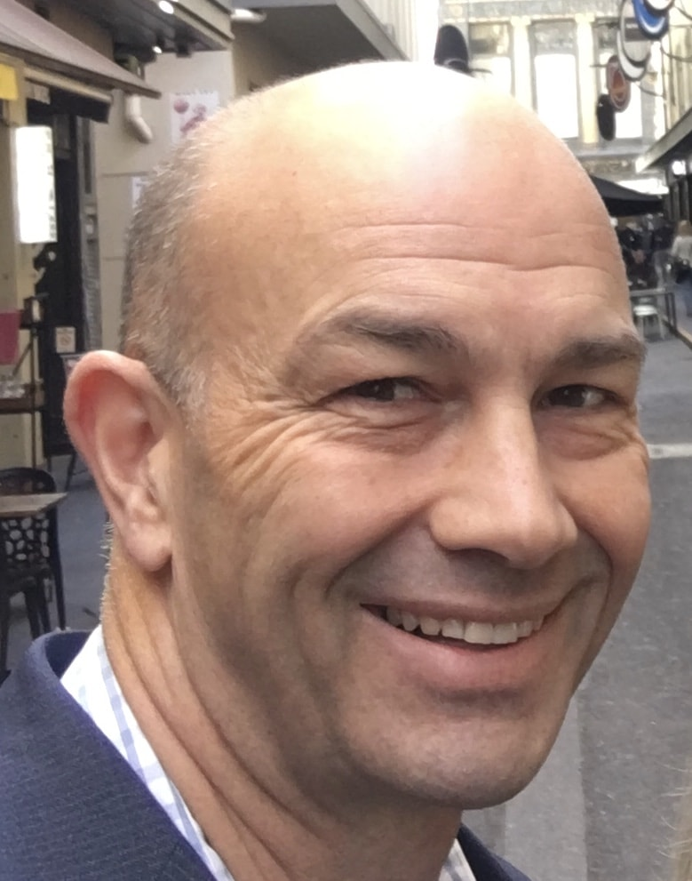

## Alumni Profile

# Andrew Moot

-   Leaving Year: [1989](https://www.middleton.school.nz/tag/1989/)

-   Please introduce yourself.

I am Andrew Moot, wife to Heather and father to Olivia, Reuben, and Patrick.

-   When did you attend Middleton Grange and for how long?

I think I started at Middleton in 1977, and left at the end of 1989.

-   What memories do you have of your time at Middleton?

Watching the training planes from Wigram out the window of my classes in primary school. The Red Checkers did put on an interesting display, and a lot of their practicing was quite viable from school in the 80s. Another primary school memory was getting the strap for throwing acorns at girls (perhaps a little harsh as I was useless at throwing and posed no danger whatsoever- although to be fair we had been warned and I was not harmed by the discipline).We used to have all school assemblies outside in ‘the dip’ before the gym was built. There was a lot of balls being kicked or thrown around in breaks or lunchtimes. Despite being quite an average football player, I had good memories of football tournaments in Nelson with our coaches Mr Down and Gillon in form 5, and a good time away to Queensland in form 6. I think I probably started listening to the teachers a bit more in high school, and was awarded senior scholar when I left. School functions were in their infancy in 1989, but I didn’t go (they were just prior to the scholarship exams so I told everyone I was studying). Instead, I went to the U2 concert at Lancaster Park, which in retrospect was an excellent decision. U2 remain awesome. In truth, I did study pretty solidly for those exams, and I think it paid off because my scholarship got me preferential entry to medical school. Teachers like Mr Pollard, Mr Hawkins, and Mr Jansen deserve my thanks- Mathematics and Chemistry were my strengths and my final year results opened doors in University.

-   Tell me about your life since leaving Middleton i.e. Did you study? Have you lived anywhere else? Employment history? Successes / achievements? Challenges?

I am an Otago graduate in Medicine, and went on to train in general surgery, becoming a fellow of the college of Surgeons in 2005. I travelled a lot while a junior doctor, left Christchurch in 1997 to go to London, then based myself in Melbourne for a few years. I also have worked somewhat less exotic places such as Invercargill and Palmerston North as a senior trainee in General Surgery, finishing general surgical training in Christchurch in 2004. Post-fellowship sub-specialty training in colorectal surgery followed in London in 2006 and Cambridge in 2007. Then back to NZ to a consultant job in the Hawkes Bay where we lived until we moved to the North Shore in 2014, where we still find ourselves today. Working as a surgeon is a great joy and privilege most of the time. I work with great people and get to help people through some of their most difficult moments. My greatest achievement to date is marrying Heather, and I’m still enjoying the joys and challenges of parenting with our kids aged around 11-16.

-   How have you seen God at work in your life?

When God’s spirit works through His word. God’s grace is amazing and I haven’t through the years been a great child of God- I often live life as if I am king rather than Jesus. God also uses his people to walk alongside me and to shape and mould me. The times I have grown the most are when I have been actively involved in a local church, where we can with gentleness and humility patiently bear with each other in love, and encourage each other to be captivated by Jesus and what he has done for us. I currently belong to an independent evangelical church in Auckland (Auckland Evangelical Church). God continues to shape and grow me through his Spirit, his word and his people,

-   Is there any advice you would give to current Middleton Grange students? If so, what would you say?

There are many great opportunities that will come your way, and it is great to achieve academically and professionally. But above all things, develop character, or what the Bible calls godliness. At Auckland EV Church we have a habit of preaching through books of the bible, which I think is helpful because the bible (God’s word) sets the agenda. We are currently in 1 Timothy, so I will share something from there-“For the training of the body has limited benefit, but godliness is beneficial in every way, since it holds promise for the present life and also for the life to come.”‭‭1 Timothy‬ ‭4‬:‭8‬ ‭CSB‬‬Training of the body is good, as is academic study. They will both benefit you greatly. But even better, train in godliness.

Andrew Moot

[Back to Alumni](https://www.middleton.school.nz/alumni/)

### More Alumni Profiles

### [Stephanie Hunt (née Mathieson)](https://www.middleton.school.nz/stephanie-hunt-nee-mathieson/)

### [Caleb Croker](https://www.middleton.school.nz/caleb-croker/)

### [Ellen Paynter](https://www.middleton.school.nz/ellen-paynter/)

### [Elisha Nuttall](https://www.middleton.school.nz/elisha-nuttall/)

### [Frances Watson](https://www.middleton.school.nz/frances-watson/)

### [Geoff Wallis (Primary Teacher, 2016–2022)](https://www.middleton.school.nz/geoff-wallis-primary-teacher-2016-2022/)

[See all](https://www.middleton.school.nz/alumni-profiles/)
