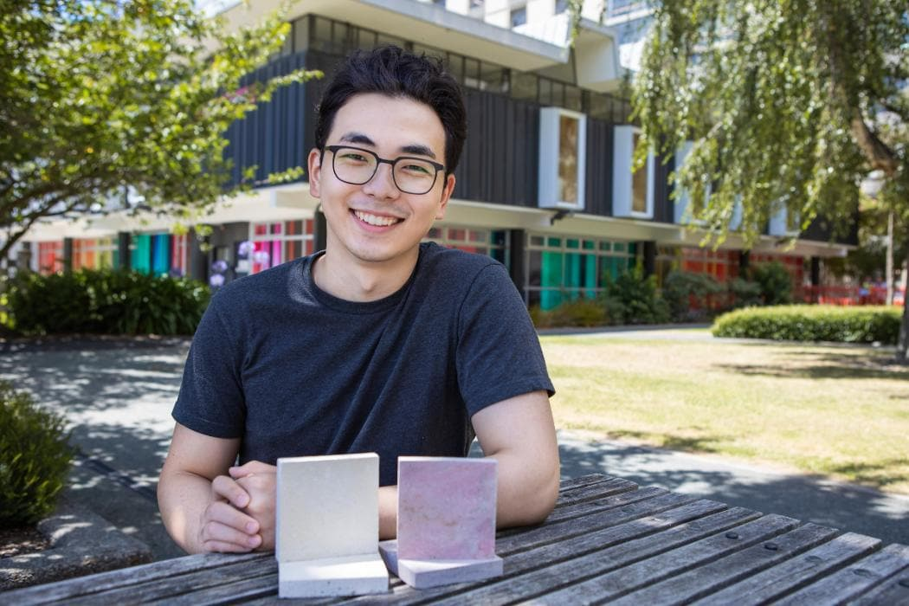
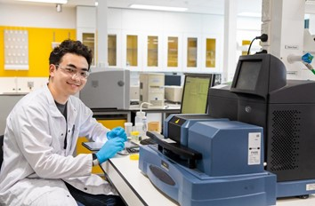

## Alumni Profile

# Andy Park

-   Leaving Year: [2018](https://www.middleton.school.nz/tag/2018/)

Andy started his studies at Middleton Grange school in 2015 as an international student from Korea. He is currently studying at the University of Canterbury doing his Bachelor of Product Design. Part of his final year Industrial Design project, he developed a revolutionary new plasterboard design incorporating seaweed to reduce the carbon footprint of building materials.  This will contribute to more safer and livable homes in New Zealand.

This 12-week project was supervised by University of Canterbury Product Design Senior Lecturer [Dr Tim Huber](https://www.canterbury.ac.nz/engineering/contact-us/people/tim-huber.html) in collaboration with UC Fire Engineering Lecturer [Dr Dennis Pau](https://www.canterbury.ac.nz/engineering/contact-us/people/dennis-pau.html).

The project recently won the UC Innovation Jumpstart Greatest Commercial Potential Award and accompanying $20,000 prize.

The full University of Canterbury article can be found by clicking [here.](https://www.canterbury.ac.nz/news/2022/new-seaweed-plasterboard-design-provides-safer-more-sustainable-building-option.html)

[Back to Alumni](https://www.middleton.school.nz/alumni/)

### More Alumni Profiles

### [Stephanie Hunt (née Mathieson)](https://www.middleton.school.nz/stephanie-hunt-nee-mathieson/)

### [Caleb Croker](https://www.middleton.school.nz/caleb-croker/)

### [Ellen Paynter](https://www.middleton.school.nz/ellen-paynter/)

### [Elisha Nuttall](https://www.middleton.school.nz/elisha-nuttall/)

### [Frances Watson](https://www.middleton.school.nz/frances-watson/)

### [Geoff Wallis (Primary Teacher, 2016–2022)](https://www.middleton.school.nz/geoff-wallis-primary-teacher-2016-2022/)

[See all](https://www.middleton.school.nz/alumni-profiles/)
