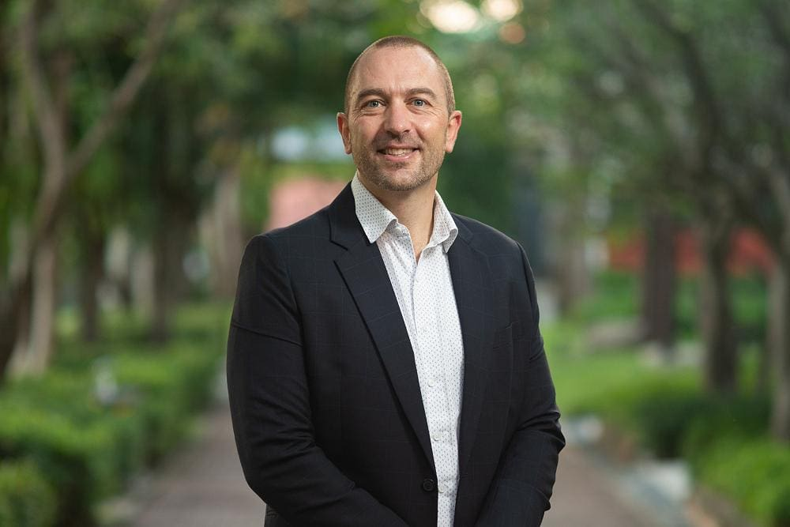

## Alumni Profile

# Andy Vaughan

-   Leaving Year: [1996](https://www.middleton.school.nz/tag/1996/), [2005](https://www.middleton.school.nz/tag/2005/)

Middleton has always held a special place in my heart as it laid the foundations of who I have become after I attended for all 13 years of my schooling from New Entrance to Form Seven. After leaving Middleton, I studied in a conjoint program through Canterbury University and College of Education training as a Physical Education and Science Teacher, with the goal to follow my passion to work with youth and give back from the many opportunities and experiences I was fortunate enough to have been provided.

After a short teaching stint at Canterbury Christian College, I felt the pull to teach back at Middleton, where I remained for 3.5 years teaching alongside many of the teachers who had taught me only a few years prior and teaching with my dad, which was a special experience. It was great being back at Middleton, but in 2005 myself and my wife Jess, both decided it was time for a change.

In 2005 we departed to teach overseas and found ourselves in the Philippines where we worked at Brent International School, an Episcopal International School south of Manila. After three years in the Philippines, we moved with our oldest daughter, Malaya, to Thailand teaching at International School Bangkok. We have remained in Thailand since, having our second daughter, Naiyana in 2010 and now call Thailand our ‘second home’ having been here so long!

For the past 12 years I have been involved in leadership within the school, first as the Athletics Director, then as an Assistant Principal in the High School overseeing pastoral care within the student population. We are a very active family and have a strong passion for the outdoors and sport. My passion for sport and endurance events has led me into the sport of Triathlon, in which I have competed in many half and full Ironman events, taking me to the World Championships in Kona in 2018. The sport draws me in due to the personal challenge and sense of pushing one’s limits which is rare in our modern lives.

I have no doubt that each day the core values I learned as a child at Middleton have continued to guide me in life, for which I’m ever grateful.

[Back to Alumni](https://www.middleton.school.nz/alumni/)

### More Alumni Profiles

### [Stephanie Hunt (née Mathieson)](https://www.middleton.school.nz/stephanie-hunt-nee-mathieson/)

### [Caleb Croker](https://www.middleton.school.nz/caleb-croker/)

### [Ellen Paynter](https://www.middleton.school.nz/ellen-paynter/)

### [Elisha Nuttall](https://www.middleton.school.nz/elisha-nuttall/)

### [Frances Watson](https://www.middleton.school.nz/frances-watson/)

### [Geoff Wallis (Primary Teacher, 2016–2022)](https://www.middleton.school.nz/geoff-wallis-primary-teacher-2016-2022/)

[See all](https://www.middleton.school.nz/alumni-profiles/)
