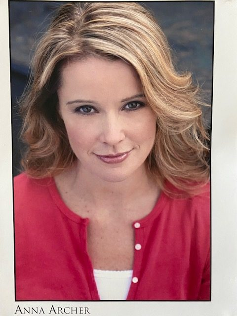

## Alumni Profile

# Anna Archer (Paynter)

-   Leaving Year: [1991](https://www.middleton.school.nz/tag/1991/)

I began my years at Middleton in 1987, Form 3.  After finishing my intermediate school years at Cobham.  I have always had a love of music, dance and performing and In my years at Middleton I participated in as many choirs, productions and performing arts as I could as well as learn voice, piano and cello and was Head Prefect in 1991.  I am fortunate for the guidance and encouragement from my teachers at Middleton.  After graduating from Middleton in 1991, I went to the United States as an ‘American Field Scholar’ to a little town called Trumbull outside of New York City.  I was there for the 1992 academic year. While I was there I was lucky to attend many amazing dance, choir and drama classes and toured Austria and Germany with the choir I was in.  My love for the performing arts grew.  I returned to New Zealand and attended Teacher’s College in Christchurch and secured my first teaching job at Kaiapoi Borough School.  During that time I continued to participate in musical theatre with Canterbury Operatic and Canterbury Music Theatre, (now called Showbiz Christchurch) and performed in Les Misérables, The King and I, Aspects of Love to name a few.  I also co-wrote and produced our Year 3/4 productions at Kaiapoi Borough School.

After teaching for 3 years at Kaiapoi I left Christchurch and went to London, where I worked at Great Ormond Street Children’s Hospital School.  I was a ward teacher, and a classroom teacher (a ward converted into a classroom) teaching long-term patients mainly on the oncology and hematology wards, maintaining their academics (liaising with their school and hospital staff and writing their IEP’s) while in hospital.  Children would come from the wards to the classroom and attend lessons, even in their hospital beds! I also helped write the policies for music and performing arts in the school and produced the hospital schools annual production with the inpatients and staff.  While at Great Ormond Street I was able to see first hand the amazing effect music and performing arts had on these children.

While in London I continued to perform with a group called Centerstage.  I performed in many of their shows including 42nd Street and yearly review shows.  As well as concerts with the church I attended.

From London, I moved to New York City and was accepted into The American Musical and Dramatic Academy (AMDA) and completed a two year professional performance certificate in musical theatre.  I was fortunate to perform on stage in New York and perform original works and compositions.  Presently I am living in Abu Dhabi, UAE with my husband and our four children.

[Back to Alumni](https://www.middleton.school.nz/alumni/)

### More Alumni Profiles

### [Stephanie Hunt (née Mathieson)](https://www.middleton.school.nz/stephanie-hunt-nee-mathieson/)

### [Caleb Croker](https://www.middleton.school.nz/caleb-croker/)

### [Ellen Paynter](https://www.middleton.school.nz/ellen-paynter/)

### [Elisha Nuttall](https://www.middleton.school.nz/elisha-nuttall/)

### [Frances Watson](https://www.middleton.school.nz/frances-watson/)

### [Geoff Wallis (Primary Teacher, 2016–2022)](https://www.middleton.school.nz/geoff-wallis-primary-teacher-2016-2022/)

[See all](https://www.middleton.school.nz/alumni-profiles/)
