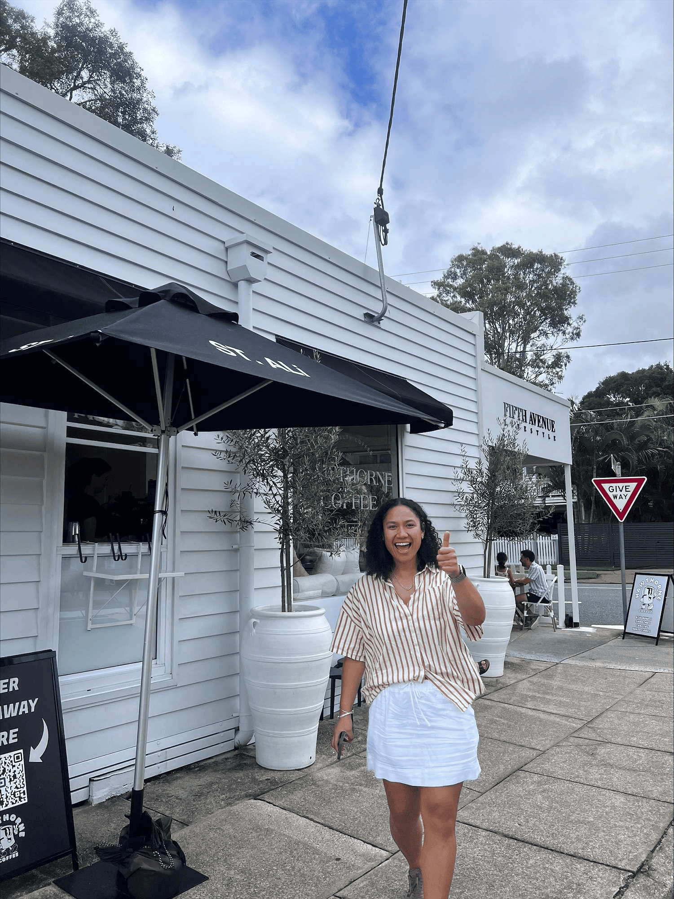

## Alumni Profile

# Annastasia Tauamiti

-   Leaving Year: [2011](https://www.middleton.school.nz/tag/2011/)

Talofa lava,

My name is Annastasia Tauamiti. I attended Middleton Grange from 2007 – 2011 and feel it a privilege to be able to speak on my time there and how it helped shape me to be the person I am today. Sending a child to a Christian school was a dream of my mothers and, together with the efforts of those around us, saw me attending Middleton. I really enjoyed my high school experience overall but would describe my performance as “just enough”.

I did just enough to pass, tried just enough to make the sports teams, joked around just enough without getting into trouble, leaned in just enough to be a part of the community, and participated just enough to have leadership opportunities. I was involved in many things but had never really found my niche or my opportunity to really excel in the classroom or even out on the court. Talking and socialising seemed to be my strength which didn’t always bode well in class. In amongst all of that there was one thing I genuinely loved and enjoyed about school; it was the strong sense of community and the relationships built with my lifelong friends, other students, staff members, and even coaches.

Being a part of a small school community that had such a huge emphasis on the character, faith, and values of their students took time for me to understand and at first it felt restrictive. But in hindsight, I understand that this environment was hugely responsible for my growth as a young person giving me the ability to encounter small pieces of who God truly created me to be and to identify the gifts He has given me to share with others.

I left school and went to Lincoln University and attempted to study Finance and Accounting while also being on sports scholarship. Here is where I found that “just enough” would not cut it. While still attempting to study, I worked a few jobs in retail, youth working, mentoring young people, coaching sports teams and also brought Rambo the Canterbury Rams mascot out of retirement. I continued to serve in my church and volunteer my time to Easter camps and also other church led events around the city. Once I realised studying was not going to work out for me and had seen brighter sights, I moved to Brisbane, Australia where I have lived for the last 5 years working as a fraud analyst and now as a leader in the space for Macquarie Bank.

I have seen God work in my life in how He has used my passion for people to change and restore the different spaces I am in and to connect within the communities I am a part of. From a young age, I have had a stirring to love, build, and reach others. I see this in how I work, socialise, and how I do life with others, which in a world like today where people are doing “just enough” to get by, it’s all that’s needed to see God at work through you in others’ lives. I am excited at the thought of how He will continue to use me in this way and what I will learn and gain from this through my career and in my personal life.  
To current students, I encourage you to lean in and make the most of your time in this school community. No one path is the same and neither are the people walking it, so tune into God’s voice and the truth He has for you. I never would have seen myself outside of NZ working in the corporate world let alone going into people management. It is my love for others and living in community that sets me apart, sprinkled with a lot of joy and laughter on the side – formally known as being a “personality hire”. This is a testament that God will use you even if you think all you have to bring is “just enough”. There are so many opportunities for us when we obey His word and walk in His truth giving all that we have.  
Thank you.

[Back to Alumni](https://www.middleton.school.nz/alumni/)

### More Alumni Profiles

### [Stephanie Hunt (née Mathieson)](https://www.middleton.school.nz/stephanie-hunt-nee-mathieson/)

### [Caleb Croker](https://www.middleton.school.nz/caleb-croker/)

### [Ellen Paynter](https://www.middleton.school.nz/ellen-paynter/)

### [Elisha Nuttall](https://www.middleton.school.nz/elisha-nuttall/)

### [Frances Watson](https://www.middleton.school.nz/frances-watson/)

### [Geoff Wallis (Primary Teacher, 2016–2022)](https://www.middleton.school.nz/geoff-wallis-primary-teacher-2016-2022/)

[See all](https://www.middleton.school.nz/alumni-profiles/)
