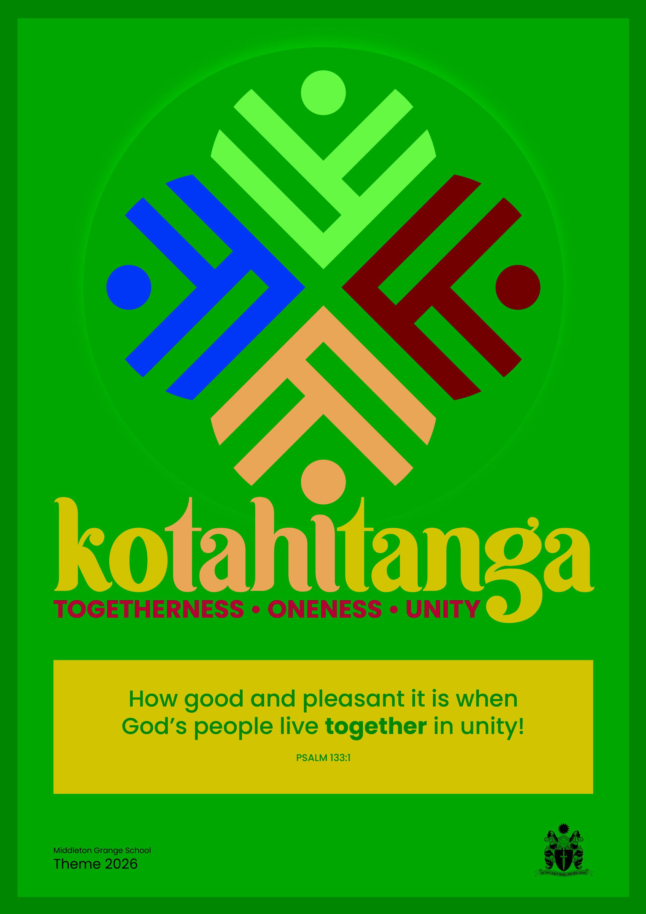

# Annual Theme

-   [Principal’s Welcome](https://www.middleton.school.nz/principals-welcome/)
-   [Special Character](https://www.middleton.school.nz/special-character/)
-   [Vision & Mission Statement](https://www.middleton.school.nz/vision-mission-statement/)
-   [Motto, Crest, Verse, Hymn, Prayer, Haka](https://www.middleton.school.nz/motto-crest-verse-hymn-prayer-haka/)
-   [Annual Theme](https://www.middleton.school.nz/annual-theme/)
-   [Our History](https://www.middleton.school.nz/history/)
-   [Senior Leadership Team](https://www.middleton.school.nz/main-school-leaders/)
-   [Middleton Grange School Board](https://www.middleton.school.nz/board/)
-   [Affiliations](https://www.middleton.school.nz/affiliations/)
-   [Key Publications](https://www.middleton.school.nz/key-publications/)
-   [The Grange Theatre](https://thegrangetheatre.nz/)
-   [Venue Hire](https://www.middleton.school.nz/venue-hire/)
-   [Location & Site Map](https://www.middleton.school.nz/location-site-map/)
-   [Contact Us](https://www.middleton.school.nz/contact-us/)

Each year the school adopts a school wide theme. The purpose of the theme is to generate a unity between the four schools and to promote an important aspect of the Middleton Grange School culture.

### 2026

The school theme for 2026 is **Kotahitanga: Unity, togetherness, solidarity**

A sense of oneness.  While we are all created differently, and gifted differently, we are better when we walk together. Kotahitanga does not demand uniformity, but appeals for humility and a posture of ‘brotherly love’, kindness and service. It is not just about being together, it is about travelling somewhere together. We know that God delights in our ‘togetherness’, our harmony. Kotahitanga is fulfilled in our common foundation in Jesus, as we look to Him together, follow Him together, and love one another with the grace that He has supplied.

-   How good and pleasant it is when God’s people live together in unity! Ps 133:1.
-   Love one another with brotherly affection \[as members of one family\], giving precedence and showing honour to one another. Rom 12v10

