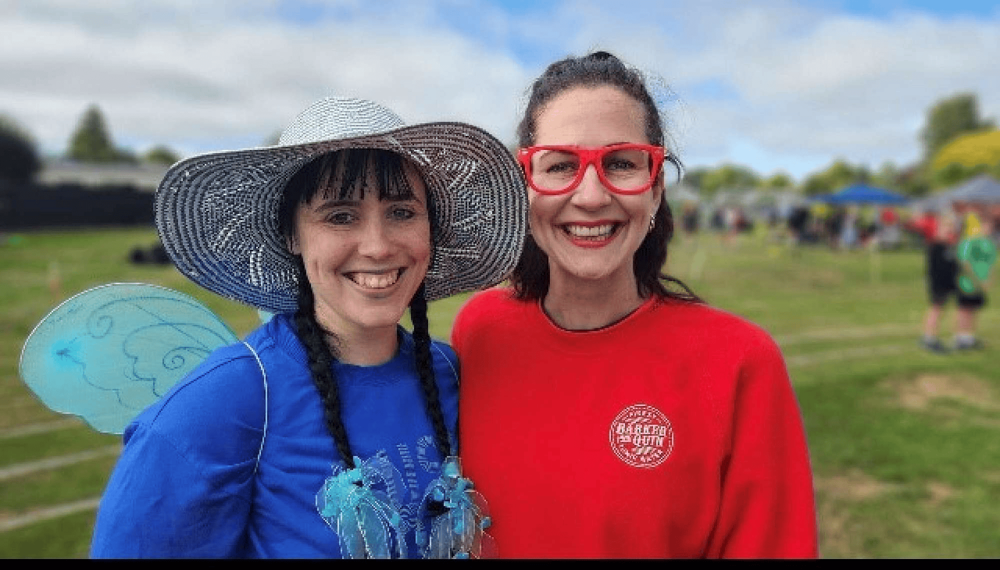

## Alumni Profile

# Ashley Wallace

-   Leaving Year: [2008](https://www.middleton.school.nz/tag/2008/)

Hi, I’m Ashley, and I attended MGS for Years 9-13, graduating in 2008. I absolutely loved my time at MGS, and the teachers that I had played a huge role in my personal faith journey. I feel incredibly blessed to have been able to have teachers that could encourage me and in my relationship with Jesus.

After leaving MGS, I completed my BSC(Hons) in Mathematics and Economics and then went on to the New Zealand Graduate School of Education to train to be a teacher. From a very young age, I always knew I wanted to be a teacher and upon leaving MGS I had my heart set on wanting to come back to teach. I was blessed with a job at MGS in 2014 and have been here ever since. Teaching is the most incredible job because each day is filled with new challenges and opportunities to impact young people and to help them discover more about themselves and about their Creator. I love teaching Maths because it provides so many opportunities to both extend students’ current knowledge and encourage them that they are capable of more than they think.

Pastoral care has become a passion of mine, and since 2020 I have served as a Senior College Dean. I never thought this would be an area I would be interested in and am grateful to God that he nudged me in this direction. I have grown closer to him through this role and have learnt to trust in Him in some pretty complex situations. In 2024, I have also taken on the role of Head of Faculty: Mathematics which has been an exciting time of learning and challenge.

Outside of school, I enjoy playing netball, basketball, and going to the gym. I love learning and completed my Masters in Educational Leadership in 2021.

Middleton has always had a special place in my heart, and I look forward to continuing to serve the school in various capacities for however long God continues to call me here.

[Back to Alumni](https://www.middleton.school.nz/alumni/)

### More Alumni Profiles

### [Stephanie Hunt (née Mathieson)](https://www.middleton.school.nz/stephanie-hunt-nee-mathieson/)

### [Caleb Croker](https://www.middleton.school.nz/caleb-croker/)

### [Ellen Paynter](https://www.middleton.school.nz/ellen-paynter/)

### [Elisha Nuttall](https://www.middleton.school.nz/elisha-nuttall/)

### [Frances Watson](https://www.middleton.school.nz/frances-watson/)

### [Geoff Wallis (Primary Teacher, 2016–2022)](https://www.middleton.school.nz/geoff-wallis-primary-teacher-2016-2022/)

[See all](https://www.middleton.school.nz/alumni-profiles/)
