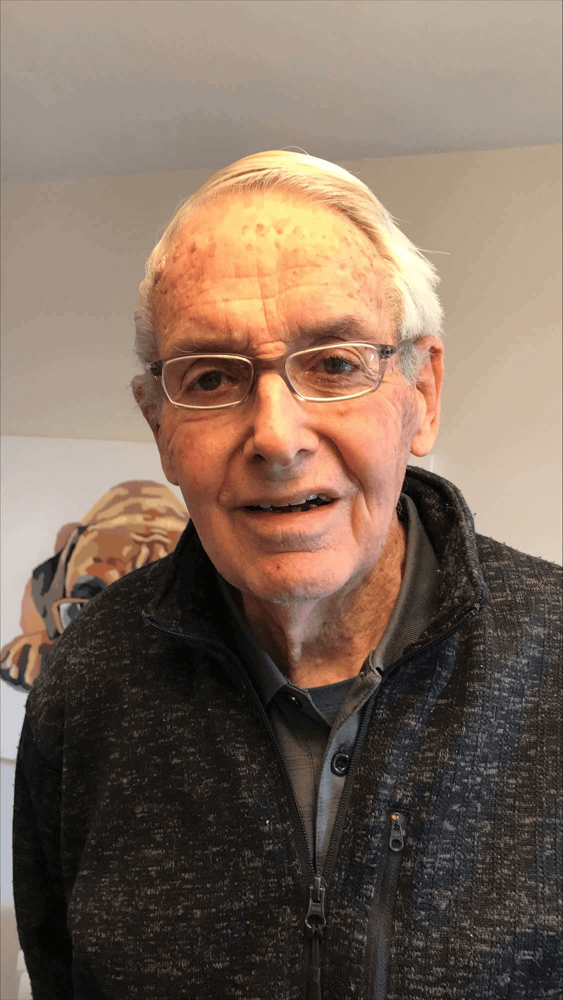

## Alumni Profile

# Barrie McConnell

Having had a strong desire to serve the Lord since I was 14 years old, I felt led to take a teaching job at the Bay of Islands College in Kawakawa, Northland.

After two years, my dearest Marion and I married, and she joined me up there, where we did what we could to reach out into the Maori community. One of our best friends was Marie Peters, the older sister of Winston Peters.

In 1962-63, we attended the Bible Training Institute in Henderson, Auckland, thinking we might be called to missionary work. However, I next taught in Ohakune for six years at Ruapehu College, teaching English, French, and Music, and producing some Gilbert and Sullivan operas. I also learnt to drive buses, collecting students from Waiouru each day.

One of our fellow students at B.T.I, Margaret Bell, had begun to teach at Middleton Grange School which was newly established in 1964 by some godly businessmen and professionals, and so I began to hear about the school. My aging parents lived in Christchurch too, so we moved down, settled in Lower Riccarton, and I began teaching at MGS in the beginning of 1970, under Eric Dunlop.

As before, I taught English and French, and I quickly got involved in productions like ‘H.M.S. Pinafore’ and ‘The Mikado’. There was a great staff team who helped with these, from the costuming to the dance routines. Michael McCormack and Elizabeth MacFarlane are still doing a marvelous job with MGS productions.

I coached the girls’ hockey team for many years, and although I had no special skills in that area, we enjoyed some good seasons. We also had two language trips to New Caledonia, and in 1999 a wonderful trip to France, largely arranged by our missionary friend, Wendy Hanna.

My wife, Marion, had long been involved in Middleton Grange, running the second-hand uniform shop and even cleaning at the school when times were financially tough for us, with fees to pay for our children.

After the trip to France, we moved to live in Arthur Street, just behind the Old House.

We had regular prayer meetings there with dear friends like Pauline Hocking, Pam Brathwaite, David Gillon, Rosemary Wallis, and Bill Down.

I edited the school magazine for many years, but when Alison McMillan took up that task, she did a far better job than I could, though I did my best.

I also ran the outside exams for many years. After all the pressure and preparation that that involved, Marion and I would then take our annual trip down the West Coast and back up through the McKenzie country, enjoying the beautiful fields of lupins in the Lake Tekapo area.

Most of my former friends and colleagues are gone from the school now, some having passed away. Greg McKenzie has been a long-standing-friend, and we still see his amazing photographic skills on Facebook, and Rudi Jansen is still involved in the labs after so many years.

I am so grateful to the Lord that after having some serious health issues years ago, I am now in excellent health and enjoy opening up the school every morning and checking round it every night, along with our boxer Ruby, with a winking light on her collar.

I know that for Middleton Grange things are going well, and God’s hand of blessing continues to be upon it.

I have been so blessed to have been a part of the school for so long.

[Back to Alumni](https://www.middleton.school.nz/alumni/)

### More Alumni Profiles

### [Stephanie Hunt (née Mathieson)](https://www.middleton.school.nz/stephanie-hunt-nee-mathieson/)

### [Caleb Croker](https://www.middleton.school.nz/caleb-croker/)

### [Ellen Paynter](https://www.middleton.school.nz/ellen-paynter/)

### [Elisha Nuttall](https://www.middleton.school.nz/elisha-nuttall/)

### [Frances Watson](https://www.middleton.school.nz/frances-watson/)

### [Geoff Wallis (Primary Teacher, 2016–2022)](https://www.middleton.school.nz/geoff-wallis-primary-teacher-2016-2022/)

[See all](https://www.middleton.school.nz/alumni-profiles/)
