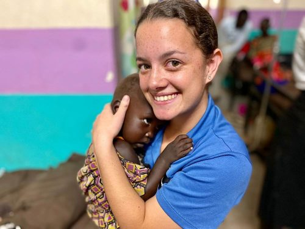

## Alumni Profile

# Bella Hikuroa

-   Leaving Year: [2020](https://www.middleton.school.nz/tag/2020/)

Kia Ora,

My name is Bella Hikuroa.  I graduated from Middleton Grange School in 2020, and applied for the Midwifery course at ARA.  My application was not accepted for the 2021 intake so I thought really hard about what I wanted to do to prepare to re-apply for 2022.  The same day my application was turned down I received an opportunity to go to South Sudan (a country in East Africa) and homeschool the three daughters of Missionary doctors.  I embarked on my 7 month journey in May and returned in December of 2021.  For those 7 months I spent every morning working through the New Zealand curriculum via Te Kura with my students.  And spent the afternoons volunteering in the clinic the doctors were running.  I gathered so much experience shadowing a nurse in the ward and was also able to witness many births in the maternity ward, and assisted practically in 16 births.  Upon returning home I applied for Midwifery again, and was accepted into the 2022 course.  I am only at the beginning of my Midwifery training, but after I have completed the three years of study I hope to gain my registration and go back overseas.  I am still unsure if I will return to South Sudan or another country.  However I am willing to go where God calls me, and share his love with women through midwifery care anywhere I find myself.

[Back to Alumni](https://www.middleton.school.nz/alumni/)

### More Alumni Profiles

### [Stephanie Hunt (née Mathieson)](https://www.middleton.school.nz/stephanie-hunt-nee-mathieson/)

### [Caleb Croker](https://www.middleton.school.nz/caleb-croker/)

### [Ellen Paynter](https://www.middleton.school.nz/ellen-paynter/)

### [Elisha Nuttall](https://www.middleton.school.nz/elisha-nuttall/)

### [Frances Watson](https://www.middleton.school.nz/frances-watson/)

### [Geoff Wallis (Primary Teacher, 2016–2022)](https://www.middleton.school.nz/geoff-wallis-primary-teacher-2016-2022/)

[See all](https://www.middleton.school.nz/alumni-profiles/)
