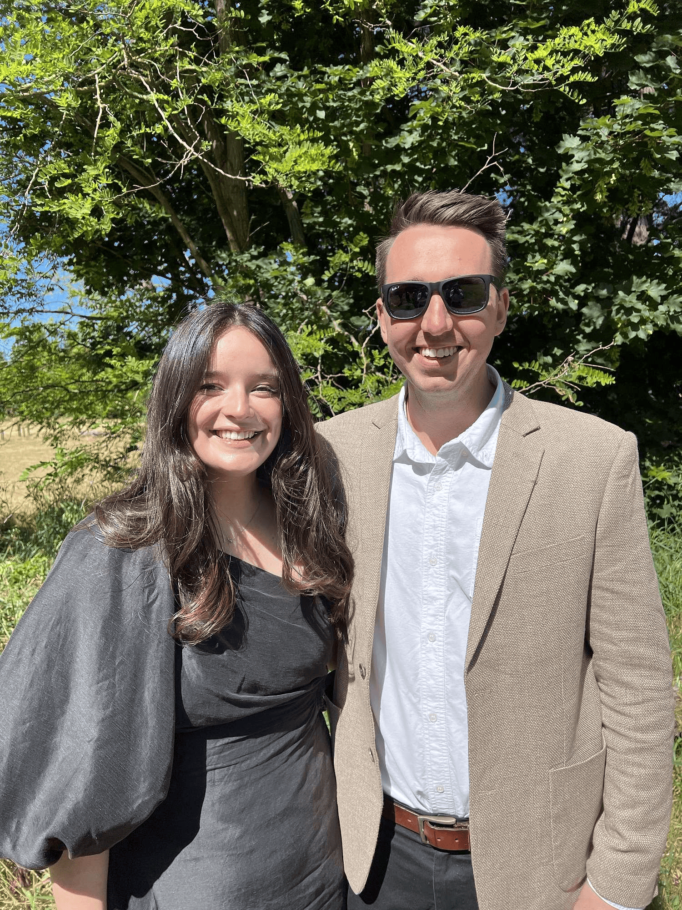

## Alumni Profile

# Brittany Lilburne

-   Leaving Year: [2013](https://www.middleton.school.nz/tag/2013/)

Hi, I’m Brittany Lilburne (France), and I am the current Director of Sport here at Middleton Grange. I am married to Zach, and we are about to welcome our daughter in June this year.

I attended Middleton Grange for high school from 2009-2013.

One of my favourite memories from school was Year 13 PE kayak camp. We kayaked over to Quail Island – performed our wet exits and rolls and then spent the night in tents on the island. Mrs Hodge was an amazing PE teacher, and the trip made for a fun night away with friends learning new skills and spending the day on the water. I have since loved any opportunity to get out on a sea kayak and explore different spots around NZ.

Since leaving school, I went on to do a Bachelor of Applied Science in Human Nutrition with a real passion for sport and sports nutrition. I then came back to Middleton as the Sports Administrator where I worked for 4 years, along with some other part-time work. I then left for a couple of years doing Property Management, and then last year came back to the Director of Sport role when the previous Director, Chris, finished up.

I have found so much joy and passion in the sports field and the way in which a holistic approach to health and well-being can contribute to not only a healthy lifestyle but also the ways it can influence our day to day and spiritual life. I have seen sport work in so many people’s lives allowing them to excel with their God given abilities, inspire others, find a place they feel confident and see success, share their faith and I have seen sport provide valuable life skills. Some of my favourite moments working back here at Middleton are seeing the alumni get back involved in coaching, mentoring, managing teams, and giving back in a way that they were served when they were students.

If I could give any advice to current Middleton students, it would be to get involved where you can. It may be with something artistic, musical, sport related or even just something social – but signing up for a social sports team or getting involved in production or house competitions is such a fun aspect of school life that is unique to school and a great chance to use the skills and passions God has given you.

[Back to Alumni](https://www.middleton.school.nz/alumni/)

### More Alumni Profiles

### [Stephanie Hunt (née Mathieson)](https://www.middleton.school.nz/stephanie-hunt-nee-mathieson/)

### [Caleb Croker](https://www.middleton.school.nz/caleb-croker/)

### [Ellen Paynter](https://www.middleton.school.nz/ellen-paynter/)

### [Elisha Nuttall](https://www.middleton.school.nz/elisha-nuttall/)

### [Frances Watson](https://www.middleton.school.nz/frances-watson/)

### [Geoff Wallis (Primary Teacher, 2016–2022)](https://www.middleton.school.nz/geoff-wallis-primary-teacher-2016-2022/)

[See all](https://www.middleton.school.nz/alumni-profiles/)
