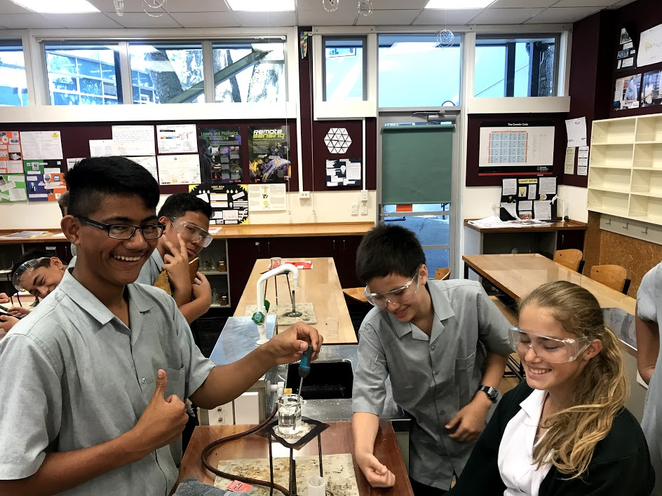
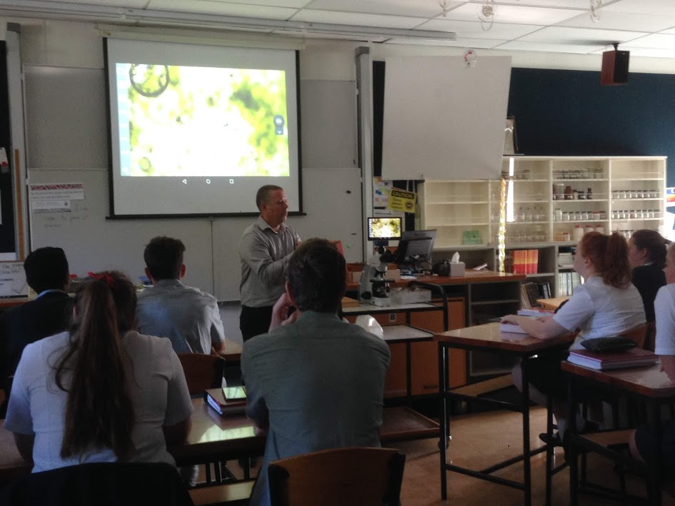
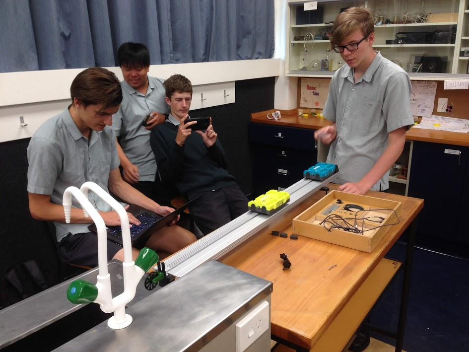
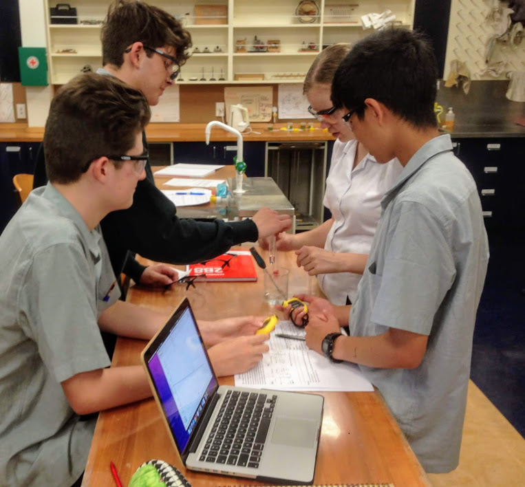
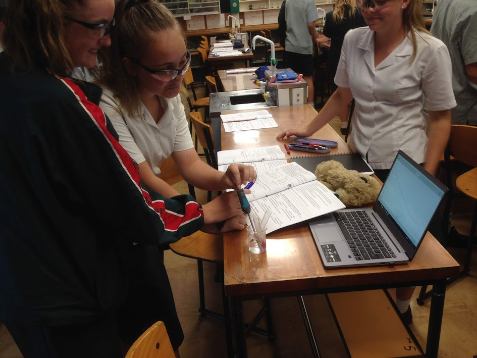
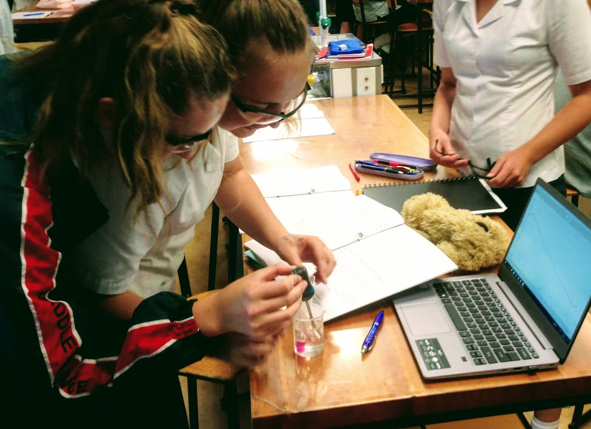
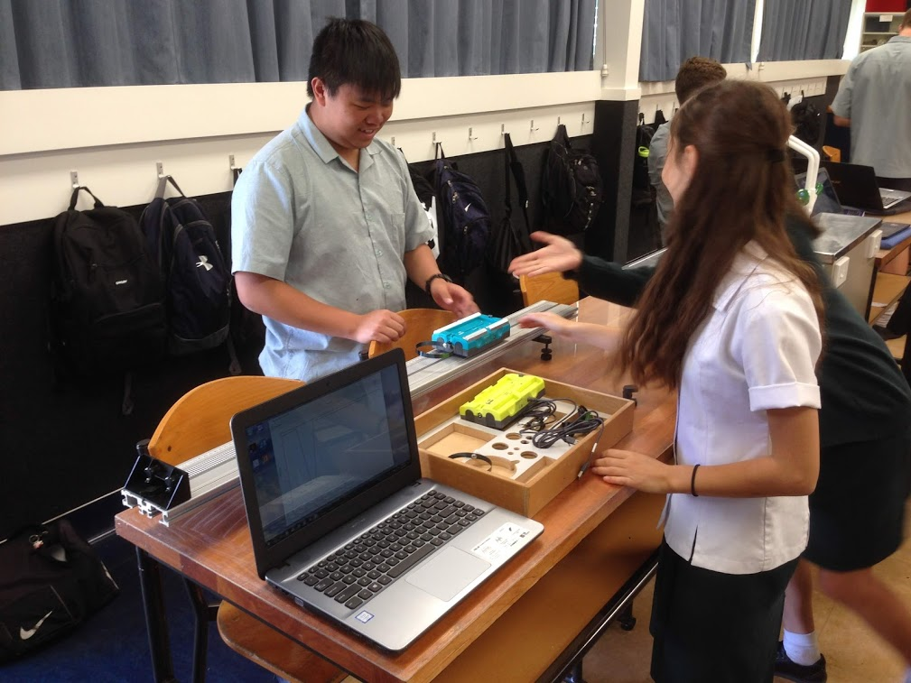

# BYOD

-   [Curriculum & Subjects](https://www.middleton.school.nz/curriculum-subjects/)
-   [Course Selection](https://www.middleton.school.nz/course-selection/)
-   [Careers Department](https://www.middleton.school.nz/careers-department/)
-   [Leadership](https://www.middleton.school.nz/leadership/)
-   [Service](https://www.middleton.school.nz/service/)
-   [Remote Learning](https://www.middleton.school.nz/remote-learning/)
-   [NCEA Information](https://www.middleton.school.nz/ncea-information/)
-   [Learning Support](https://www.middleton.school.nz/learning-support/)
-   [Fostering Strengths](https://www.middleton.school.nz/fostering-strengths/)
-   [Pastoral Care](https://www.middleton.school.nz/pastoral-care/)
-   [BYOD](https://www.middleton.school.nz/byod/)
-   [Library Dashboard](https://aiscloud.nz/MDD00/#!landingPage)
-   [Overseas Trips](https://www.middleton.school.nz/overseas-trips/)
-   [Sport](https://www.sporty.co.nz/middleton)
-   [Performing Arts](https://www.middleton.school.nz/performing-arts/)

#### BYOD at Middleton Grange School

##### Why BYOD?

The Middleton Grange Board and Senior Leadership Team think that this is the ‘right thing’ to do for our students. We need to provide them with the means and access to the best learning environment and future opportunities. E-learning and BYOD must be a key part of that.

To enable our vision of ‘enhancing independent learning, collaboration and creative thinking in our students’, we need to:

-   Create personalised learning opportunities that are flexible and authentic and meet students’ aspirations and educational needs
-   Support students to take responsibility for their own learning and enhance their learning through the use of collaboration
-   Integrate new technologies into the wide range of opportunities students are offered to enable them to participate in a global world.

We acknowledge that the world is changing, becoming increasingly digitised at an incredible pace, resulting in opportunities for different learning pedagogies (teaching philosophies). There are more internet enabled devices than people in the world. We need to engage in this digital world to remain relevant, make the most of the opportunities presented, and prepare our students for ongoing learning and future careers. However, technology is only a **tool** to help enhance our current practice. The challenge is to strike the right balance between what we currently do very well and the incorporation of new technologies. This is often referred to as “blended” learning. It isn’t appropriate to use technology 100% of the time. It should be used, when it can, to enhance our proven practice. Teaching and learning at Middleton will always stay at the forefront. The New Zealand Curriculum (NZC) explicitly states that our vision is to foster young people who will be “confident, connected, actively involved and lifelong learners” (NZC, 2007). In the 21st century, eLearning is becoming fundamental to enabling this vision.

All students from Years 7 through to 13 are strongly encouraged to bring their own device (BYOD) to engage with their learning at Middleton Grange. We believe that the use of these devices is extremely important in developing our students’ 21st Century competencies of digital literacy, communication and working collaboratively to problem solve and think creatively.

We have placed some clear guidelines around the introduction of BYOD:

-   Students will be able to use their device only at the clear invitation of the teacher.
-   Students are responsible for the care and upkeep of their device. The school will not provide technical support for the device. Devices are brought to school at the owner’s risk. The school is not liable for the loss or damage to any device.
-   Mobile phones will not be used as a learning tool unless it is an exceptional circumstance, and then only with permission from the Principal.
-   Students may use their devices at lunchtimes, however, this must for educational use only and in approved, monitored areas of the school.

**BYOD Device Specifications**

There are a number of device specifications that are critical to the success of the BYOD programme and these are listed below:

-   Full Windows 11 Home or above (if Windows 11 S Mode, then you’ll need to switch out of S mode. Windows will no longer support Windows 10 devices from October 2025, so it is recommended that all devices move to Windows 11)
-   Device must have a physical keyboard (***iPads and chrome books are NOT suitable as a device***)
-   Processor i3 (Ryzen 3) *or above is recommended (but Intel Celeron for entry level for Middle School is ok)*
-   16Gb of Ram is *recommended (but 8Gb for entry level for Middle School is ok)*
-   SSD Hard drive *highly recommended*
-   Guaranteed battery life of 5 hours or more
-   Protective case *is recommended*
-   Antivirus software essential
-   All students are able to access the full Microsoft Suite of programs **free of charge** through the school

Middleton Grange is supported by Cyclone computers who are creating a purchasing portal specific to our programme. Devices for sale through this portal are approved by the school. To access go to [www.cyclone.co.nz/byod](http://www.cyclone.co.nz/byod)  – select Middleton Grange School and use this password: byodmgs

A number of retailers offer purchase options to assist with the purchase of a device. An extensive warranty and comprehensive insurance are highly recommended for all student devices.

The school board are committed to providing a safe digital environment for students. We are working with the Ministry of Education and the government company N4L (Network for Learning)  to provide monitoring and filtering through a FortiGate firewall for the school.

It is recommended that parents investigate options to provide extra reassurance of student’s personal device use. The Ministry of Education and N4L provide advice and assistance through the website [www.switchonsafety.co.nz](http://www.switchonsafety.co.nz)**.** 

A good website for advice is: [https://www.keepitrealonline.govt.nz/parents/controls-and-settings/](https://www.keepitrealonline.govt.nz/parents/controls-and-settings/)

This site looks at options for parents to help control device use.

We recommend considering **Microsoft Family Safety**. A guide to setting this up is available on YouTube here: [How to Setup Microsoft Family Safety (youtube.com)](https://www.youtube.com/watch?v=k-MVamBCrpg&ab_channel=StephenHelwigTalksTech)

Two more websites that are informative are:

[www.netsafe.org.nz](http://www.netsafe.org.nz) ,

[https://parentingplace.nz/resources/controls-and-filters-a-how-to-guide-for-parents](https://parentingplace.nz/resources/controls-and-filters-a-how-to-guide-for-parents)

