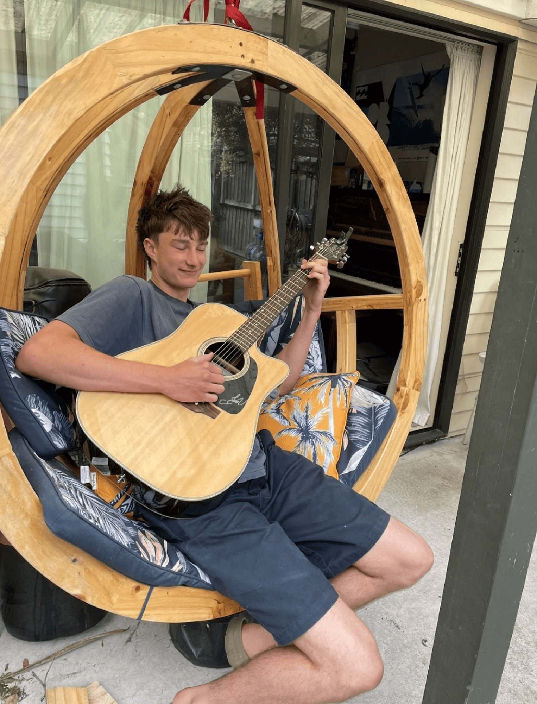

## Alumni Profile

# Caleb Croker

-   Leaving Year: [2024](https://www.middleton.school.nz/tag/2024/)

I was a troublesome student at Middleton. I hurt a number of people, I made teachers’ lives harder than they had to be, I had a foul mouth, I loved stirring people to rage, and I loved breaking rules.

I was blessed immensely to have been raised by God-fearing parents and, since infancy, I spent several chapters of my life in Africa. After many life-shaping experiences, we returned to our homeland, England, and moved to New Zealand shortly after.

Although I was brought up on missions, raised in church by a loving family, and always knew God was real, I lived a life of rebellion and rejection of the truth I was raised in. At the age of 16, I remember consciously rebelling against God and, instead of departing from iniquity, I departed to it.

I willingly lived a life of pride and debauchery, living in lust, greed, violence, anger, and alcoholism. However, the whole time, having been raised in the fear of the Lord, the Spirit would speak conviction to me, and I was aware that what I was doing was not my calling, that it was wrong (see Proverbs 22:6).

Not a year into living this way, I came home one night and, having had the bewitchment of alcohol snap off me, with a heart filled with contrition, I knelt penitently before the Lord and, in the darkness of the night, cried out for Him to save me. I believe that night I was born again. The story of the prodigal son too became the story of my life, an unworthy son reconciled to an ever-loving Father.

I was saved at the end of Year Twelve, so spent my final year at Middleton on mission, learning about God, being sanctified, and witnessing to my peers. My fondest memories from my time at Middleton were those in which the opportunity to share the gospel with my beloved peers presented itself to me.

Fresh out of high school, I embarked on my journey at Laidlaw Bible College, as for me, I could see no eternal value in going to university. My calling to study was out of reverent fear, knowing that Christ is returning and time is running out. People need saving (2 Corinthians 5:11). Having completed my diploma in theology, I look to Christ for the next season I am entering.

Alongside my studies this year, God graciously caused my path to align with the girl I have known and loved for the past 10 years. God’s divine orchestration in our relationship can be traced right back to where it started all those years ago, something written in eternity. She came to freedom and repentance from the world towards the end of 2024 and, not long after, God ignited a switch inside of me to pursue her. God lined everything up. We have been courting and dating for nine months now, and I feel an irrevocable call to make her my bride. I feel God has grown and matured us together in this one year, what would normally take couples a decade. It is my joy and privilege to be learning how I shall love and serve as a husband and lead a family. Seeing her grow so fervently in the Lord is something invaluable to me. Through marriage, I believe God will use us as a testimony of Himself to our generation, a generation that hates marriage, children, gender, and God.

My call to evangelism remains as an unceasing fire within my spirit. However, I am learning that in marriage my greatest ministry will be my wife and family, then the lost.

Urgency…

If I could say anything to Middleton students, it would be that we do not know when we shall die. Tomorrow is not promised. After death comes judgement. At any moment your soul will be required of you, and you shall stand before a holy, righteous God. A God who does not delight in the death of the wicked, but will by no means declare the guilty unpunished. We have all fallen short of His perfect, holy standard. We have all sinned (examine yourself against His 10 Commandments). Yet, while we were still sinners, Christ died for us. He swallowed up death. The perfect God became cursed so that we might be freed from the curse of sin.

Therefore, with the breath you draw today that has been given to you as a gift, a second chance from God in His grace, take this chance, repent, run to Christ, flee to Him, flee from the wrath that abides on you by nature. Call on the Name of the Lord and you shall be saved, and thus become a child of God, adopted into His heavenly Kingdom. No longer shall you be dead, cursed, and in bondage to your sin, but alive, clothed, and free in Christ Jesus. You will be empowered with power from on high. It will descend upon you from heaven on cherubim wings. Do not fear the judgement of man. Do not seek the approval or validity of the world. Let God’s eternal words and promises be spoken over you through His Bible. Haste, rise, awake, O sleeper, and Christ will shine on you.

[Back to Alumni](https://www.middleton.school.nz/alumni/)

### More Alumni Profiles

### [Stephanie Hunt (née Mathieson)](https://www.middleton.school.nz/stephanie-hunt-nee-mathieson/)

### [Caleb Croker](https://www.middleton.school.nz/caleb-croker/)

### [Ellen Paynter](https://www.middleton.school.nz/ellen-paynter/)

### [Elisha Nuttall](https://www.middleton.school.nz/elisha-nuttall/)

### [Frances Watson](https://www.middleton.school.nz/frances-watson/)

### [Geoff Wallis (Primary Teacher, 2016–2022)](https://www.middleton.school.nz/geoff-wallis-primary-teacher-2016-2022/)

[See all](https://www.middleton.school.nz/alumni-profiles/)
