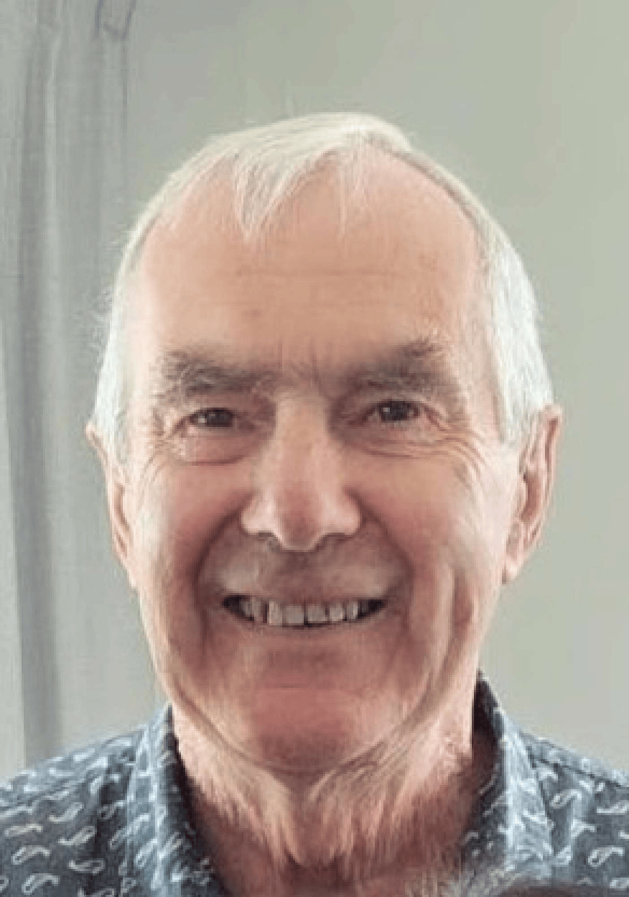

## Alumni Profile

# Carlyle Irving

-   Leaving Year: [2008](https://www.middleton.school.nz/tag/2008/)

I grew up in South Canterbury with a family of faith and became a committed Christian at age sixteen. This was followed by four years at Otago University graduating with a BSc in the Science/Maths areas. In 1969, I moved to Christchurch to attend Teachers College and boarded with a family who had children attending Middleton Grange School which I had never heard of. I applied to be sent there on one of my teaching practice sections which gave me the opportunity to engage with the school. The following year was the beginning of the Senior School (Form 6/Year 12), and I applied for and was accepted to become the Physics teacher.

This was the beginning of a five year period at the school – a very fulfilling time when I developed my teaching skills. It was also during this time that I became engaged to and then married my wife, Lois Reddell. The school choir sang at our wedding with the music teacher, Russell Kent, playing the organ and leading the choir. Lois then joined the staff, so we were both involved in the life of the school. I have many happy memories of both the staff and the students interacting together to make the school a very successful learning environment.

The school was quite small, and in 1974, I felt that I needed to get wider experience so applied and was accepted for a Chemistry position at Cashmere High, teaching there for two years before moving across to Hornby High to set up the Physics department there in 1977. In 1983/4, we took a two year leave of absence to teach at Hebron School in South India. On our return, I continued teaching at Hornby High until I attended a meeting with the Principal of Middleton Grange School to enrol our daughter into Form 3 for the following year and became aware that the school was needing a Physics teacher. I applied and came back into the school in 1987 and taught there until leaving in 2008, ending 27 years of teaching at the school. This was followed by relief teaching at Middleton Grange, Lincoln High School, and Ellesmere College until 2023.

In those first five years at the school, its size meant that everyone knew everyone and in some ways it was like a big family. I was very aware that many parents were making huge financial sacrifices to send their children to the school. We even had a pupil working as a cleaner after classes finished. It was very special to catch up with some of those pupils at the recent 60th anniversary and to hear them being so positive about their time at the school.

The situation was very different when I returned to the school twelve years later. It was much larger and has continued to grow into a very large school. I have seen staff and students come and go; new buildings springing up and the gradual expansion has far exceeded what I would have dreamed of in those earlier years. It has continued to grow due to the continuing sacrifices of many involved in the school.

We had a very special speaker come to share with us not long after he was on the moon in 1971 as one of the Apollo 15 astronauts. Jim Irwin had a profound encounter with God while on the moon. Another significant event for me was the opportunity, via a parent who was a very experienced ham radio operator, for students to ask astronauts questions as the International Space Station passed over us.

I had a student challenge me in front of the class with the question, “Don’t you get sick of teaching the same things year after year?” to which I replied “You are asking the wrong question”. At the end of the period she asked me as she left, “Is it about us?” and I responded “Now you get it”. Our teaching is all about the students. I look back at the years of teaching thousands of students as a great privilege and a responsibility to model a way of life that reflects a commitment to a faith in Jesus Christ. We are with the students during the years in which they are gradually sorting out who they are, what they believe, and what future they choose to aspire to. I was always conscious of the fact that when they left school, we were not seeing the final ‘product’, as life would continue to shape and mould them as they grew into adulthood. Meeting up with them again as adults has been a very rich experience, hearing about their life journeys and getting to know the person they have become. I have been in regular contact with a few of them, including my dentist, lawyer, and doctor (now retired). They have all given me insight into the impact we can be in their development at school.

For those who are still students, I would encourage you to try and appreciate all that has gone before which allows you to benefit from what is available to you now. You are very privileged, and I believe that if you explore the myriad of options available to you and gradually become aware of which ones you readily identify with, it will help you to become the person God wants you to be. As I have discovered myself, a commitment to His ways will be a very rewarding experience.

[Back to Alumni](https://www.middleton.school.nz/alumni/)

### More Alumni Profiles

### [Stephanie Hunt (née Mathieson)](https://www.middleton.school.nz/stephanie-hunt-nee-mathieson/)

### [Caleb Croker](https://www.middleton.school.nz/caleb-croker/)

### [Ellen Paynter](https://www.middleton.school.nz/ellen-paynter/)

### [Elisha Nuttall](https://www.middleton.school.nz/elisha-nuttall/)

### [Frances Watson](https://www.middleton.school.nz/frances-watson/)

### [Geoff Wallis (Primary Teacher, 2016–2022)](https://www.middleton.school.nz/geoff-wallis-primary-teacher-2016-2022/)

[See all](https://www.middleton.school.nz/alumni-profiles/)
