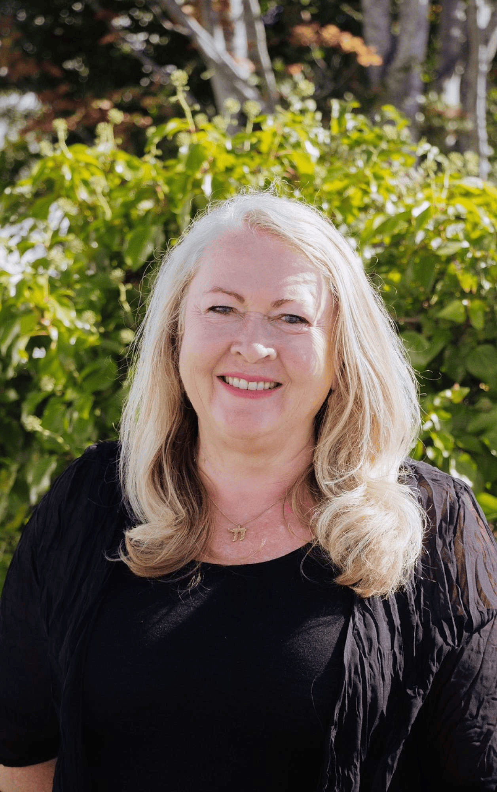

## Alumni Profile

# Catherine Hoekendijk (née Irving)

-   Leaving Year: [1979](https://www.middleton.school.nz/tag/1979/)

I attended Middleton Grange School during the days of pink dresses, hats, and gloves for girls, when boys and girls sat separately in assembly. Rector Eric Dunlop, fondly nicknamed “The Bat” for his flowing black gown, presided over our school. As one of the few who joined in Year 9, I initially found it challenging to integrate, but I later formed lifelong friendships.

Music and Art were my greatest passions, guided by inspiring teachers like Russell Kent and Bill Moore. I loved performing in school productions such as The Mikado and The Witness, with fish-and-chip dinners in the music room on rehearsal nights. While sport played a lesser role in my life, I was active in various teams, finishing my school years as a Shackleton House leader. My time at MGS (1975–1979) encouraged my faith, thanks to the influence of staff and fellow students.

The passing of my dear friend and fellow pupil, Rosalie Matheson, was a profound turning point, leading me to explore my faith more deeply. In 1984, I joined Youth With A Mission (YWAM) in the Netherlands, serving in music ministry across Europe and Asia for 5 years. During this time, I became a fluent Dutch speaker and met my future husband, Gideon.

Gideon and I married in 1988, spending time in Singapore before settling in Christchurch, where we have ministered for over 35 years. I served as Worship Pastor at Spreydon Baptist (now South West Baptist) and, alongside Gideon, organised nationwide Christian events under Harmony Ministries, including March for Jesus and Billy Graham Global Mission.

In 2009, we planted Harmony Church, which has since grown into a thriving city church impacting many lives. In my 40s, I pursued further education, earning a Bachelor of Music in composition and ethnomusicology.

We are the proud parents of four children—David, Jonathan, Saskia (married to Wairepo Te Hae, also an MGS alumnus), and Fabian (married to Samara van Ameyde, also an alumna). Now, with a growing number of grandchildren, our family continues to expand, and we are grateful for the legacy of faith that was fostered at Middleton.

Looking back, I wouldn’t have been an obvious candidate for the journey I’ve taken—but God’s plans are bigger than what we can see. My advice to students? Pursue truth, embrace who God created you to be, and never give up. Your story is still unfolding.

[Back to Alumni](https://www.middleton.school.nz/alumni/)

### More Alumni Profiles

### [Stephanie Hunt (née Mathieson)](https://www.middleton.school.nz/stephanie-hunt-nee-mathieson/)

### [Caleb Croker](https://www.middleton.school.nz/caleb-croker/)

### [Ellen Paynter](https://www.middleton.school.nz/ellen-paynter/)

### [Elisha Nuttall](https://www.middleton.school.nz/elisha-nuttall/)

### [Frances Watson](https://www.middleton.school.nz/frances-watson/)

### [Geoff Wallis (Primary Teacher, 2016–2022)](https://www.middleton.school.nz/geoff-wallis-primary-teacher-2016-2022/)

[See all](https://www.middleton.school.nz/alumni-profiles/)
