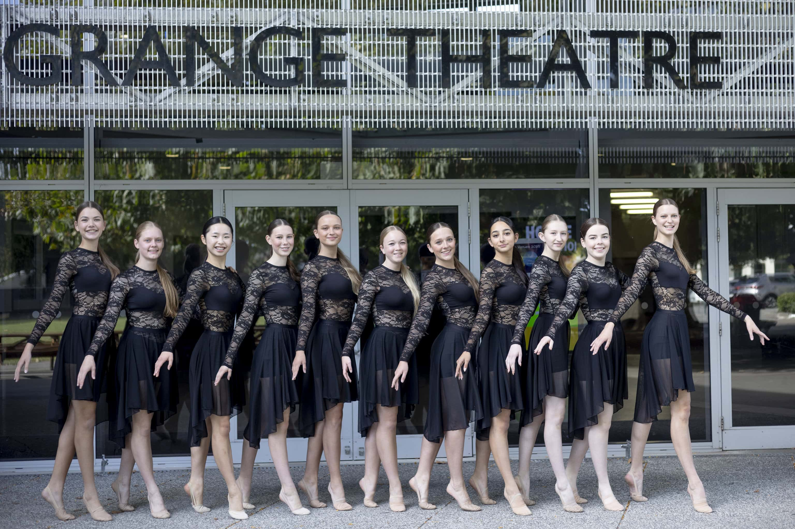

-   [Curriculum & Subjects](https://www.middleton.school.nz/curriculum-subjects/)
-   [Course Selection](https://www.middleton.school.nz/course-selection/)
-   [Careers Department](https://www.middleton.school.nz/careers-department/)
-   [Leadership](https://www.middleton.school.nz/leadership/)
-   [Service](https://www.middleton.school.nz/service/)
-   [Remote Learning](https://www.middleton.school.nz/remote-learning/)
-   [NCEA Information](https://www.middleton.school.nz/ncea-information/)
-   [Learning Support](https://www.middleton.school.nz/learning-support/)
-   [Fostering Strengths](https://www.middleton.school.nz/fostering-strengths/)
-   [Pastoral Care](https://www.middleton.school.nz/pastoral-care/)
-   [BYOD](https://www.middleton.school.nz/byod/)
-   [Library Dashboard](https://aiscloud.nz/MDD00/#!landingPage)
-   [Overseas Trips](https://www.middleton.school.nz/overseas-trips/)
-   [Sport](https://www.sporty.co.nz/middleton)
-   [Performing Arts](https://www.middleton.school.nz/performing-arts/)

## MGS Performing Arts

## Middleton Dance Academy

“Dance is your pulse, your heartbeat, your breathing. It’s the rhythm of your life. It’s the expression in time and movement, in happiness, joy, sadness and envy.”

Jacques d’Amboise

Everything in the universe has rhythm. Everything dances.

Maya Angelou

“Dancing is like breathing — missing a day doing either is very bad.”

Vera Ellen

# **Vision Dance**

Vision is our senior performance group who dance a mixture of lyrical, contemporary and jazz. This is an auditioned group. The annual cost for Vision dance is $45.

**What we do**

-   Rehearsals are every Monday morning 7.30-8.30am.
-   Create choreography for a variety of pieces
-   Perform within school and for our local community

**You will grow in**

-   Relationships with each other
-   Various dance styles and techniques
-   Exposure to new ideas
-   Opportunity to express faith in a unique way

**Opportunities include**

-   Easter Performance
-   Dance Workshops
-   Performing at other schools and teaching workshops
-   MGS dance show
-   Performing Arts Awards Evening
-   Production and production choreography
-   A Night at the musicals

## Dance Groups 2026

### Our Y5/6 group will learn one lyrical dance and one musical theatre dance.

Cost: $25

Rehearsal time: Wednesday lunchtime

Tutors: Vision Dancers

### Lyrical

Cost: $45

Rehearsal time: Tuesday lunchtime

Tutors: Vision Dancers and Renee Lee Dance

### Musical theatre

Cost: $45

Rehearsal time: Thursday lunchtime

Tutors: Vision Dancers and Renee Lee Dance

### Hip hop

Cost: $65

Rehearsals: Friday lunchtime

Tutors: Renee Lee Dance  
This class is taught both dances by our outside tutor

[Email Mrs Horn](mailto:r.liebert@middleton.school.nz)
