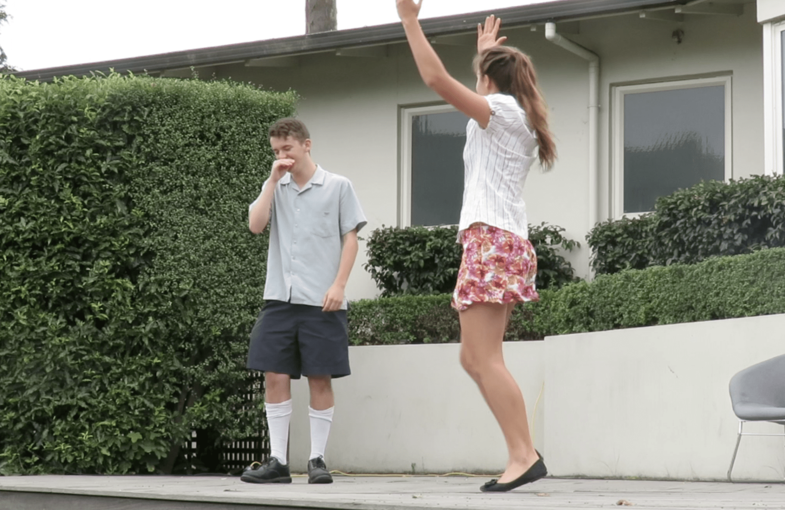
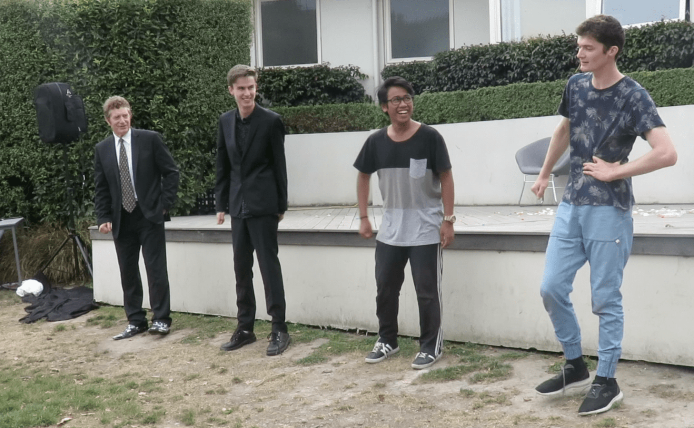
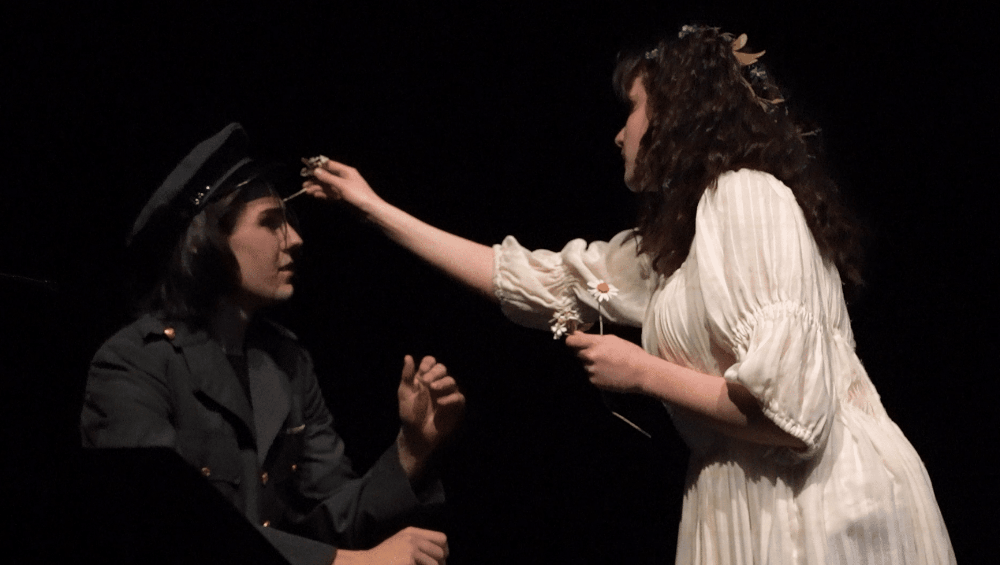
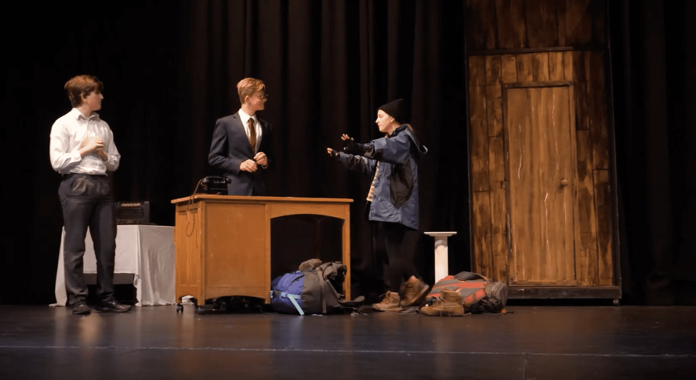
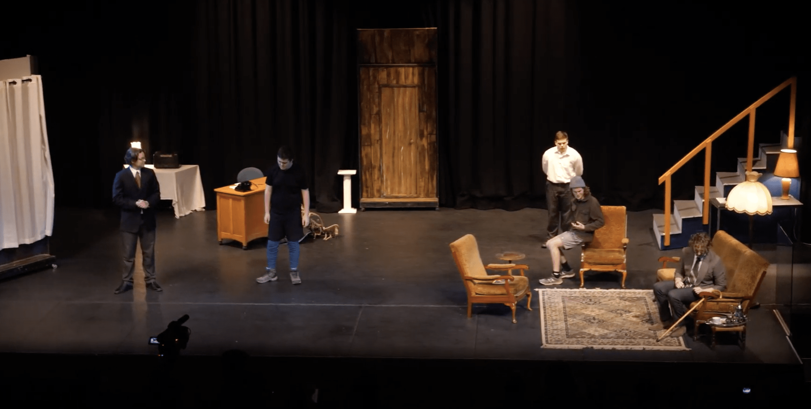

-   [Curriculum & Subjects](https://www.middleton.school.nz/curriculum-subjects/)
-   [Course Selection](https://www.middleton.school.nz/course-selection/)
-   [Careers Department](https://www.middleton.school.nz/careers-department/)
-   [Leadership](https://www.middleton.school.nz/leadership/)
-   [Service](https://www.middleton.school.nz/service/)
-   [Remote Learning](https://www.middleton.school.nz/remote-learning/)
-   [NCEA Information](https://www.middleton.school.nz/ncea-information/)
-   [Learning Support](https://www.middleton.school.nz/learning-support/)
-   [Fostering Strengths](https://www.middleton.school.nz/fostering-strengths/)
-   [Pastoral Care](https://www.middleton.school.nz/pastoral-care/)
-   [BYOD](https://www.middleton.school.nz/byod/)
-   [Library Dashboard](https://aiscloud.nz/MDD00/#!landingPage)
-   [Overseas Trips](https://www.middleton.school.nz/overseas-trips/)
-   [Sport](https://www.sporty.co.nz/middleton)
-   [Performing Arts](https://www.middleton.school.nz/performing-arts/)

## MGS Performing Arts

## DRAMA

## Select a group to get started

[Theatre Sports](#TheatreSports)

[Shakespeare Festival](#Shakeyshakey)

[Performance Drama](#DramaPerform)

"I regard the theater as the greatest of all art forms, the most immediate way in which a human being can share with another the sense of what it is to be a human being."

\- Oscar Wilde.

"Drama is exposure; it is confrontation; it is contradiction and it leads to analysis, construction, recognition, and eventually to an awakening of understanding."

\- Peter Brook

"Great theater is about challenging how we think and encouraging us to fantasize about a world we aspire to."

\- Willem Dafoe

## THEATRE SPORTS

## Wednesdays - 2:30pm

## Y9 - 13

**Acting is a sport. On stage, you must be ready to move like a tennis player on his toes. Your concentration must be keen, your reflexes sharp; your body and mind are in top gear, the chase is on. Acting is energy!**

*– Clive Swift*

### What we do

-   Classic Theatre Sports games
-   Practice of drama and performance techniques such as movement, voice, and use of space
-   Improvisation and working as a team

### You will grow in

-   Confidence
-   Character
-   Communication
-   Relationships
-   Performance Techniques

### Opportunities include

-   Theatre Sports Competitions
-   School Performances
-   Theatre Sports Tours to CEN Schools
-   Contribution to Performing Arts Events such as School Production, Prizegiving or Performing Arts Awards Evening

**Theatre Sports is run by Mr Michael McCormack**

[Email Mr McCormack](mailto:m.mccormack@middleton.school.nz)

## SHAKESPEARE FESTIVAL

## Rehearsals as arranged in Term 1

## Y11 - 13

#### *“Be not afraid of greatness. Some are born great, some achieve greatness,  
and some have greatness thrust upon ’em!”*

### What we do

-   Rehearse and perform a play written by Shakespeare, **with our own spin on the genre, setting and style**
-   Weekly rehearsals in Term 1/2 in preparation for the competition

### You will grow in

-   Confidence
-   Character
-   Communication
-   Relationships
-   Performance Techniques

### Opportunities include

-   Competing in the Shakespeare Festival Competition
-   School Performances

**Shakespeare Festival Group is run by Mr Michael McCormack – Reherasals as arranged once the group is formed**

[Email Mr McCormack](mailto:m.mccormack@middleton.school.nz)

## Performance Drama

#### While most drama performances are accessible through the curriculum subject (3+ performances a year for some year levels), there are other opportunities to engage in drama performance. These include:

-   #### **Easter Performances**
    
-   #### **School Tours**
    
-   #### **Prizegiving**
    
-   #### **Performing Arts Awards Evening**
    

Please contact Mr Michael McCormack to express your interest in these opportunities

[Email Mr McCormack](mailto:m.mccormack@middleton.school.nz)

[Looking for SCHOOL PRODUCTION? Click here!](https://www.middleton.school.nz/school-production/)
