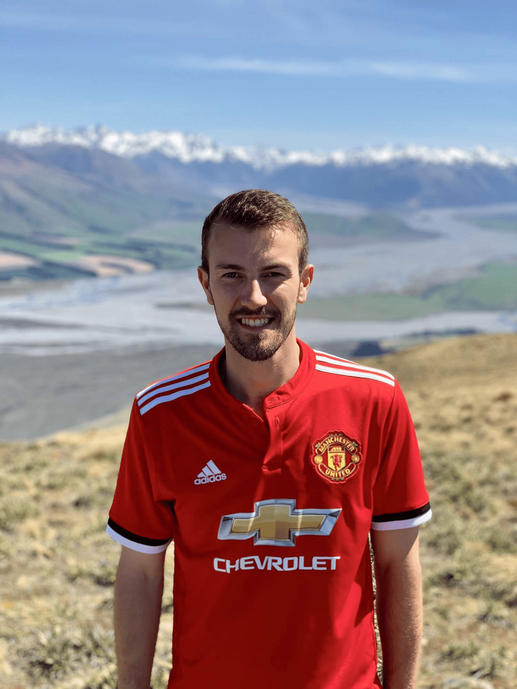

## Alumni Profile

# Elisha Nuttall

-   Leaving Year: [2010](https://www.middleton.school.nz/tag/2010/)

My name is Elisha Nuttall. I joined Middleton Grange in Year 6 at the same time as my two siblings, Michael and Lydia, and was there until Year 13 in 2010. Over this time, lifelong friends were made. A couple of my best friends to this day I met in the first week of school.

Middleton offered countless opportunities to play a variety of sports, and somehow I tried most of them. My senior year was a highlight for sport, including winning Hillary Challenge Nationals, qualifying for Football Nationals, and winning South Island canoe polo champs. The teachers and coaches were amazing throughout. Mr Anderson founded the canoe polo schools competition in Christchurch, opening opportunities for hundreds of players since. Hillary Challenge must have been the hardest sport to oversee. We were always back late from our training camps, and in the competition, after two days, only made it in on time by two minutes.

I was a diligent student, applying myself to my studies. Cantamath competitions through the middle school years were an early highlight. In my senior year, a highlight was Scholarship Biology. There was a bright group of students and a fantastic teacher. I worked hard all year, determined to show what I could do alongside the smartest students, and managed to get an Outstanding award (top 26 in the country).

It’s surprising that 18-year-olds are expected to be able to decide what their career will be. On little more than wanting job security and thinking, ‘I’m good at Biology, so maybe I should be a doctor,’ I went down to Otago to study pre-med. Coming off the sporting and academic highs, I believed I would succeed. I put in the work more than I ever had, but there were many other hardworking and very academic students. With an A average, I didn’t make the cut for medicine. I was devastated, but God had other plans.

I came back to Christchurch to study at UC, returning to Economics, which I enjoyed at school, and picking a second major based on a two-sentence blurb at registration. What even is Finance? There was also time to take some sports I enjoyed a bit further. I continued playing canoe polo and started expedition adventure racing, culminating in a top 20 world ranking. A literal high was climbing Mt Cook on a breathless summer day, with views from coast to coast.

I graduated university with a Bachelor of Science, majoring in Economics and Finance. With career security still front of mind, all the Commerce students were talking about the ‘Big 4’, so I got a role at PwC in the Corporate Finance team. Here I was part of large transactions and became a spreadsheet whiz. After three years in the Christchurch office, I moved to Auckland and into the Management Consulting team, another career I didn’t know existed when I was 18. Here I gained exposure to large business advisory jobs, learning about business strategy, supply chain, and procurement. A few years later, I moved to Grant Thornton to launch its Data and Analytics team, finding a niche doing holiday pay recalculations. I grew this service to be the second largest in the team, with a specialist sub-team of 10 staff across three locations. But what started out innovative became routine and predictable.

The Covid period created plenty of time for thinking and trying new things. Somewhere between a sourdough starter and a mid-week wine, an entrepreneurship bug deep inside me started to flare up. Auckland also wasn’t the place I wanted to bring up a family, so I moved back to Christchurch, where my girlfriend at the time, Jasmine, was living. We married just over a year later at a lovely ceremony at Pemberton Gardens and recently welcomed our first child, Boaz.

After investigating dozens of businesses for sale, one stood out, so I convinced a friend I had first met in Year 6 at Middleton to buy it together. Soon after, I resigned from my secure job to focus on our business, a far cry from the safe career I had planned. This grew into Talanton Holdings, with its name and vision coming from the Parable of the Talents. Talanton is about stepping out, stewarding our God-given gifts and resources, and seeking to multiply resources that can be used for the Kingdom. Over the last four years, we have acquired three companies, Hi-Tec Aerials, Industrial Painters, and Signals NZ. It has been amazingly challenging and rewarding, and we are just getting started.

My advice to current students is to apply yourself. Opportunities come to those who are diligent. Take opportunities. You never know what experiences you will get or what will come from them. Hold your plans loosely. God might have better plans in store for you down the line.

[Back to Alumni](https://www.middleton.school.nz/alumni/)

### More Alumni Profiles

### [Stephanie Hunt (née Mathieson)](https://www.middleton.school.nz/stephanie-hunt-nee-mathieson/)

### [Caleb Croker](https://www.middleton.school.nz/caleb-croker/)

### [Ellen Paynter](https://www.middleton.school.nz/ellen-paynter/)

### [Elisha Nuttall](https://www.middleton.school.nz/elisha-nuttall/)

### [Frances Watson](https://www.middleton.school.nz/frances-watson/)

### [Geoff Wallis (Primary Teacher, 2016–2022)](https://www.middleton.school.nz/geoff-wallis-primary-teacher-2016-2022/)

[See all](https://www.middleton.school.nz/alumni-profiles/)
