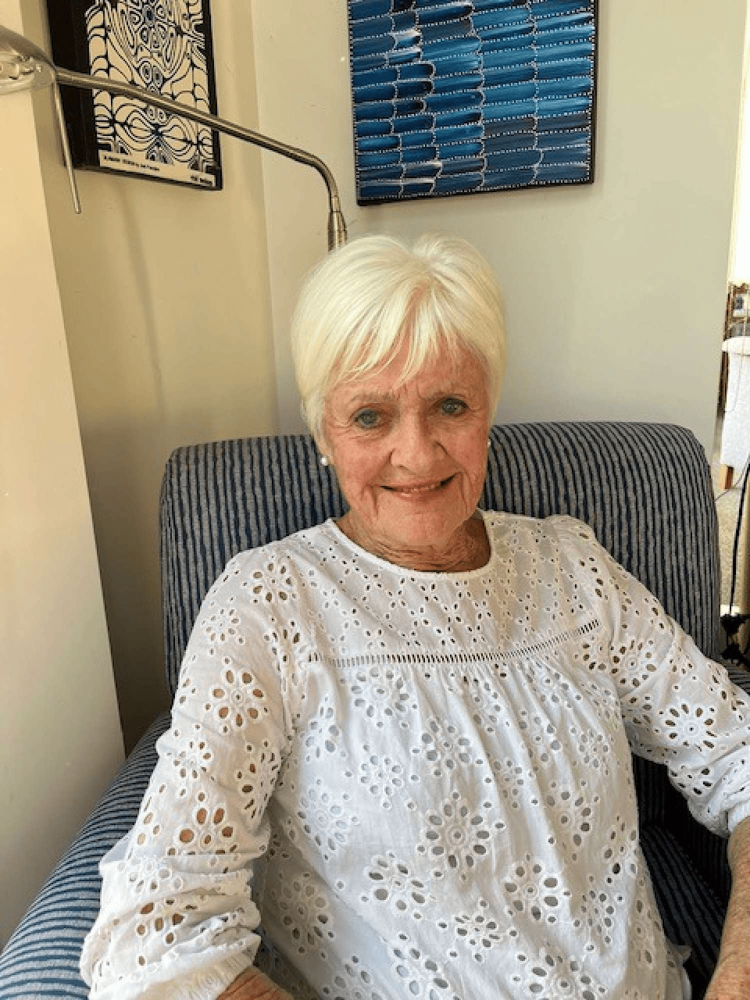

## Alumni Profile

# Ellen Paynter

I was fortunate to be born into and brought up in a loving Christian family in Christchurch. We attended Rutland Street Church, where there was a strong youth group, and it was here that I met my future husband. I came to faith during this teenage period.

After leaving school, I went to the Home Science School at the University of Otago for three years, followed by a year at Auckland Teachers College, where they trained us as teachers of Home Economics.

My first teaching job was at Mairehau High School, and while I was there I was approached and asked if I would be interested in a role with the Department of Agriculture Farm Advisory Division. The Department had created a Home Economics section where country women could get advice on house planning, home management, food, and nutrition. Rural women’s groups in Canterbury, the West Coast, and Nelson would organise day schools in rural areas, and we would go and lecture on these topics. This would often lead to a home visit.

During this time I was married, and when I became pregnant with our first child I left work to be at home. We have four children, two living in New Zealand and two overseas. Once our youngest was at intermediate school, I decided I would like to return to teaching. I came to work at Middleton Grange School in the Home Economics Department. I so enjoyed teaching the subject, skills for life and wellbeing.

After having taught in a secular school, I found the total care of the students, intellectual and spiritual, at Middleton so appealing and satisfying. I also appreciated the staff and prayer support.

During this time, my husband became part of the trust raising funds for the Hamlin Fistula Hospital in Ethiopia, a charitable hospital. When I retired from teaching, we both involved ourselves in this work. We visited the hospital in Addis Ababa several times for conferences and met many wonderful people from many countries who were supporting the hospital. Here in Christchurch, I spoke to many women’s groups about the work of the hospital to raise funds.

During this time also, I sensed a real appreciation of God’s creation, possibly helped by travel, and I wanted to express this in some form. I experimented with creating pictures using fabrics, braids, ribbons, dried leaves, bark, and old music to make textured pictures on canvas. I also made platters, bowls, and containers from papier mâché. Friends persuaded me to go to local markets, which I found stimulating, talking to potential customers and other stallholders.

At this time, we lived on a section with a stream boundary and lovely mature trees. I decided to invite friends who had crafts to sell to come to an annual ‘Craft in a Garden’ at our place. They did not have to pay the excessive fees that were often required at other markets. We created a café where the funds were donated to City Mission. This annual event was very successful and continued for several years.

I thank God for His guidance over the years, His prompting, and His assistance in the various situations I have been in.

[Back to Alumni](https://www.middleton.school.nz/alumni/)

### More Alumni Profiles

### [Stephanie Hunt (née Mathieson)](https://www.middleton.school.nz/stephanie-hunt-nee-mathieson/)

### [Caleb Croker](https://www.middleton.school.nz/caleb-croker/)

### [Ellen Paynter](https://www.middleton.school.nz/ellen-paynter/)

### [Elisha Nuttall](https://www.middleton.school.nz/elisha-nuttall/)

### [Frances Watson](https://www.middleton.school.nz/frances-watson/)

### [Geoff Wallis (Primary Teacher, 2016–2022)](https://www.middleton.school.nz/geoff-wallis-primary-teacher-2016-2022/)

[See all](https://www.middleton.school.nz/alumni-profiles/)
