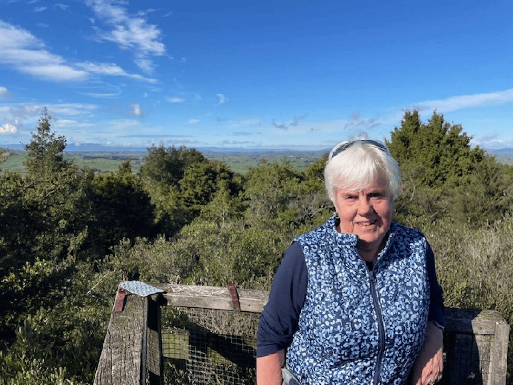

## Alumni Profile

# Frances Watson

-   Leaving Year: [1971](https://www.middleton.school.nz/tag/1971/)

My name is Frances Watson (née Posthuma). I’m very blessed to have grown up in a Christian home and seen what it is to live your life for Jesus. Home and school have helped shape me into the person I am today.

I started at Middleton Grange School on 4 February 1964, yes, a first-day pupil in Year 5 (Standard 3), and stayed until 1971, Year 12 (Form 6).

School was great in the early years. Small classes, everyone knew everyone. The highlights for me in the early years were the Friday assemblies held in the Old House. I loved the missionary visits and the stories read to us by Miss Laugesen, *Star of Light*, *Treasures of the Snow*, *Pilgrim’s Progress*, and others. I appreciated lunchtime activities such as Young Sowers League, where we answered a question on each chapter in the New Testament, different sections through the Old Testament, and God’s promises and precepts through the Bible. Crusaders (now ISCF) was a way to learn more of God’s word, along with getting to know each other through social events. Prayer times in the later years were wonderful. Being part of the first-ever school production, *The Mikado*, led by Mr Shadbolt and Mr Major, was very special. I also enjoyed school camps and trips, the introduction of choir, orchestra, Māori Club, and the House Competition.

It was an exciting time when the Secondary School block was opened by Dr Paul White, author of the *Jungle Doctor* series. There were more classrooms and space.

One of my favourite teachers was Tony Hawkins. He taught us Maths and Science, but from Year 9, only Maths, which was not my strong point. He was encouraging, and I learnt several scriptures from him that I will never forget. When I was puzzled or didn’t understand the Maths, he would say, ‘Frances, have you called God’s emergency number?’ (Jeremiah 33:3) or ‘Have you dialled 5522?’ (Psalm 55:22). He came to several of our reunion lunches and was always encouraging and checking where we stood in our faith journey. He went home to glory in June this year, aged 96.

On leaving school, I completed a one-year Secretarial Course at Polytech in 1972.

My first job was in the accounts department at General Foods on Blenheim Road. Later, I moved to Associated Cones, a subsidiary of General Foods, where I was in a sole-charge position.

I married Derrick Watson in 1978. Sadly, he went home to glory in 2014. We had four children who attended Middleton Grange, and four of my grandsons, two of whom have now left school. One of my daughters teaches Maths part-time.

When my youngest son turned five, I was fortunate to get a part-time position at Middleton Grange School in the office. As the children grew, the job grew, and I finished in 2012.

I also worked in our window cleaning and cleaning business, which we bought in 1998. One of my brothers bought half when Derrick died, and I retired in February 2025.

Retirement is such a blessing, being able to do things I’ve previously wanted to. I am involved in my church, particularly in encouraging and visiting, and I am part of a Growth Group. I love being a grandparent, intentionally keeping in contact with my grandchildren and encouraging them to keep persevering in faith. They grow up too quickly. There is now time for quilting, gardening, and reading, and for spending time socially with other women on their own.

God has certainly worked in my life. He faithfully provided for us in many practical ways, especially through the years our children were at Middleton Grange. I have seen His goodness and faithfulness, particularly in the later years on my own. I have stepped out of my comfort zone, trusted in the Lord to protect me on my travels, and appreciated meeting new people of all cultures. Reading the Bible, either on my own or with others, has grown me, not just reading it but applying it to life. He continues to be my joy and strength.

Advice after Middleton Grange? Reflect on your school years often, the friendships made, the advice given by teachers, and treasure the memories you made at school. We had such a great small year group and still meet up annually for a lunch or coffee reunion. Hold on to the friendships you made through school. We need to be there for each other through the joyous times and the sadness. Some of my year group travel to Christchurch from Whakatāne and Te Anau faithfully every year to be together. It only takes one person to get a group together and it will grow. During the years when we have young families, staying in touch is not easy, but with technology today it is. As we grow older, friendships are precious and special. Be there for each other, as life is short.

[Back to Alumni](https://www.middleton.school.nz/alumni/)

### More Alumni Profiles

### [Stephanie Hunt (née Mathieson)](https://www.middleton.school.nz/stephanie-hunt-nee-mathieson/)

### [Caleb Croker](https://www.middleton.school.nz/caleb-croker/)

### [Ellen Paynter](https://www.middleton.school.nz/ellen-paynter/)

### [Elisha Nuttall](https://www.middleton.school.nz/elisha-nuttall/)

### [Frances Watson](https://www.middleton.school.nz/frances-watson/)

### [Geoff Wallis (Primary Teacher, 2016–2022)](https://www.middleton.school.nz/geoff-wallis-primary-teacher-2016-2022/)

[See all](https://www.middleton.school.nz/alumni-profiles/)
