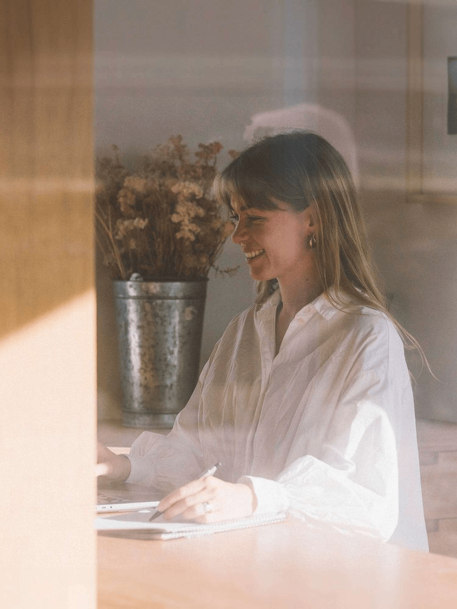

## Alumni Profile

# Grace White

-   Leaving Year: [2012](https://www.middleton.school.nz/tag/2012/)

Kia Ora,

My name is Grace White (most people probably remember me as Grace Mortimer!), and I live with my husband Conor in Lake Hawea.

I was at Middleton for all of my schooling – from 1999 to 2012 – and thoroughly enjoyed my time there. I formed some wonderful friendships, many who were also there for 13 years. We seem to have all ended up in different places, but when we get back together it feels like nothing has changed! Memories from school always seem to crop up, and we have a lot of laughs about our younger selves and school happenings. I really enjoyed school and think Middleton did well at fostering a close knit community that installed some great values in all of us. I particularly enjoyed sports – netball tournaments, early morning trainings, team comradery, freezing showers after training, Saturday morning sport, and athletics day! I’ve just got back into Netball recently and realised how much I missed it! I also loved house competitions and the creative, fun, competitive nature they had. I’ll always remember our Scott house lip sync victory!!! I was a tri-sci nerd (chemistry, physics, and biology) and really thrived off learning about the intricate nature of our physiology and our environment. I also, however, dreamed of being an actress and a silver fern hahaha.

Science got the better of me and led me to Otago University where I studied health science, hoping to get into medicine. After missing out the first year, I decided to pursue a NeuroScience degree and apply for post grad. Along the way, I picked up Human Nutrition papers and realised I’d prefer to be helping people prevent disease and address health concerns naturally. Four years later, I came out with a Bachelor of Science in NeuroScience and a post grad diploma in Human Nutrition. And a lot of fun memories and friends from my time in Dunedin.

I was fortunate to then get a job working for a holistic nutrition clinic called BePure which at the time was based in the Hawkes Bay. I was there for a year then moved up to a new clinic in Auckland for another year. I worked initially in customer support and then moved to a clinical role. We saw people with all sorts of health concerns and worked to get to the root cause of what was driving their condition – typically looking at their microbiome/gut health, blood work, the nervous system, sleep, nutrition, hormones, and stress management. It was an awesome experience, and I learnt a lot rapidly working under some incredibly talented individuals who were truly passionate about seeing health tackled holistically and from a root cause approach – not just addressing the apparent symptoms.

Along the way, I met Conor (at another X-Middleton (Annabelle White!) pupil’s engagement doo). I’d had enough of the big smoke and so moved to the much more appealing Mount Maunganui where Conor was living. Struggling to find a job in my field, I decided to start my own business. At the same time, I was part of a very interesting study looking at the effects of a ketogenic diet on Alzheimer’s disease which proved to be very promising, and there is a lot more research in this area now.

A couple of years later, we got married in Tarras, Central Otago which is not far from where we now live and have lived for almost 4 years. More recently, I have re-launched my business under Pheno Nutrition and work with a whole array of individuals to address their health concerns. I’ve been blessed to help a lot of people on their health journey and seen many cases of type 2 diabetes put in remission, autoimmunity symptoms disappear, migraines disappear, IBS and gut related symptoms settle and many other niggley symptoms/conditions tackled in between! I guess the main motivation for my work is that I believe God designed us cleverly to live on earth in optimal health and that He provided us with all the resources to live and be well! When we use the resources appropriately around us, we can put our body into the right environment to heal – regardless of your genetic profile.

Central Otago now feels like home, but Christchurch will always hold a special place! I feel very blessed to have a faith and have seen God work in numerous circumstances in my life and open up opportunities that I would never have thought possible. My advice to current pupils? Do as many extra curricular activities as possible! There’s so much time to do fun activities at school and explore many different areas to really get a feel for what fills your cup. And whether you have a faith or not, know that God’s got an incredible plan for you regardless of whether you can see it or not.

[Back to Alumni](https://www.middleton.school.nz/alumni/)

### More Alumni Profiles

### [Stephanie Hunt (née Mathieson)](https://www.middleton.school.nz/stephanie-hunt-nee-mathieson/)

### [Caleb Croker](https://www.middleton.school.nz/caleb-croker/)

### [Ellen Paynter](https://www.middleton.school.nz/ellen-paynter/)

### [Elisha Nuttall](https://www.middleton.school.nz/elisha-nuttall/)

### [Frances Watson](https://www.middleton.school.nz/frances-watson/)

### [Geoff Wallis (Primary Teacher, 2016–2022)](https://www.middleton.school.nz/geoff-wallis-primary-teacher-2016-2022/)

[See all](https://www.middleton.school.nz/alumni-profiles/)
