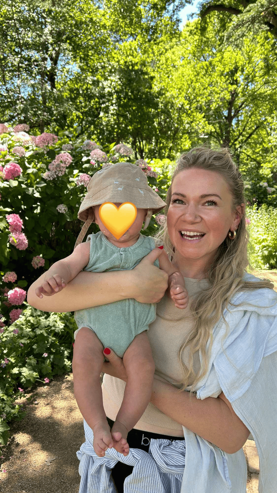

## Alumni Profile

# Hannah Soakai

-   Leaving Year: [2008](https://www.middleton.school.nz/tag/2008/)

Kia ora!

My name is Hannah Soakai (neé Johnson), and I am currently a stay at home mum (my dream job!) here in Christchurch.

I attended Middleton Grange School from 2006-2008 and was part of the very first class to go from Year 10 at Hillview Christian School to Middleton. I really enjoyed my time at Middleton and made lots of new friends as well as continued many friendships I had from Hillview. My fondest memories at Middleton include marae stays at Ōnuku Marae in Akaroa, cooking class with Mrs McQuillan, Classics with Mr Juriss (who was always a laugh), completing first year Te Reo Māori at UC as part of the STAR Course with a few of my closest friends, the Fiji Missions Trip in my last year, and having the privilege of being Deputy Head Girl in 2008.

After leaving Middleton, I took a year off to work full time, and then in 2010 I started a Bachelor of Arts at The University of Canterbury, majoring in Te Reo Māori and Māori and Indigenous Studies. After completing my degree in 2012, I traveled a bit and then moved to Auckland. In 2016, I received a Graduate Diploma in Primary Teaching and taught in a primary school in Auckland for 3 years. I absolutely loved teaching, and although it was the hardest job I’ve ever had, I had never felt so fulfilled and like I was living out the special calling God had on my life. I met my amazing husband Dietrich in Auckland, and then four years ago, we decided to move down to Christchurch.

My advice to current Middleton Grange students would be to get as involved as you can in the many opportunities MGS has to offer, surround yourself with positive, life-giving friends who genuinely want the best for you, and to cling on to God, trusting in Him through all that life throws at you.

Hannah.

[Back to Alumni](https://www.middleton.school.nz/alumni/)

### More Alumni Profiles

### [Stephanie Hunt (née Mathieson)](https://www.middleton.school.nz/stephanie-hunt-nee-mathieson/)

### [Caleb Croker](https://www.middleton.school.nz/caleb-croker/)

### [Ellen Paynter](https://www.middleton.school.nz/ellen-paynter/)

### [Elisha Nuttall](https://www.middleton.school.nz/elisha-nuttall/)

### [Frances Watson](https://www.middleton.school.nz/frances-watson/)

### [Geoff Wallis (Primary Teacher, 2016–2022)](https://www.middleton.school.nz/geoff-wallis-primary-teacher-2016-2022/)

[See all](https://www.middleton.school.nz/alumni-profiles/)
