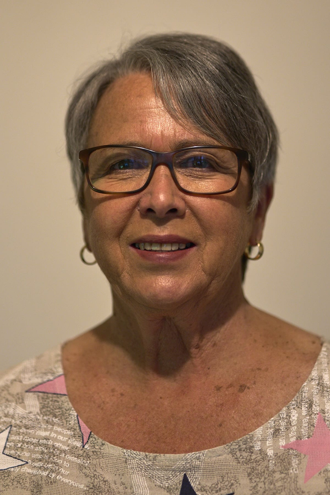

## Alumni Profile

# Heather Kench

-   Leaving Year: [2013](https://www.middleton.school.nz/tag/2013/)

Hello Everyone,

My name is Heather Kench, and it has been my privilege to have been part of the life of Middleton Grange School for over 34 years. I commenced as a Standard 1 (Year 3) teacher in May, 1989. Over time, I taught at various class levels, became a team leader and finally was given the honour of leading the Primary School in the Head of Primary role.

Throughout my life, I have known God’s leading in many amazing ways. My initial decision to apply for the classroom teacher role was a prompting I felt led to follow. The interview was scary and I was sure I had ‘blown it’ when I became emotional while sharing my testimony, so when I received the great news that the job was mine, I was so thankful to God. My determination then, was to give my very best in every way for His honour and glory.

So at the start of Term 2, 1989, with a certain amount of fear and trepidation, but a great deal of enthusiasm, I commenced my time at MGS. Little did I realise all the amazing colleagues, children and parents I would meet through my time at the school and the many opportunities that would be presented to me. Having only worked in state schools prior to having a family, the greatest point of difference for me was the prayer life of the school. At MGS, I was able to pray, read God’s word, share my testimony…..something I hadn’t always been able to do openly. This had such an impact on me, that my husband Brian and I decided that this was the school we wanted our children to attend. We were able to enrol our 3 children and at the start of 1990 the four of us headed off to school together each day. Amy, Anna, and Jeremy loved their time at Middleton almost as much as I did!

Music was one of my passions, so when the opportunity came my way to take the Primary School choir I grabbed it with both hands. Preparing the children each year for participating in the Primary Schools’ Festival, the World Vision ‘Kids For Kids’ concert as well as various school assemblies was something I revelled in. Bringing all that musical talent together and working to ensure it was the best it could be, was a privilege I didn’t take for granted. Every second year, the Primary School put on a production and the choir provided a strong base for all the singing required in those musicals. I was always amazed by the children who stepped up to take leading solo and acting roles in these.

I loved sport, too, so looking after the girls’ netball teams was no hardship, except perhaps on rainy days! There were a couple of years where the talent pool was high and the teams performed well above expectation. Working to develop their skills and have them playing confidently together was a key focus and it was great to see the progress made each year.

I also loved school camps which were a lot of hard work but provided a great deal of satisfaction from observing the achievements of the children. The camps at Cracroft were a highlight each year for the Year 4s, some of whom had never been away from family. Seeing them push through the homesickness, I believe, was character building for them. The many and varied activities kept everyone busy and focused and the parents that willing supported each year ensured the time was memorable.

The opportunity to take on leadership roles, firstly as Year 3 & 4 Team and then as Head of Primary would have been beyond my wildest expectations when I first started at MGS. I believe in God’s planning and timing in my life and so determined to give of my best when these opportunities were placed before me. The blessings I received in return are treasure I continue to hold dearly. The people who speak into your life along the way are a blessing beyond words. Their wisdom, encouragement, and support help in the good and the tough times. There were many during my time at MGS who did just that, and I give thanks for them.

In 2013, God placed on my heart that it was time to relinquish my Head of Primary role.

In obedience, I handed in my resignation and was totally at peace over the decision. My time at Middleton Grange, however, did not finish there. I have been a relief teacher over the intervening years, counting it a privilege to cover when and where necessary. I now enjoy seeing my grandchildren at Middleton and love seeing pupils I taught bringing their children to school as well.

I have not retired…… I am ‘re-tyred’ and ready to do what God wants. I am fully involved at my church helping with community music programmes as well as leading our choir of 40.

There is still plenty for me to do!!

God bless,

Heather

[Back to Alumni](https://www.middleton.school.nz/alumni/)

### More Alumni Profiles

### [Stephanie Hunt (née Mathieson)](https://www.middleton.school.nz/stephanie-hunt-nee-mathieson/)

### [Caleb Croker](https://www.middleton.school.nz/caleb-croker/)

### [Ellen Paynter](https://www.middleton.school.nz/ellen-paynter/)

### [Elisha Nuttall](https://www.middleton.school.nz/elisha-nuttall/)

### [Frances Watson](https://www.middleton.school.nz/frances-watson/)

### [Geoff Wallis (Primary Teacher, 2016–2022)](https://www.middleton.school.nz/geoff-wallis-primary-teacher-2016-2022/)

[See all](https://www.middleton.school.nz/alumni-profiles/)
