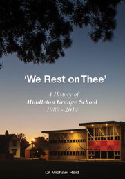
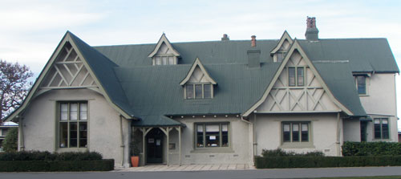

# Our History

-   [Principal’s Welcome](https://www.middleton.school.nz/principals-welcome/)
-   [Special Character](https://www.middleton.school.nz/special-character/)
-   [Vision & Mission Statement](https://www.middleton.school.nz/vision-mission-statement/)
-   [Motto, Crest, Verse, Hymn, Prayer, Haka](https://www.middleton.school.nz/motto-crest-verse-hymn-prayer-haka/)
-   [Annual Theme](https://www.middleton.school.nz/annual-theme/)
-   [Our History](https://www.middleton.school.nz/history/)
-   [Senior Leadership Team](https://www.middleton.school.nz/main-school-leaders/)
-   [Middleton Grange School Board](https://www.middleton.school.nz/board/)
-   [Affiliations](https://www.middleton.school.nz/affiliations/)
-   [Key Publications](https://www.middleton.school.nz/key-publications/)
-   [The Grange Theatre](https://thegrangetheatre.nz/)
-   [Venue Hire](https://www.middleton.school.nz/venue-hire/)
-   [Location & Site Map](https://www.middleton.school.nz/location-site-map/)
-   [Contact Us](https://www.middleton.school.nz/contact-us/)

Middleton Grange opened with 64 students and 4 teachers on the 4th of February 1964 as the result of a vision for Christian education in Christchurch. Since its inception it has been increasingly interdenominational in character as patterns of church structure and attendance have changed markedly since the early 1960s. The school has a strong International College, with some students coming from non-Christian cultures and homes.

The first secondary students sat the School Certificate examination in 1968 and subsequently, Form 7 qualifications in 1970. By this date, Middleton Grange was offering courses in most senior subjects although full secondary facilities were not provided until the mid 1970s.

There was always tension between providing a Christian Education for as many families as possible and the high fees required as an independent (private) school. Consequently, numbers of interested parents were precluded from sending their children to Middleton Grange and many that were here remained loyal, but struggled to pay high fees year after year.

The Catholic Schools pioneered the integration scheme in 1975 and by 1995, when Middleton Grange growth made integration into the state system an option for serious consideration, many of the legal and practical problems had been ironed-out with the Catholic experience. As an integrated school, the government funds day-to-day operations including teacher salaries, while the proprietors (the Christian Schools’ Trust) levy parents to upgrade facilities to Ministry of Education requirements. Integration also means a commitment on behalf of the school to deliver and assess the national curriculum.

Middleton Grange became integrated in 1996. With lowered fees and improved facilities the school has subsequently become more attractive and more accessible. The current roll is over 1300 pupils across all 4 schools and applications are regularly made to the Ministry of Education for maximum roll increases.

At the end of June, 2015 a special weekend of commemorating our 50th anniversary was celebrated. A commemorative full-colour magazine was published, along with the book ‘We Rest on Thee’ which details the Middleton Grange History from 1983-2014. The book can be purchased from reception (03 348-9826 ext. 201) for $40 and the [endnotes](../media/2018/10/we-rest-on-thee-endnotes.pdf) are available for downloading.

For an interesting article from the Christchurch City Council on the former Middleton Homestead which is a listed heritage place and still stands proudly on our grounds today click [here](../media/2018/10/Listed-Heritage-Place.pdf)

