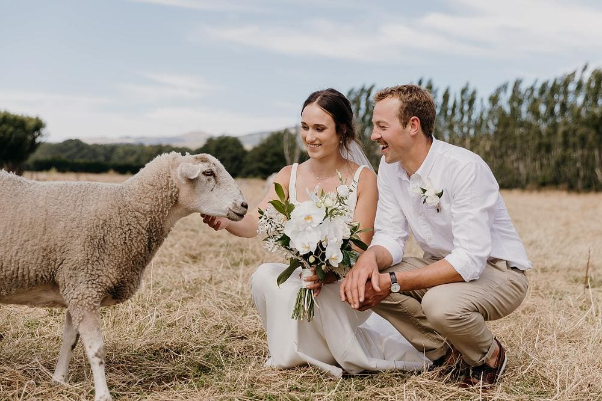

## Alumni Profile

# Holly Broom (Gardyne)

-   Leaving Year: [2017](https://www.middleton.school.nz/tag/2017/)

It is a privilege to write a short summary of my time at Middleton Grange and the years that have followed. I began at Middleton in year 0, having recently moved from Wellington. I remained there my entire school life, so I owe a lot to the education and people who put time and effort into teaching there. It was a privilege to be head prefect in my final year and I am so thankful to the wonderful team of leaders, both teacher and student, that surrounded us.

From as young as I can remember I have wanted to be a veterinarian and this drive shaped my time at school and gave me a goal. In 2018, I left home and moved to Palmerston North to start my study. It was a rocky road, especially in my first year, adjusting to being away from home and balancing demanding studies with some health issues. Looking back, I can see God’s hand in that time of my life and I’m incredibly thankful for my supportive family and church in Palmerston North. This got easier over the years and have now completed my degree, it seems to have gone incredibly fast.

Vet school has taught me a lot about how to care and treat for animals but more importantly, it has left me in awe of God’s wonderful creation. As we learned about anatomy and body systems, I was often amazed at how God has made such intricate and detailed animals. What an incredible testament to God that we can see in His creation!

My final year in vet school this year has been incredibly full. It started with getting married to my husband Richard in the middle of Covid – God has a funny way of teaching us reliance on Him in the most stressful of situations! From there I had a full-on year of placement throughout the country. Some highlights were doing surgery on deer, getting to deliver my first calf via a c-section, and getting to visit some of the most remote farms in the country.

The next year has some big changes for us as we head to Southland to start a new job for Richard and my first job as a vet. I’m sure in the dead of winter when there’s snow underfoot and is -10C outside I’ll miss the sub-tropical north. But for now, I look forward to the future and my prayer is that the Lord uses me to bring Him glory.

[Back to Alumni](https://www.middleton.school.nz/alumni/)

### More Alumni Profiles

### [Stephanie Hunt (née Mathieson)](https://www.middleton.school.nz/stephanie-hunt-nee-mathieson/)

### [Caleb Croker](https://www.middleton.school.nz/caleb-croker/)

### [Ellen Paynter](https://www.middleton.school.nz/ellen-paynter/)

### [Elisha Nuttall](https://www.middleton.school.nz/elisha-nuttall/)

### [Frances Watson](https://www.middleton.school.nz/frances-watson/)

### [Geoff Wallis (Primary Teacher, 2016–2022)](https://www.middleton.school.nz/geoff-wallis-primary-teacher-2016-2022/)

[See all](https://www.middleton.school.nz/alumni-profiles/)
