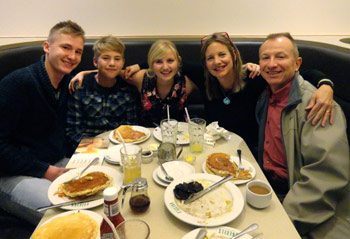

# Residential Care Accommodation

-   [Welcome](https://www.middleton.school.nz/international/)
-   [International Contact](https://www.middleton.school.nz/international-contact/)
-   [International Enrolment](https://www.middleton.school.nz/international-enrolment/)
-   [Residential Care Accommodation](https://www.middleton.school.nz/homestays/)
-   [NCEA & Subjects](https://www.middleton.school.nz/ncea/)
-   [ESOL Programmes](https://www.middleton.school.nz/esol-programmes/)
-   [University Pathways](https://www.middleton.school.nz/university-pathways/)
-   [Student Stories](https://www.middleton.school.nz/student-stories/)
-   [Our Photos](https://www.middleton.school.nz/international-photos/)
-   [Our Videos](https://www.middleton.school.nz/international-videos/)
-   [Useful Links](https://www.middleton.school.nz/useful-links/)
-   [International Board](https://www.middleton.school.nz/international-board/)
-   [International College Staff](https://www.middleton.school.nz/international-college-staff/)
-   [ERO Review](https://ero.govt.nz/institution/335/middleton-grange-school)
-   [Agents](https://www.middleton.school.nz/agents/)

Middleton Grange School’s International College has been serving international pupils since 1964. From the beginning residential care accommodation have been part of the plan with thousands of pupils placed in primarily Christian homes.

Hosting pupils is about inviting someone into your family, loving and caring for them and helping them to become people of strength and character. The school community has served in this capacity and continues to do so.

All pupils studying at Middleton Grange School are required to live in a residential care accommodation regardless of age, unless they live with a parent. Residential Caregivers are Police Vetted by the New Zealand Police and homes are checked to make sure they confirm with the requirements set out in the Code of Practice for the Pastoral Care of International Students.

Residential Caregivers work with the school in the care of international pupils. They will provide all your meals, a warm and comfortable bedroom, will take you to the doctor when you are sick and encourage you in your studies and your life in Christchurch. You will be included in the lives of your residential care family and be a part of everything they do.

### [Click here for the Residential Care Portal](https://www.middleton.school.nz/homestay-portal/)
