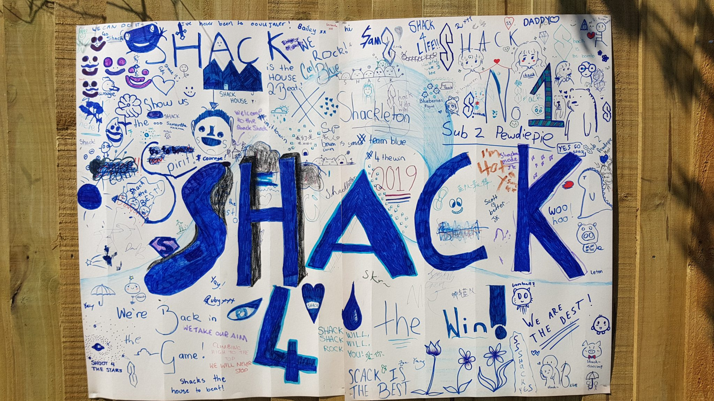
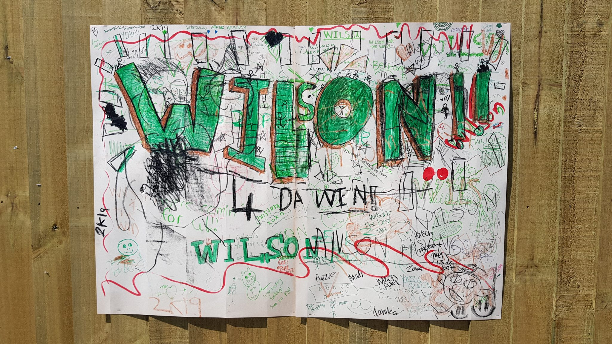
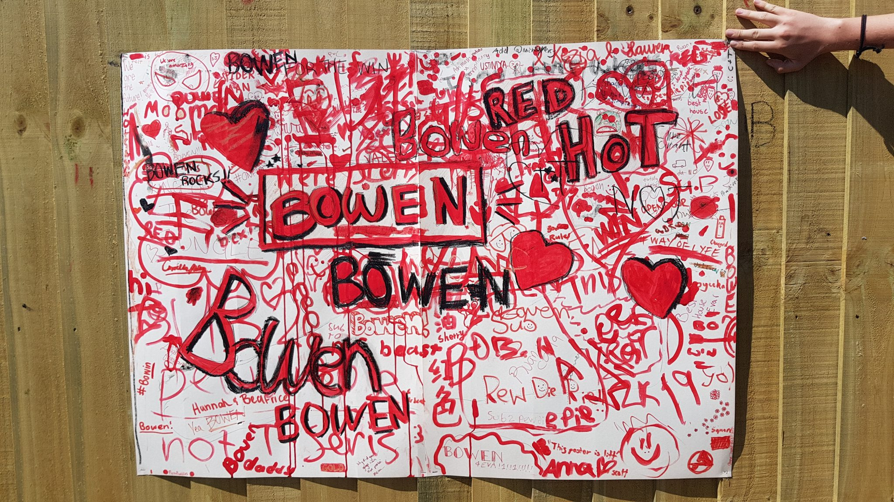
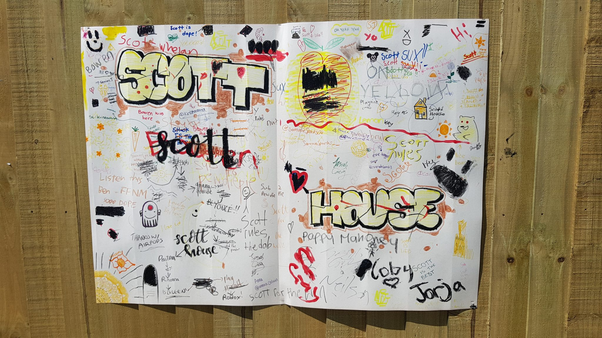
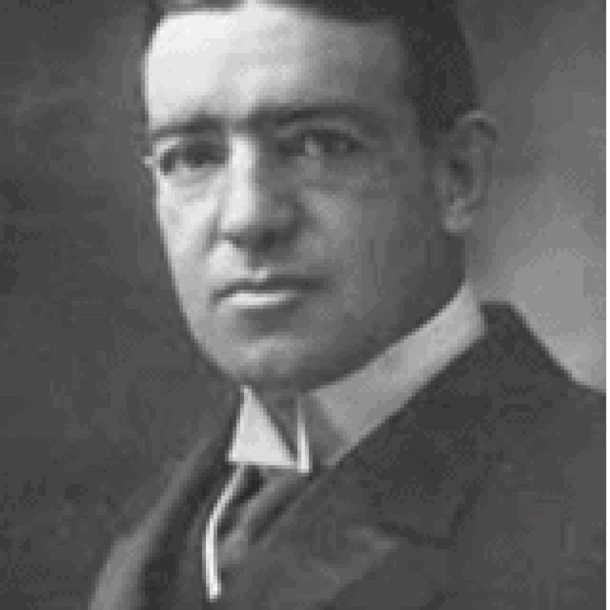
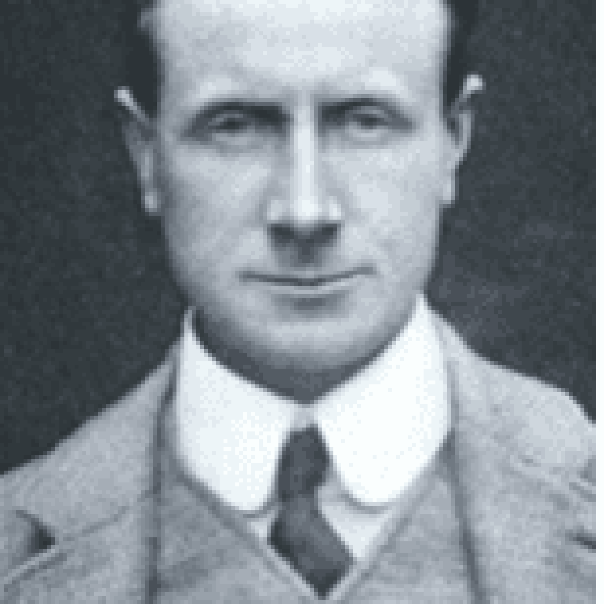
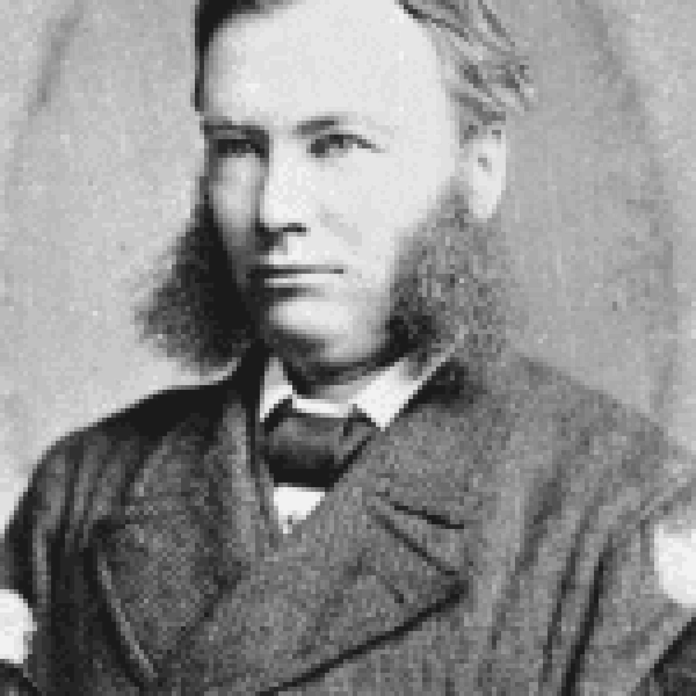
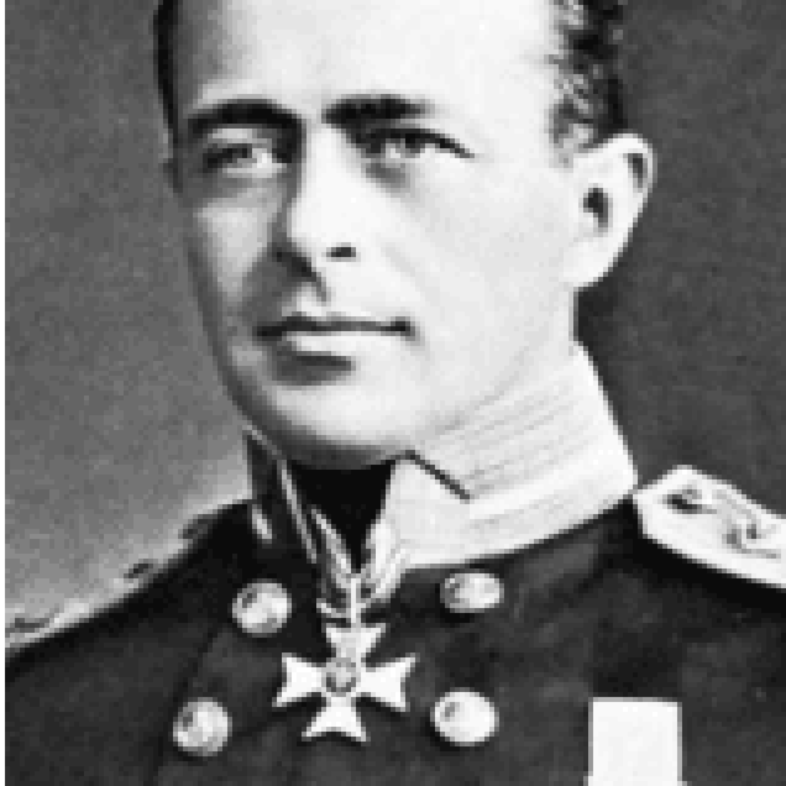

## HOUSE COMPETITION

One of the major events in 1967 was the establishment of a House system in the Secondary Department. The names of the Houses were chosen in order to link the four men with the Historic associations of the school property. The names Scott, Shakleton, and Wilson were synonymous with the Heroic Age of Antarctic exploration. Sir Charles Bowen was the major owner of the property that the school now stands on.

Scott, Shakleton and Wilson were all commemorated Antarctic explorers who were known as visitors to the property. In 1860 Charles Bowen, in the company of Clements Markham (a noted traveller and geographer), crossed the Andes of South America. In 1861 Charles married Markham’s sister. Clements Markham later became President of the Royal Geographic Society and as such laid the plans for Robert Scott’s Antarctic voyages. It is not surprising that he chose to make Scott’s New Zealand headquarters at Middleton.

Each student is allocated to one of the following houses:

## SHACKLETON

## Leadership & Perserverance

## WILSON

## Dependability & Faith

## BOWEN

## Service & Hospitality

## SCOTT

## Courage & Endurance

Sir Ernest Henry Shackleton

Dr Edward Adrian Wilson

Sir Charles Christopher Bowen

Captain Robert Falcon Scott

During the year, sports, cultural and service events become part of the House Competition, toward a trophy at the end of the year. Students are encouraged at each event to wear their house colours and enter into the spirit of the occasion. Each house elects house captains and vice captains.

Competitions include, Athletic Sports, Cross Country, Lunchtime Sports, House Singing, Quiz, Lip Sync and Kapa Haka and others.

## 2025 RESULTS

## SHACKLETON

Points

0

## WILSON

Points

0

## BOWEN

Points

0

## SCOTT

Points

0
