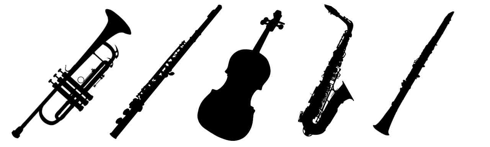

[Home](https://www.middleton.school.nz/musicacademy/)

[Who We Are](https://www.middleton.school.nz/music-who-we-are/)

[Performance Groups](https://www.middleton.school.nz/music-performance-groups/)

[Music Tuition](https://www.middleton.school.nz/music-tuition/)

[Instrument Hire](https://www.middleton.school.nz/instrument-hire/)

[Upcoming Events](https://thegrangetheatre.nz/#events)

Instrument Hire

The Middleton Music Academy has a variety of well-maintained instruments for hire. Usually instruments are hired by pupils taking instrument tuition; however, it may be possible for other MGS pupils to hire instruments if they are wishing to use them in one of our performance groups. 

Please email enquiries to [PAC@middleton.school.nz](mailto:PAC@middleton.school.nz)

## Cost per year

## \*Prices reviewed in Dec 2022

-   [
    
    Violin $120
    
    
    
    ](#)
-   [
    
    Flute $120
    
    
    
    ](#)
-   [
    
    Clarinet $120
    
    
    
    ](#)
-   [
    
    Trumpet $120
    
    
    
    ](#)
-   [
    
    Trombone $120
    
    
    
    ](#)
-   [
    
    Oboe $220
    
    
    
    ](#)
-   [
    
    Cello $220
    
    
    
    ](#)
-   [
    
    Alto Sax $220
    
    
    
    ](#)
-   [
    
    Tenor Sax $220
    
    
    
    ](#)
-   [
    
    Baritone Sax $220
    
    
    
    ](#)
-   [
    
    Bassoon $220
    
    
    
    ](#)
-   [
    
    Double Bass $220
    
    
    
    ](#)
-   [
    
    Piccolo $220
    
    
    
    ](#)

####  MAINTENANCE AND REPAIRS

All reasonable maintenance and repairs are paid for by the department. Accidents and obvious damage by a pupil will be negotiated on a case by case basis. Some instruments have small running costs (e.g. reeds, valve oil) and these are paid by the user. 

Pupils learning the guitar or drums can use school instruments for lessons and practice but these are not hired out. 

