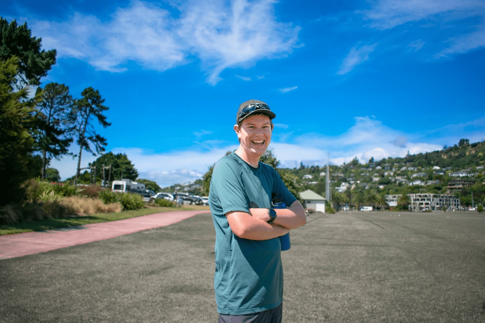

## Alumni Profile

# Izaac Wilson

-   Leaving Year: [2019](https://www.middleton.school.nz/tag/2019/)

I started at Middleton in 2012 in year 6, moving from Methven, a small town in Mid-Canterbury. In my final year at Middleton Grange, I studied Chinese, Business, Statistics, Christian Studies and Geography.  I loved all of my classes and thoroughly enjoyed my teachers, too. Graduating in 2019, I then went and worked for World Vision for 6 months, followed by starting my studies at Canterbury University.  I am Majoring in Chinese and Political Science and International Relations.  At the moment I do not know what I intend to go onto doing, however, I would love to spend some time overseas in China or Taiwan and then see where I am led to go from there.  It may be into a role such as the Ministry of Foreign Affairs, Diplomacy or Border work and translation.  I am excited to see where I can go with my degree and where it leads me.  Can you expect something big from me? We will see.  I hope so and believe that if I follow my passions then I can make a change and difference (it may be something BIG)!

[Back to Alumni](https://www.middleton.school.nz/alumni/)

### More Alumni Profiles

### [Stephanie Hunt (née Mathieson)](https://www.middleton.school.nz/stephanie-hunt-nee-mathieson/)

### [Caleb Croker](https://www.middleton.school.nz/caleb-croker/)

### [Ellen Paynter](https://www.middleton.school.nz/ellen-paynter/)

### [Elisha Nuttall](https://www.middleton.school.nz/elisha-nuttall/)

### [Frances Watson](https://www.middleton.school.nz/frances-watson/)

### [Geoff Wallis (Primary Teacher, 2016–2022)](https://www.middleton.school.nz/geoff-wallis-primary-teacher-2016-2022/)

[See all](https://www.middleton.school.nz/alumni-profiles/)
