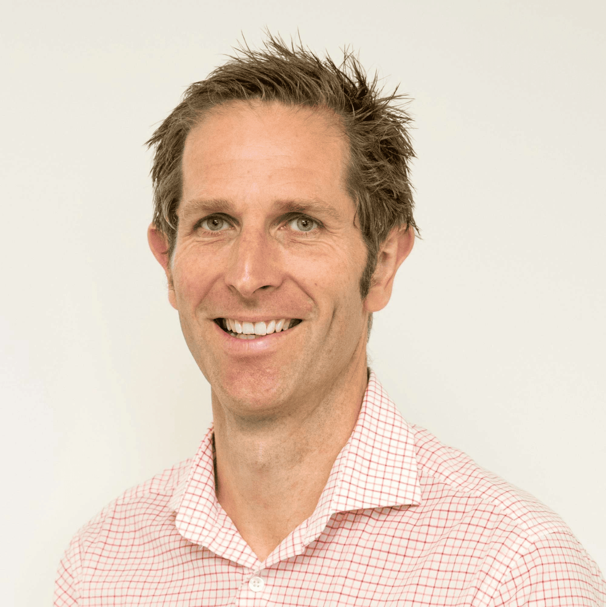

## Alumni Profile

# Jake Couprie

-   Leaving Year: [1995](https://www.middleton.school.nz/tag/1995/)

Kia ora,

I attended Middleton Grange School for the full 13 years of my schooling life, graduating in 1995.

One of my earliest memories was launching myself off the green fort in the primary school as a fully caped “Super Grover,” landing in a large pile of spiky chestnut shells. Thankfully, things improved from there!

Primary and secondary school were happy times, and whilst I was not super academic or even that sporty, I still gave everything a go. What stood out for me throughout my MGS years was the extra effort from various teachers to support me, show me undeserved grace, and point me to Jesus.

Since leaving school in 1995, I have had a varied educational and working career. I initially studied mechanical engineering at ARA, then switched to a civil engineering diploma, before completing my engineering degree at Canterbury University in 2001. After getting married to Thelmarie in 2002, we moved to the Hawkes Bay for work, and after four years, we took time off to study theology in Melbourne.

We returned to Christchurch in 2007, and after a brief time in engineering, I left to start working with a community outreach that supported at-risk youth and adults. After the earthquakes in 2011, I returned to engineering, and I have been in this profession ever since. The mix of civil engineering and social work over the past 23 years has given me a unique approach to my work. Whilst I enjoy engineering, my greatest desire (just like many of my teachers at MGS) is that my colleagues come to know Christ. It’s a constant prayer and work-on for me.

Thelmarie and I have been blessed with four boys (yip, four boys!). When people ask me what I do, my answer is typically this: “I’m a father of four boys, and in my spare time, I do a bit of civil engineering.” Parenting is a really tough gig, and I’m super thankful for my wife and the support of the wider Christian community.

Over the past 47 years, God has tested me and taken me through some deep valleys, but He has never stopped walking beside me. Isaiah 41:10 declares: “So do not fear, for I am with you; do not be dismayed, for I am your God. I will strengthen you and help you…”

For current MGS students, my advice would be this: Wherever life takes you, never look to be defined by your profession, status, or achievements (it’s a slippery slope!), seek God first and the rock-solid identity He gives us in Christ.

Blessings to you all,

Jake.

[Back to Alumni](https://www.middleton.school.nz/alumni/)

### More Alumni Profiles

### [Stephanie Hunt (née Mathieson)](https://www.middleton.school.nz/stephanie-hunt-nee-mathieson/)

### [Caleb Croker](https://www.middleton.school.nz/caleb-croker/)

### [Ellen Paynter](https://www.middleton.school.nz/ellen-paynter/)

### [Elisha Nuttall](https://www.middleton.school.nz/elisha-nuttall/)

### [Frances Watson](https://www.middleton.school.nz/frances-watson/)

### [Geoff Wallis (Primary Teacher, 2016–2022)](https://www.middleton.school.nz/geoff-wallis-primary-teacher-2016-2022/)

[See all](https://www.middleton.school.nz/alumni-profiles/)
