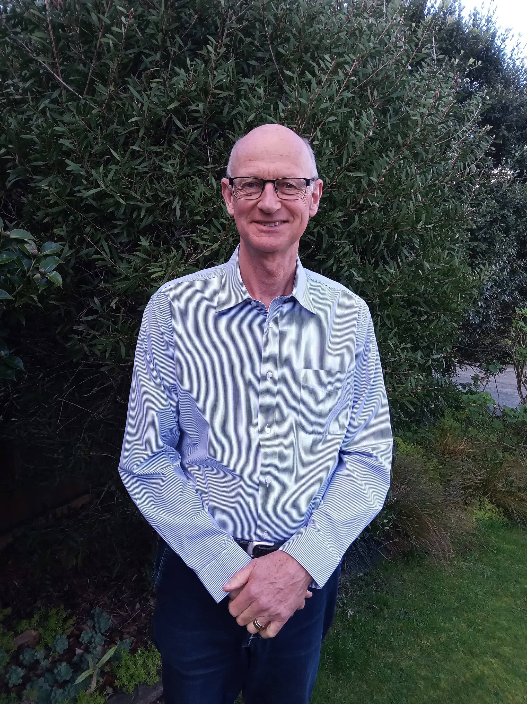

## Alumni Profile

# John Haverland

-   Leaving Year: [1974](https://www.middleton.school.nz/tag/1974/)

My name is John Haverland, and I am an alumni of Middleton Grange School. I have been married to my wife Harriet for 41 years, and we have four children – William, Joanna, Michael and Peter– all of whom are married. We are blessed with 13 grandchildren.

I had the privilege of attending Middleton Grange School from 1964 to 1974. My parents moved from Mairehau to Riccarton in order to be closer to the school. I have very fond memories of those years of schooling and of those who taught me. As I was paging through the Alumni bios I read one by Russell Vaughan, who taught me geography in my high school years, and taught our daughter Joanna! In my senior years the deputy principal, Don Capill, was very influential in my spiritual development. A small group of us met regularly with him and read a few books by Francis Schaeffer. In my last year of schooling, Form 7 as it was then, I was appointed Head boy. That sounds more impressive than it is, as there were only seven students in that year and only two boys, my friend Brian Sparrow and me! The school has grown considerably in the last 50 years. Eric Dunlop was the Principal during most of my time at the school, and I see from the Alumni page that he died in June of this year at the age of 96.

From a young age I had sensed a call to be a pastor, so after leaving school I did a BA at Canterbury University in History and English as I thought this would be a good foundation for theological study. After completing this, I did a year of study on Hebrew and Greek, and went back to MGS as a part-time cleaner.

I then studied at the Reformed Theological College in Geelong, Australia for a Bachelor of Divinity degree. After graduating, I married Harriet van der Kolk, who was a minister’s daughter and so wasn’t at all fazed about being a pastor’s wife. Together we travelled to Calvin Seminary in Grand Rapids, Michigan, USA for a further year of study, and then spent three months travelling in Europe and the Netherlands.

On returning to NZ, we settled in Bucklands Beach in Auckland where we served for seven years in the Reformed Presbyterian Church there. Our four children were born there. Then we moved to the Reformed Church of Bishopdale in Christchurch, and I was the pastor there for 13 years. Our children attended MGS, and I served on the school board for a few years. During this time, the school was seeking integration with the state system, while also seeking to maintain the special Christian character of the school. That was an intense but worthwhile time. Later on, Harriet also served on the Board.

In 2004, our family moved to Pukekohe, and I have served as the pastor here for 20 years. I am 66 years of age and plan to retire from full time ministry at the end of next year, but hope to be able to serve usefully in Pukekohe and other areas after that, Lord willing.

Harriet and I are very committed to Christian education. I have had the blessing of Christian schooling through MGS, and so have our children, and now our grandchildren are at Christian Schools in Pukekohe and Hamilton. The ideal environment for our children and grandchildren is when the home, church, and school are all pointing them to the Lord Jesus Christ and to the word of God in the Scriptures.

I am very grateful to the Lord for all his rich blessing to me in my schooling, marriage, in our family, and in the churches we have served, by God’s grace.

[Back to Alumni](https://www.middleton.school.nz/alumni/)

### More Alumni Profiles

### [Stephanie Hunt (née Mathieson)](https://www.middleton.school.nz/stephanie-hunt-nee-mathieson/)

### [Caleb Croker](https://www.middleton.school.nz/caleb-croker/)

### [Ellen Paynter](https://www.middleton.school.nz/ellen-paynter/)

### [Elisha Nuttall](https://www.middleton.school.nz/elisha-nuttall/)

### [Frances Watson](https://www.middleton.school.nz/frances-watson/)

### [Geoff Wallis (Primary Teacher, 2016–2022)](https://www.middleton.school.nz/geoff-wallis-primary-teacher-2016-2022/)

[See all](https://www.middleton.school.nz/alumni-profiles/)
