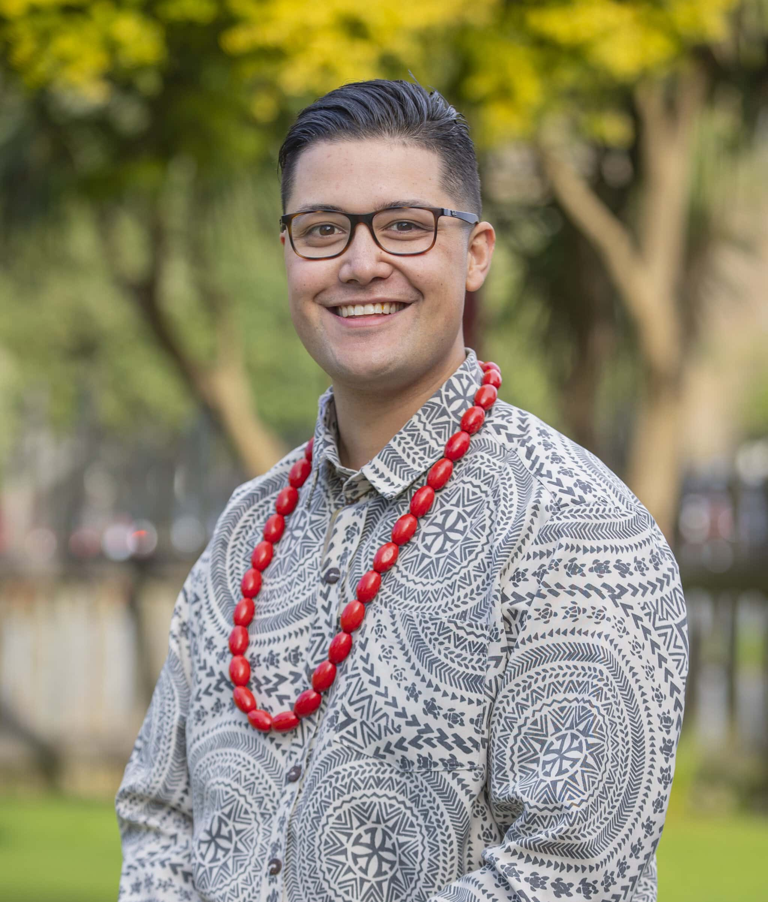

## Alumni Profile

# Josiah Tualamali’i

-   Leaving Year: [2013](https://www.middleton.school.nz/tag/2013/)

Talofa lava, my name is Josiah Tualamali’i. Our Dad came to Aotearoa in the 1980’s from Samoa, and Mum was born in Dunedin to our Pakeha grandparents of predominately Irish, Scottish, and Polish heritage. I am one of five brothers – four of us came to Middleton (with one in his final two years right now) – up Bowen House!

I work in mental health planning, community funding, and children and young peoples wellbeing. I am also studying my Masters at the University of Canterbury in History part-time particularly around Christchurch community stories and Pacific communities experiences here. I love to play the piano and sing. I also collect rare books and papers to do with New Zealand’s Pacific connections, one of the most precious is a copy of the photography album from the New Zealand Governments visit to the Pacific in 1903.

I came to Middleton from 2011 – 2013 where I did my final three years of school. Before this I was at Hillview (which was a great school for me too), and I had been there since I was 6 years old.

In our first few weeks at Middleton, the February 22, 2011 earthquake happened. It meant that it was a very uncertain and difficult time for many in our school community. We also had some students from other schools who came to learn with us for a while; and for a longer period getting to and from school was more complicated for some of us who caught the bus – we needed to catch three buses instead of two with a closed bus exchange and central city.

Three very memorable parts of my school experience were:

1\. Joining the Crescendos. That first year was very welcoming as the year 12’s and 13’s in choir looked out for us all. I don’t think it can be understated how important the awhi from older students is to grow a great team, and we carried that on when we were the older ones. That year we attended the Big Sing Finale as a guest choir, and our families helped us sell the many many metres of reusable glad wrap to fundraise our trip. The special and funny times with Mrs Philippa Chirnside and our choir members throughout those three years were a huge privilege. I also like that we introduced lots of music many of our friends hadn’t heard and maybe opened them up to liking something they didn’t expect. Every morning tea and lunch practice was worth it.

[http://www.r2.co.nz/20110822/session-3-4.htm](http://www.r2.co.nz/20110822/session-3-4.htm) )

2\. History with Mrs Jane Ellis – who retired from Middleton in 2017 after serving an amazing 34 years. Mrs Ellis shared practical stories, didn’t simplify the past and spoke up for how essential it is for us who are non-Māori to know our local histories and understand as best we can the experiences for tangata whenua. One of our key ways of teaching was taking us out into the field. I had the blessing to visit Takapūneke with our class – the wero from that visit stayed with me and impacts how I serve today. I would encourage you to take time to look up the history of this site

*Linked here* – [https://my.christchurchcitylibraries.com/ti-kouka-whenua/takapuneke/](https://my.christchurchcitylibraries.com/ti-kouka-whenua/takapuneke/))  
*A conversation I had last year about studying history at UC* – [https://youtu.be/ro\_fR88Qk2M?si=fUfKk28EywnEhUVD](https://youtu.be/ro_fR88Qk2M?si=fUfKk28EywnEhUVD) )

3\. I had the privilege of being elected by our student body to be their trustee on our school board for the end of 2012 – 2013. At that time I remember the conversations we were having about building the second gym which was great to be part of.

To current students: please stand for this role. It has been a huge part of learning around prayerful people that one of the places I have been called to serve is on boards, and maybe you are too. To student trustees: energetically keep finding ways to increase student voice to the board – your work may not be well known, but it is so important.

In 2014, my first year out of school, I got a law scholarship and decided to study law and politics at the University of Canterbury. I did this for the next two years becoming part of the Uni community and learning more about my Samoan whakapapa which was very meaningful. During that time, I was also finding that what I thought studying law was, and what it is, are different. I also had some challenges which impacted my wellbeing. I failed some courses and left Uni to work with my Dad as a host at a restaurant and bar in town.

Before I came to Middleton, I was part of the Pacific Youth Leadership and Transformation – or PYLAT network who empowered Pacific Youth Voice in democracy, so this carried on. Knowing the importance of mental health support for our friends, we got training and some support and we helped train youth leaders across the city to recognise and support their friends and mentees. All of this helped me when I was off Uni, and also prepared me to serve on our national mental health and addictions Inquiry in 2018 where we travelled the length and breadth of Aotearoa listening to the deep challenges that so many in our communities face, and also the hope that keeps these precious people and their families going.

Since then, I have worked in national mental health and wellbeing planning. At the end of 2018, I went back to Uni confirming that I wanted to study History and Politics and began to keep working on my degree part-time graduating in December 2019. At the same time, my work in supporting boards of companies, teams, and our country with mental health planning deepened and has carried on. In 2023, I was appointed as one of our Children and Young Peoples Commissioners. I see Children and Young People as my boss and my role is to support you / them alongside our team of Commissioners to be heard.

God has been so faithful to our family and to me. Mum and Dad have always done their best financially and yet many times through our childhood it was a struggle. To this day, I still don’t know who it was but someone paid for my three years at Middleton to support my parents and our family. This person/s had gone to my old school office and asked the receptionists to tell my parents. This was a huge help and made it far easier for our family to make the decision to go to Middleton. This generous giver changed my life and my family with what I believe was heavenly inspired support. We all need to be sensitive to the Holy Spirit’s calling when we are called to quietly tautoko and help meet the needs of others – I try and carry this on myself.

I got to interview Simon Barnett for a school project at Hillview more than 15 years ago. Simon is an awesome member of our Middleton community and the Barnett’s have blessed Middleton in many ways.

He said “start small, think big” and this helps me daily.

[Back to Alumni](https://www.middleton.school.nz/alumni/)

### More Alumni Profiles

### [Stephanie Hunt (née Mathieson)](https://www.middleton.school.nz/stephanie-hunt-nee-mathieson/)

### [Caleb Croker](https://www.middleton.school.nz/caleb-croker/)

### [Ellen Paynter](https://www.middleton.school.nz/ellen-paynter/)

### [Elisha Nuttall](https://www.middleton.school.nz/elisha-nuttall/)

### [Frances Watson](https://www.middleton.school.nz/frances-watson/)

### [Geoff Wallis (Primary Teacher, 2016–2022)](https://www.middleton.school.nz/geoff-wallis-primary-teacher-2016-2022/)

[See all](https://www.middleton.school.nz/alumni-profiles/)
