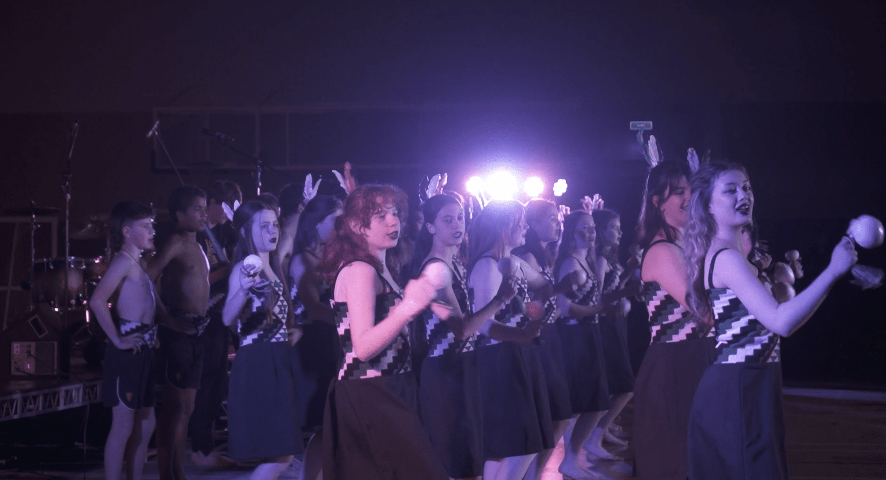
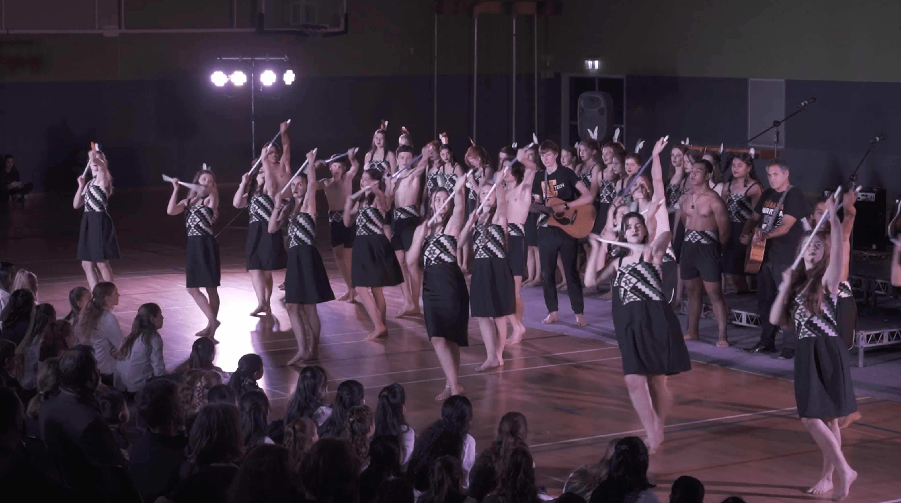
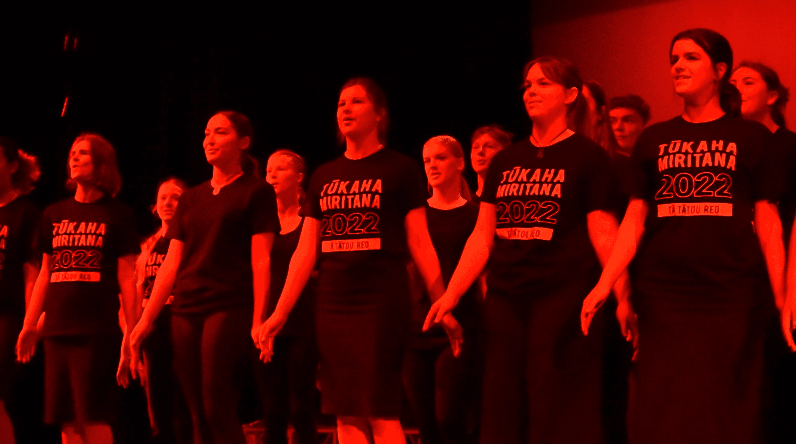
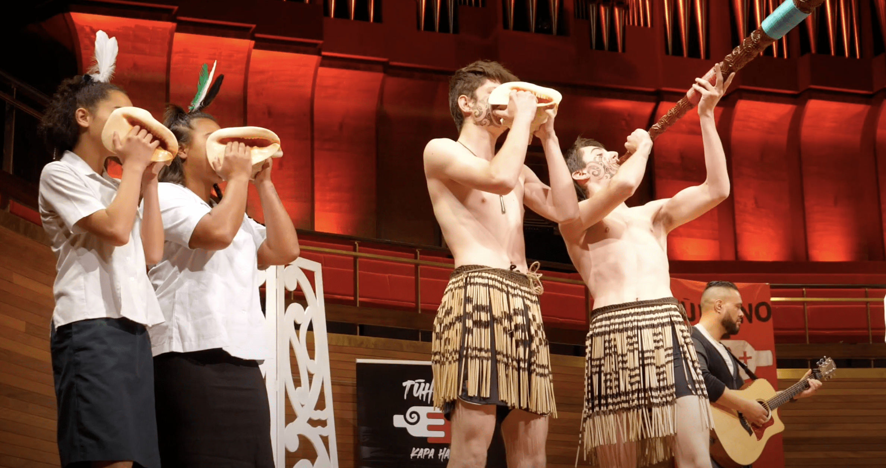
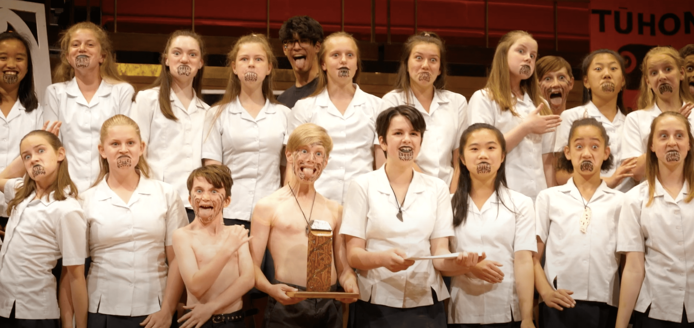
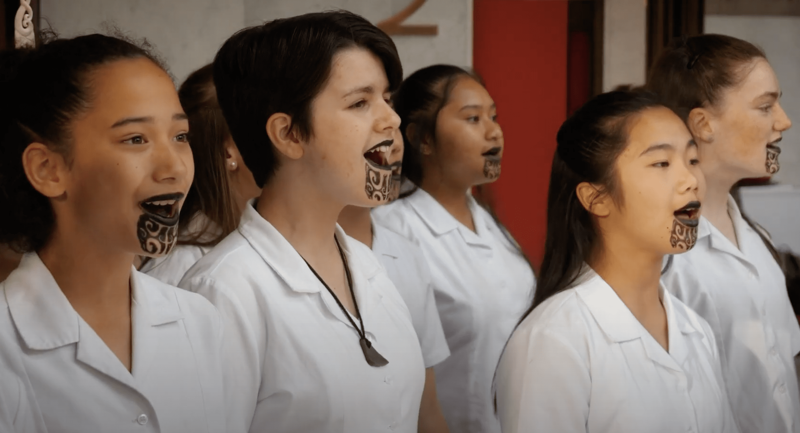

-   [Curriculum & Subjects](https://www.middleton.school.nz/curriculum-subjects/)
-   [Course Selection](https://www.middleton.school.nz/course-selection/)
-   [Careers Department](https://www.middleton.school.nz/careers-department/)
-   [Leadership](https://www.middleton.school.nz/leadership/)
-   [Service](https://www.middleton.school.nz/service/)
-   [Remote Learning](https://www.middleton.school.nz/remote-learning/)
-   [NCEA Information](https://www.middleton.school.nz/ncea-information/)
-   [Learning Support](https://www.middleton.school.nz/learning-support/)
-   [Fostering Strengths](https://www.middleton.school.nz/fostering-strengths/)
-   [Pastoral Care](https://www.middleton.school.nz/pastoral-care/)
-   [BYOD](https://www.middleton.school.nz/byod/)
-   [Library Dashboard](https://aiscloud.nz/MDD00/#!landingPage)
-   [Overseas Trips](https://www.middleton.school.nz/overseas-trips/)
-   [Sport](https://www.sporty.co.nz/middleton)
-   [Performing Arts](https://www.middleton.school.nz/performing-arts/)

## MGS Performing Arts

## KAPA HAKA

### What we do

-   Regular Weekly Rehearsals
-   Practice of haka & waiata significant to both Middleton Grange & Maori Culture
-   Compete in local competitions 
-   Perform at school events

### You will grow in

-   Relationships with eachother
-   Knowledge &  Cultural History
-   Performance Techniques

### Opportunities include

-   Mihi Whakatau
-   Tu Kaha
-   Tuhono Festival
-   Prizegivings
-   Haka Competition

**Kapa Haka is run by Matua Steve Reid & managed by Matua Pairama Moon**

## Y9-13

## Monday Whanau Time

## Friday Lunch

## Y7-8

## Monday Whanau Time

## Friday Lunch

[Email Matua Pai](mailto:p.moon@middleton.school.nz)

[Learn the School Haka](https://www.youtube.com/watch?v=Qlpy8e2wX6g)

