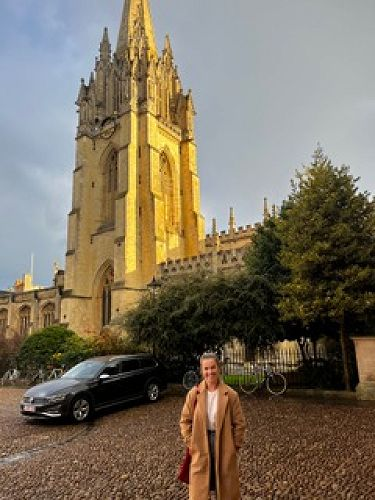

## Alumni Profile

# Kate Pickworth

-   Leaving Year: [2012](https://www.middleton.school.nz/tag/2012/)

I graduated from Middleton Grange High School in 2012, which is where my love of history was fostered under the fantastic teaching of Jane Ellis. I went on to study history at the University of Canterbury where I obtained a Bachelor of Arts with First Class Honours in 2016 and a Master of Arts with Distinction in 2019. I served on the Canterbury Historical Association committee for six years and am passionate about connecting the local community with history. I have also tutored for the University of Canterbury History Department for the past two years and love helping undergraduate students engage in historical discussions. Currently, I am attending the University of Oxford as the Edward Gibbon Wakefield Scholar as a part of my Doctor of Philosophy. Here, I am analysing women’s roles in creating propaganda in Britain during the First World War.

[Back to Alumni](https://www.middleton.school.nz/alumni/)

### More Alumni Profiles

### [Stephanie Hunt (née Mathieson)](https://www.middleton.school.nz/stephanie-hunt-nee-mathieson/)

### [Caleb Croker](https://www.middleton.school.nz/caleb-croker/)

### [Ellen Paynter](https://www.middleton.school.nz/ellen-paynter/)

### [Elisha Nuttall](https://www.middleton.school.nz/elisha-nuttall/)

### [Frances Watson](https://www.middleton.school.nz/frances-watson/)

### [Geoff Wallis (Primary Teacher, 2016–2022)](https://www.middleton.school.nz/geoff-wallis-primary-teacher-2016-2022/)

[See all](https://www.middleton.school.nz/alumni-profiles/)
