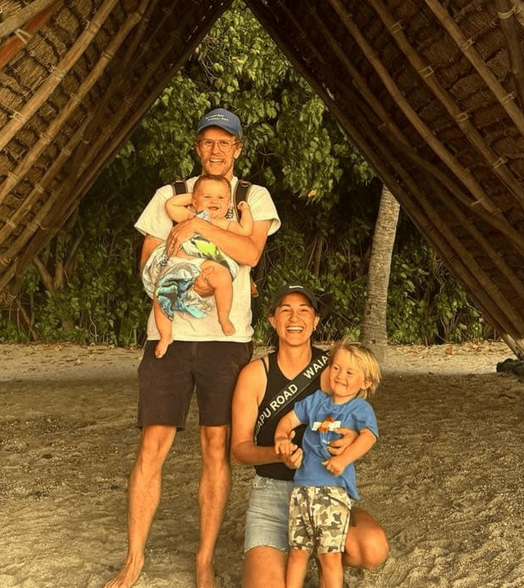

## Alumni Profile

# Letitia Gager (née McConnell)

-   Leaving Year: [2009](https://www.middleton.school.nz/tag/2009/)

Ko Tongariro te Maunga  
Ko Whanganui te Awa  
Ko Taupo-nui-a-tia te Moana  
Ko Arawa te Waka  
Ko Mau raua ko Judah oku tamąiti  
Ko Barry toku hoatane  
Ko Ngati Hikairo te Hapū  
Ko Ngati Tūwharetoa te Iwi  
Ko Otautahi tōku papa kainga!  
Ko Letitia tāku ingoa

My name is Letitia Gager (maiden name McConnell) and while my whānau are from the North, I’m a born and raised Christchurch kid. My husband, Barry, and I live in Northland where we are the directors of Youth With A Mission (YWAM) Zion. Barry is from Colorado, and we have two amazing boys, Mau (3yrs) and Judah (1yr).

I started at Middleton when I was 5yrs old and attended until the first term of year 13. Sadly, I left year 13 early as I was experiencing stress outside of school which impeded my ability to focus in my final year. I was grateful for Mrs Velluppillai’s compassion as I processed the decision in her office, and for Mātua Harrison noticing I wasn’t my usual self, so checking in with me and my parents. I often reflect on how much that level of care and intentionality meant and still means to me.

The fact that I started MGS as a 5yr old with friends that are still my friends to this day is awesome, and that my grandparents lived right through the back fence of the school so family was always close by. I loved my netball and volley and have the best memories in tournaments with my closest friends. I was a major chatterbox in class and that was always noted in my school reports, haha. Some of the best memories were school fiesta’s where my siblings and I loved getting amongst the white elephant early and hoping to score a cheap bike for the day.

At 16, I vividly remember finishing one of my end-of-year exams and heading straight to the airport for a missions trip to Fiji with YWAM. A team took me in for two weeks of their eight-week outreach abroad, even though I never planned on doing a discipleship training school in the future. Following that trip, and into my early 20s, there were times I walked closely with the Lord, but also moments when I chose my own way. Still, I always had a deep desire to be part of something much larger than what I was surrounded by at the time. I knew the Lord wanted my *whole* life, and not just parts of it.

YWAM eventually found its way into my life again when one of my good friends printed the enrolment forms out and had me sign up in 2013 (thanks Dani Bailey!). I completed my DTS and went on to staff at that same base, where I eventually became engaged to my now husband. Barry and I finished up with YWAM in 2015 and after a stint of living in America, I studied Counselling with Laidlaw College for 3yrs. It was during this time that I counselled at Hillmorton High School and Middleton Grange, working alongside high schoolers who were in situations much like I had been 10 years earlier. My husband worked at Haeata as a teacher aide and ultimately we just loved working alongside youth in Christchurch.

While studying at Laidlaw, the Lord put it on the director of YWAM Zion’s heart to invite my husband and I to return as her successors and the new ministry directors. I had come to know the Lord well enough to discern when it was genuinely Him inviting us, so after a lot of prayer and processing with good mentors and the Lord, we gave our ‘yes!’ and took on the base as directors in January 2020.

Five years of schools and a global pandemic later, we currently have a school of 22 students from 10 different nations on week five of their DTS in Whangārei city. My husband and I travel as speakers on schools at bases around NZ and abroad, and particularly love speaking on Holy Spirit, Cross-Cultural Missions, and Relationships (thank you counselling degree!). We have the coolest staff team, 18 world-changers from the ages of 18-32yrs from all around the globe who love Jesus and love international missions. As a team we train, disciple, and send out young people to be the hands and feet of Jesus in our region, the Pacific Islands, and Asia. We love seeing young people encounter the Lord and go all-in for Christ being made known wherever He calls them for the short or long-term.

My advice to current students would be to do a DTS! Haha. But seriously. It’s just one amazing way to step aside from the hustle and bustle, establish your relationship with the Lord amongst community, and perhaps discover more of what you’re passionate about before spending time and money elsewhere. YWAM and overseas missions may not be everyone’s cup of tea for the long-haul, but I can guarantee you that no time is wasted when it’s spent on Jesus.  
Whether you do a DTS or not, just place Christ at the centre, and be willing to make radical changes throughout life to keep it that way.

[Back to Alumni](https://www.middleton.school.nz/alumni/)

### More Alumni Profiles

### [Stephanie Hunt (née Mathieson)](https://www.middleton.school.nz/stephanie-hunt-nee-mathieson/)

### [Caleb Croker](https://www.middleton.school.nz/caleb-croker/)

### [Ellen Paynter](https://www.middleton.school.nz/ellen-paynter/)

### [Elisha Nuttall](https://www.middleton.school.nz/elisha-nuttall/)

### [Frances Watson](https://www.middleton.school.nz/frances-watson/)

### [Geoff Wallis (Primary Teacher, 2016–2022)](https://www.middleton.school.nz/geoff-wallis-primary-teacher-2016-2022/)

[See all](https://www.middleton.school.nz/alumni-profiles/)
