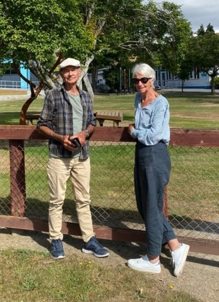

## Alumni Profile

# Lyn Campbell

-   Leaving Year: [1993](https://www.middleton.school.nz/tag/1993/)

My 10 years as Deputy Principal at Middleton Grange School had a significant impact upon me and my family.

In 1985, following a variety of teaching positions initially in primary schools, I made the shift to secondary and taught in many parts of New Zealand. On reflection, I see God’s leading in all these contexts, particularly when Fraser and I decided to move to the Hokianga area followed by several years in Pukekohe. The experience of living in predominantly Maori contexts – both rural and urban – brought life changing experiences which shaped our values and understandings of Te Ao Maori and our bicultural history. I am very thankful to God, particularly as I see how that experience impacted our three children and the way they live their lives today. I also deeply appreciate the impact this has had upon our six granddaughters, all of whom have grown up with clear understandings and appreciation of their bicultural heritage and current contexts in New Zealand.

Joanna, Jono, and Kim began their education at Middleton Grange School in 1985 – respectively in Year 13, 9, and 8. They recall the caring attitude of the staff, great outdoor education camps, opportunities for meaningful discussions about Christian faith, and opportunities to establish enduring friendships.

Our three children were all competitive swimmers. A highlight of their introduction to Middleton Grange was the 1985 swimming sports when Kim won every final in the Under 12’s and Joanna burned off Vic Pollard (my fellow Deputy Principal) in the Staff vs Students relay. Bowen House creamed it!

Highlights I recall are the first Middleton Grange Wananga in 1990 held in partnership with what is now called Laidlaw College. 200 people gathered to discuss topics such as ‘Questions relating to Cross-cultural Issues in NZ’ and ‘A Biblical Approach to Racial Issues in NZ’ led by Maori Kaumatua.

I remember the brilliance of drama and musical productions led by the inspirational partnership of Michael McCormack and Richard Marrett – legends! I valued the short term mission experiences overseas – our son Jono loved the Tongan trip, living with a local family and playing rugby in bare feet. I loved the school’s commitment to forward thinking in terms of the World Vision 40 Hour Famine, especially when Fraser and I were able to visit projects in India and Bangladesh while on sabbatical, to see the impacts of the Middleton Grange effort at a local level. I deeply appreciated the place of prayer in school life, as did my whanau. Staff were approachable, caring, and supportive. Although Middleton Grange’s culture tended to be conservative, there was always room for constructive discussion, even if we agreed to disagree.

In 1992, I requested the Board to review and reconsider the role of women in leadership at MG. It took eight months to respond, but it did result in them positively addressing the imbalanced representation of women in leadership positions by recognising the need for multiple talents plus the ‘best person for the job’. I was grateful to God for the attitude and wisdom of Board Chair David Brown.

I had a long held ‘big idea’ of developing an educational enrichment center to develop giftedness in children, working with other Christchurch schools. In 1993, I took the plunge and resigned from Middleton Grange School. I leased a block of classrooms and began the establishment of the centre in the city.

In 1995, I became involved in a consultation involving 900 children aged 7 to 13 years, plus parents, caregivers, and service providers in Christchurch, aimed at gathering information for CCC on how children experienced life in the city. This resulted in the development of a Strategy for Children to integrate quality policies which placed children and families at the center of policies.

In 1996, I was appointed Children’s Advocate for CCC – a unique opportunity to influence change locally, nationally, and internationally through involvement with an international network ‘Cities of Tomorrow’. This was a catalyst for learning, creativity, and developing effective cross sector partnerships and initiatives, and it was a constant reminder of God’s presence and influence in opening doors in many situations.

I became a Commissioner in the NZ Families Commission in 2004 – an initiative designed to increase public awareness and informed debate relating to NZ families, plus stimulation of relevant research to inform government policy. My portfolios were local government, education sectors, and faith communities. It was a huge privilege to work with Commissioners of the calibre of Sir Kim Workman and Sir Mason Durie. It was also a steep learning curve, especially around the challenges of the adversarial culture of our NZ government, the difficulties of embedding genuine and lasting cross sector collaboration in a democracy, and developing informed research, policies, and practices which survive and endure changes of government and public service bureaucracies. In all of the contexts, I have experienced God’s presence – opening and closing doors and bringing opportunities to be ‘salt and light’.

Since that period, I have invested time and energy in various national roles within the Baptist network plus Boards, external reference groups, and advising and review groups in different sectors. Now I am retired! I love the opportunities God has brought through my current role as Chaplain to the Riwaka School community – students, staff, and families. Fraser and I are constantly grateful to God for our own whanau and the opportunities within our own community – if we keep our eyes open and expect to be God’s ‘salt and light’!

If I was to give advice to current Middleton Grange senior students and staff, I would say:

– Develop God-given wisdom, discernment, and creative thinking. Aim to bring God’s love, justice, and the courage to be ‘salt and light’ outside of your comfort zone.

– Prepare for uncharted territory now and in the future in this rapidly changing world.

– Be a lifelong learner, especially in understanding God’s purpose for you.

– Develop competence and credibility so you can influence others and bring positive change in this world.

– Become an ‘adaptable’ leader – listen and learn.

– Take a ‘Gap Year’ and serve amongst the poor.

– Stay connected with family.

– Keep a healthy sense of humour!

– Laugh a lot!

– Follow Jesus – who knows you through and through, yet loves you UNCONDITIONALLY!

Lyn Campbell (QSM for public service)

[Back to Alumni](https://www.middleton.school.nz/alumni/)

### More Alumni Profiles

### [Stephanie Hunt (née Mathieson)](https://www.middleton.school.nz/stephanie-hunt-nee-mathieson/)

### [Caleb Croker](https://www.middleton.school.nz/caleb-croker/)

### [Ellen Paynter](https://www.middleton.school.nz/ellen-paynter/)

### [Elisha Nuttall](https://www.middleton.school.nz/elisha-nuttall/)

### [Frances Watson](https://www.middleton.school.nz/frances-watson/)

### [Geoff Wallis (Primary Teacher, 2016–2022)](https://www.middleton.school.nz/geoff-wallis-primary-teacher-2016-2022/)

[See all](https://www.middleton.school.nz/alumni-profiles/)
