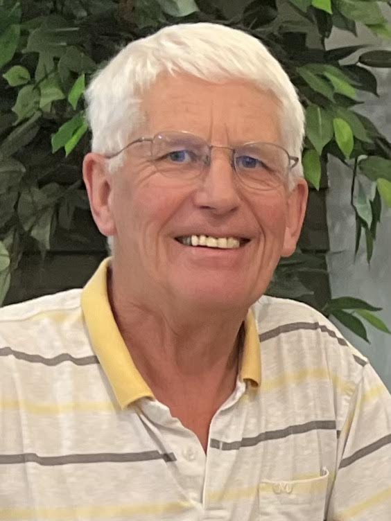

## Alumni Profile

# Malcolm Sparrow

-   Leaving Year: [1970](https://www.middleton.school.nz/tag/1970/)

I’m one of the “old-timers” who was at Middleton Grange more than 50 years ago. The school had been going for just three years when I started in Form 3 (Year 9) in 1967. I left at the end of my 6th form year in 1970 with U.E. (University Entrance). My three younger siblings also did their secondary years at Middleton Grange.

I have fond memories of the school, although back then I was one of the relatively quiet and shy kids. Mr Dunlop was rector. Mr Capill was deputy (I think), and other teachers’ names like Miss Wilson (Maths), Mr McMillan (Science), Mrs Hill, Mr Riddell and Mr Hawkins spring to mind.

I can still picture the green VW Kombi vans used to transport kids to school from all over Christchurch although I wasn’t one of them. My family lived in Woolston and most days I biked the 10 kms to school on my 3-speed, often along Moorhouse Ave and Blenheim Road, major thoroughfares which back then carried a fraction of the traffic they do today. I was only ever caned once at school – for throwing a water-filled sponge in the biology lab! Science was never my favourite subject. Geography and History were, although I actually enjoyed Algebra too!

I did well at the school academically, at least in my first two years before slackening off somewhat and having to sit the U.E. exams instead of being accredited! I worked hard at that point and passed.

The Christian teaching (and all-round atmosphere) provided by Middleton Grange gave me a solid foundation for life. The old school verse “In Thy light shall we see light” still rings true.

The first 20 years of my working life were spent in the insurance field, initially on the clerical side and then in sales. In the 1990s, I compiled and marketed a yearly Christian directory in each of Christchurch, Wellington, and Auckland.

In 1996, my wife Karen and I, along with our two young daughters, moved to Tawa, Wellington – one of NZ’s best urban communities. In the early 2000s, I became very much involved in the local community, serving on the Tawa Community Board for several years, including a chairing role. From 2013 to 2021 I was a full-time Wellington City councillor, particularly enjoying the community aspect of that role and promoting community preparedness initiatives.

Towards the end of 2021, I retired, and we moved 30 minutes up the road to Paraparaumu on the Kāpiti Coast. In retirement, I remain involved in church and community life (the “salt and light” role where possible in our increasingly secular society) and that includes organising twice-yearly BBQs in my own street. I enjoy photography (amateur level), working on the Sparrow family tree, geography & travel (especially US & UK), exploring NZ (especially Central Otago) in our motorhome, off-road cycling (nothing more challenging than the Lake Dunstan trail), and walking the dog. We are close to our two married daughters (in their early 30s) and three young grandchildren who provide us with lots of pleasure.

I made it to the 25th anniversary of Middleton Grange in 1989, and to the 50th anniversary in 2014. It was wonderful to see how the school had progressed and God had blessed it over that half-century.

Earlier this year, I got in touch with some ‘old’ classmates in Christchurch and met with a small group a few days later. It’s great to maintain those contacts, especially considering we’re all now hitting the big 7-0! Even though some of us reside out-of-town, we hope to get together at least once or twice a year in the future. At whatever stage of life, I think that relationships with other people are all-important. And don’t put off renewing/maintaining a friendship. You never know what might be around the corner!

[Back to Alumni](https://www.middleton.school.nz/alumni/)

### More Alumni Profiles

### [Stephanie Hunt (née Mathieson)](https://www.middleton.school.nz/stephanie-hunt-nee-mathieson/)

### [Caleb Croker](https://www.middleton.school.nz/caleb-croker/)

### [Ellen Paynter](https://www.middleton.school.nz/ellen-paynter/)

### [Elisha Nuttall](https://www.middleton.school.nz/elisha-nuttall/)

### [Frances Watson](https://www.middleton.school.nz/frances-watson/)

### [Geoff Wallis (Primary Teacher, 2016–2022)](https://www.middleton.school.nz/geoff-wallis-primary-teacher-2016-2022/)

[See all](https://www.middleton.school.nz/alumni-profiles/)
