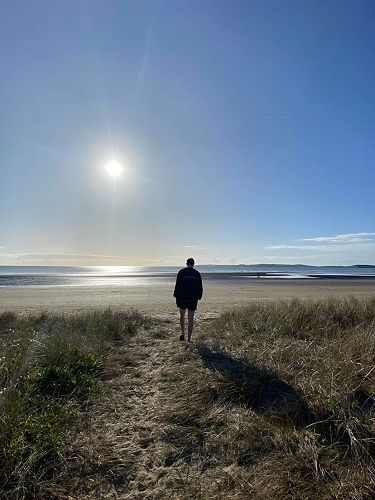

## Alumni Profile

# Mason Murphy

-   Leaving Year: [2021](https://www.middleton.school.nz/tag/2021/)

Since finishing school last year, I’ve completed my first year at Laidlaw College in Christchurch studying a Bachelor’s in Theology. I’ve also become involved in coaching basketball, youth leading, and training for a half-marathon. I’m looking forward to all the opportunities still to come next year, which will hopefully include playing representative basketball again and an overseas mission trip.

[Back to Alumni](https://www.middleton.school.nz/alumni/)

### More Alumni Profiles

### [Stephanie Hunt (née Mathieson)](https://www.middleton.school.nz/stephanie-hunt-nee-mathieson/)

### [Caleb Croker](https://www.middleton.school.nz/caleb-croker/)

### [Ellen Paynter](https://www.middleton.school.nz/ellen-paynter/)

### [Elisha Nuttall](https://www.middleton.school.nz/elisha-nuttall/)

### [Frances Watson](https://www.middleton.school.nz/frances-watson/)

### [Geoff Wallis (Primary Teacher, 2016–2022)](https://www.middleton.school.nz/geoff-wallis-primary-teacher-2016-2022/)

[See all](https://www.middleton.school.nz/alumni-profiles/)
