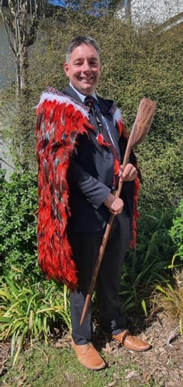

## Alumni Profile

# Matt Barlow

-   Leaving Year: [2022](https://www.middleton.school.nz/tag/2022/)

#### **Tēnā koutou katoa**  
**Ka mihi au ki te maunga o Tongariro**  
**Ka mihi au ki te awa o Whanganui**  
**Ka mihi au ki te iwi o Tūwharetoa**  
**No Taumarunui ahau**  
**Ko Matt Barlow tōku ingoa**

Hi everyone,

My name is Matt Barlow, and I am originally from the central North Island from a little town called Taumarunui. I did not attend Middleton Grange School as a student; however, in 2008 I started there as a teacher in the Physical Education department. I finished my time at Middleton as the Head of Middle School in October of 2022, taking up my new role as Principal of Amuri Area School in the rural North Canterbury town of Culverden in Term 4 of last year.

For me, Middleton Grange School was a wonderful place to work. This was especially made so by the students and staff who I interacted with in my time there. He aha te mea nui o te ao? He tangata, he tangata, he tangata! What is the most important thing in the world? It is people, people, people! I have such amazing memories of classes, Year 9 and Year 12 Camps, coaching the 1st XI Football team and a long involvement with the OPC/Hillary Challenge Team. Many of the students that I coached have stayed in touch after they had left school, and I am always excited to hear updates of the lives they are now leading.

My colleagues were also a highlight of my time at Middleton, with a great deal of laughs (and tears) over many years of doing life together both in and out of school. The love and support of colleagues like Ruth Velluppillai, Megan Cassidy, Rod Thompson, Andy Given, Andy O’Neill, Ingrid Gomez, Matt Vannoort, Simon Bisseker, and Shane McConnell was incredible, and I miss them and many others dearly.

I was blessed to serve under three wonderful Principals in Mark Larson, Richard Vanderpyl and most recently Mike Vannoort. I am grateful to each of them for the way that they modelled Godly leadership. During my time as a senior leader at Middleton, both Richard and Mike have helped shape who I am as an educational leader and Principal. Their prayer, trust, and encouragement were wonderful to be on the receiving end of.

Our move to Culverden as a family has been great. Our children (aged 16, 14 and 11) have settled into rural life and are making connections through school and sport. We are enjoying being part of a small community and the opportunities to serve the Lord, even though we are now in a secular environment. It is our goal to live out the mantra of ‘being blessed in order to be a blessing’ and to serve all who we come into contact with. I do miss Middleton Grange; however, we know that this move has been part of a bigger picture plan!

If I was to give some advice to Middleton students, I would say the following. It is sometimes hard to see just how much of a blessing Middleton Grange School is and it might not be until you are on the outside looking back or in that you see this. Take every opportunity you can to appreciate it for what it is. We can take for granted the true measure of what the Lord is doing through the school. I would also encourage every student to intentionally consider how they can contribute, be involved, and truly live out the commandment to love your neighbour as yourself.

I am so grateful for the 15 years I spent as part of the Middleton whānau, and I keep the school and community in my prayers. I often reflect on my time there with a great deal of fondness.

Ngā mihi nui

Matt

[Back to Alumni](https://www.middleton.school.nz/alumni/)

### More Alumni Profiles

### [Stephanie Hunt (née Mathieson)](https://www.middleton.school.nz/stephanie-hunt-nee-mathieson/)

### [Caleb Croker](https://www.middleton.school.nz/caleb-croker/)

### [Ellen Paynter](https://www.middleton.school.nz/ellen-paynter/)

### [Elisha Nuttall](https://www.middleton.school.nz/elisha-nuttall/)

### [Frances Watson](https://www.middleton.school.nz/frances-watson/)

### [Geoff Wallis (Primary Teacher, 2016–2022)](https://www.middleton.school.nz/geoff-wallis-primary-teacher-2016-2022/)

[See all](https://www.middleton.school.nz/alumni-profiles/)
