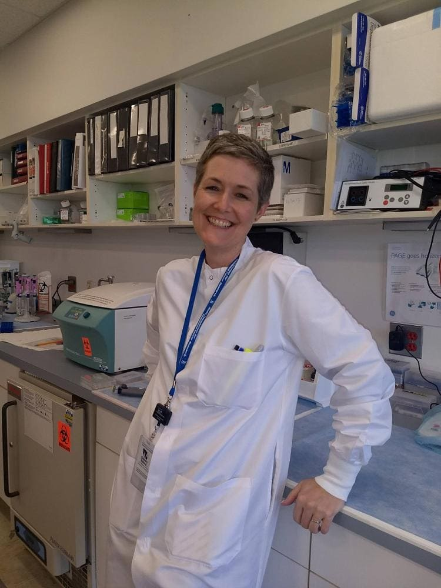

## Alumni Profile

# Melanie Grant

-   Leaving Year: [1989](https://www.middleton.school.nz/tag/1989/)

My favorite memories of MGS include production time with Mr McCormack, French classes with Mr McConnell & Mrs Hocking, English with Miss Braithwaite, Music composition with Mr Kent & Classics with Dr Sally Davey & another teacher whose face I can vividly remember but whose name I have unfortunately forgotten. I was exposed to teachers who taught me how to think, rather than just regurgitate what I was supposed to remember. On the other end of the spectrum, Mr Pollard’s math classes instilled the fear of Beezelbub, while Mr Hawkins’ math classes were entertaining but I still have no idea what the mathematical concept was that lay behind ‘Mummies & daddies & Para rubber pools’. I enjoyed Biology and wanted to continue with it in 6th form. Alas, a well-intentioned, but misguided teacher who shall remain nameless advised me that I should ’stick with the arts’, sending me into an arts & humanities wilderness, which I eventually stumbled out of 16 years later. God is gracious. I spent a year overseas in Costa Rica in 1990 as an exchange student, completed my first year of a BA at Canterbury in 1991 but decided to work for a while until I figured out what I wanted to do with my life. I took the first job that came along, which happened to be as a flight attendant for Air Nelson/Air NZ & spent the next 9.5 years flying around NZ & the world. During this time I fell in love with a wonderful man, and in 2023 we’ll celebrate our 30th wedding anniversary. After almost 10 years flying around the world I realized I needed to do something more with my brain and took a small business course. We opened our first business, a small importing & retail shop & enjoying systemizing & operationalizing that before we sold it and moved to Scotland to continue life’s adventure. There my husband enjoyed working in another small business and renovating ancient buildings on a 500 year old estate while I re-trained as a nutritionist. An opportunity arose for me to have my own nutrition practice in a health clinic in Nelson, so we returned to NZ. After 2 years I felt the need for more training and returned to Otago University at age 36 to become a doctor. When I was not admitted to Medical School at the end of the first year I was devastated. Now what? I had felt one of the clearest calls of my life. Had I misunderstood? What was God up to? After wiping away the tears, picking myself up & dusting off my battered illusions, I enrolled for the 2nd year and focused on subjects I enjoyed and/or was good at. As a result I discovered that I hated anatomy & physiology and fell in love with immunology. I proceeded to complete a Bachelor of BioMedical Sciences with Honors in Infection and Immunity and from there ended up doing a PhD in Immunotherapy for Cancer. It was in the 3rd year of my PhD when I had a blinding flash of the obvious: I was going to be a doctor. Just not THAT kind of doctor. Prior to submitting my PhD thesis I was offered the opportunity to do a postdoctoral fellowship in the clinical and translational research lab of a fellow kiwi who has made a name for herself in the field of cell therapy for cancer and viral infections after bone marrow transplant. So in 2016 Darryl & I moved to Washington DC, where I worked at Children’s National Hospital for 4.5 years. I was recruited to a faculty position at Emory University in Atlanta in February 2021 and in Oct 2022 I will put on my next hat as Director of Correlative Studies for the new Marcus Pediatric Advanced Cellular Therapies (MPACT) center at Children’s Hospital of Atlanta. We are enjoying our new life here in Atlanta and all that God has for us in this new season.It’s a long way from Woodend and the fulIfillment of many dreams that were kindled thanks to my years at MGS with the teachers who inspired me to follow God and study to show myself approved and get trained so I could use my God-given skills and talents to the best of my ability. It’s been a wild ride with many ups and downs and struggles and sorrows scattered with joys, but God has been faithful and has been my rock and my source of strength. It’s a pleasure to share a highly abbreviated version of our journey and I look forward to reading more stories from other MGS alumni.

[Back to Alumni](https://www.middleton.school.nz/alumni/)

### More Alumni Profiles

### [Stephanie Hunt (née Mathieson)](https://www.middleton.school.nz/stephanie-hunt-nee-mathieson/)

### [Caleb Croker](https://www.middleton.school.nz/caleb-croker/)

### [Ellen Paynter](https://www.middleton.school.nz/ellen-paynter/)

### [Elisha Nuttall](https://www.middleton.school.nz/elisha-nuttall/)

### [Frances Watson](https://www.middleton.school.nz/frances-watson/)

### [Geoff Wallis (Primary Teacher, 2016–2022)](https://www.middleton.school.nz/geoff-wallis-primary-teacher-2016-2022/)

[See all](https://www.middleton.school.nz/alumni-profiles/)
