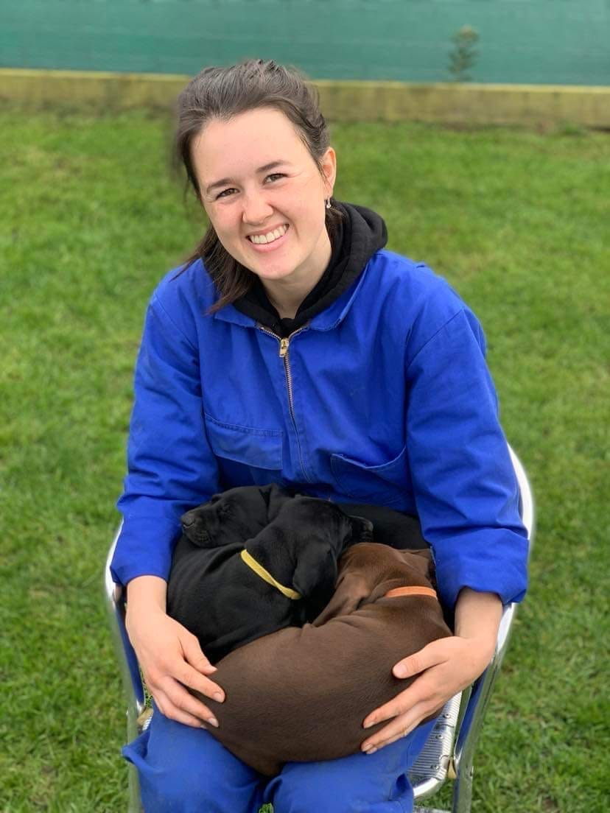

## Alumni Profile

# Mercedes Marshall

-   Leaving Year: [2018](https://www.middleton.school.nz/tag/2018/)

When asked to share my journey since graduating high-school, I felt very honoured and excited to be able to share with fellow alumni and up-coming graduates all God has done in my life since finishing up at Middleton.

I transitioned from Hillview Christian School to Middleton Grange going into Year 11 at the start of 2016. I spent my final 3 years of school at Middleton, and I truly believe the opportunities and growth that occurred in those years were so key to where I am now.

A lot of my Middleton years were spent in the music rooms, as my passion for songwriting flourished with the input from Mr Bisseker and being involved with Perco for 2 years. Middleton also brought out my passion for the sciences. All throughout my schooling years, I’d been planning to become a teacher after school. While I still held that idea until I graduated, my new love for Biology and Chemistry opened up a different door for me.

In my first year out of high school, I began studying at UC to get a Bachelor of Science majoring in Biochemistry. My plan was to get this degree and then do a year of teaching afterwards so I could teach Science.

While studying, I had a few different creative hobbies going on at the side. In year 13, I bought a few pieces of recording equipment so I could bring my songwriting passion to life. I created a faith-based Instagram account (@faithbymercy), where I started sharing my journey with Jesus and also had a small ‘business’ of selling hand-painted journals and now Bibles. This was a way for me to keep my artistic hobby going and also use it to bless others.

As I got towards the end of my Biochemistry degree, I realised I no longer had the same passion to teach Science. I still really enjoyed the biochemistry of our bodies and how we work at a deep level, but I didn’t get that same excitement when thinking about teaching in a classroom.

It was throughout my final year of study that I became quite passionate about holistic health. I have been on an incredible journey of growth in my faith, fitness, mental and emotional health and overall confidence in life. I found the UC papers that focused on the body, hormones and intricate processes that go on inside were the most interesting for me.

To my complete surprise, I started looking at study options to become a holistic health coach. I love working with people one-on-one. I love to get alongside people and celebrate their growth and their own journeys. I think youth leading for the 5 years after high school played a big part in showing me where my strengths and passions are.

I graduated with my Biochemistry degree half-way through 2022. I spent 6 months praying and looking into the health coach pathway. I also spent these months doing life-giving things. I even trained for and completed my second ½ marathon!

At the end of 2022, I had become confident in my next step, and at the start of this year (2023), I enrolled through the Holistic Performance Institute to become a qualified holistic health coach and nutritionist!

I still paint journals & Bibles to utilise my artistic heart. I also started up my own podcast a few months back using the recording gear I had bought in highschool. I love how God has been showing me the beauty of my creative side and all the ways He has blessed my dreams and creative adventures.

While I study part-time, I am going on 8-years working as a nanny, house-keeper and dog-breeder for a big family that I adore. I count this unique job as a huge blessing, because the flexibility and support I have allows me to also pursue my study and other ambitions. This job is a great example of God’s provision in my life.

These past 5 years out of school have taught me how much our lives are not meant to be cookie-cutter replicates of each other’s. I am doing a lot of things that are very different to what my high-school friends and current community are invested into. I have recognised how capable God is of taking my dreams and passions to give Him glory. As a high-school graduate, I did not see myself living out all the beautiful opportunities God has brought along since then.

If I were to encourage soon-to-be graduates or current students, I would say “Don’t limit yourself to the traditional ‘post-high school route.’ You have gifts, dreams and strengths that can be used in so many exciting and fresh ways. You’re not in a rush. There is time to explore and figure out what is life-giving for you. God loves getting to know what’s on your heart and what adventures you would love to take with Him.”

[Back to Alumni](https://www.middleton.school.nz/alumni/)

### More Alumni Profiles

### [Stephanie Hunt (née Mathieson)](https://www.middleton.school.nz/stephanie-hunt-nee-mathieson/)

### [Caleb Croker](https://www.middleton.school.nz/caleb-croker/)

### [Ellen Paynter](https://www.middleton.school.nz/ellen-paynter/)

### [Elisha Nuttall](https://www.middleton.school.nz/elisha-nuttall/)

### [Frances Watson](https://www.middleton.school.nz/frances-watson/)

### [Geoff Wallis (Primary Teacher, 2016–2022)](https://www.middleton.school.nz/geoff-wallis-primary-teacher-2016-2022/)

[See all](https://www.middleton.school.nz/alumni-profiles/)
