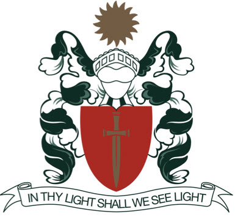

# Motto, Crest, Verse, Hymn, Prayer, Haka

-   [Principal’s Welcome](https://www.middleton.school.nz/principals-welcome/)
-   [Special Character](https://www.middleton.school.nz/special-character/)
-   [Vision & Mission Statement](https://www.middleton.school.nz/vision-mission-statement/)
-   [Motto, Crest, Verse, Hymn, Prayer, Haka](https://www.middleton.school.nz/motto-crest-verse-hymn-prayer-haka/)
-   [Annual Theme](https://www.middleton.school.nz/annual-theme/)
-   [Our History](https://www.middleton.school.nz/history/)
-   [Senior Leadership Team](https://www.middleton.school.nz/main-school-leaders/)
-   [Middleton Grange School Board](https://www.middleton.school.nz/board/)
-   [Affiliations](https://www.middleton.school.nz/affiliations/)
-   [Key Publications](https://www.middleton.school.nz/key-publications/)
-   [The Grange Theatre](https://thegrangetheatre.nz/)
-   [Venue Hire](https://www.middleton.school.nz/venue-hire/)
-   [Location & Site Map](https://www.middleton.school.nz/location-site-map/)
-   [Contact Us](https://www.middleton.school.nz/contact-us/)

### Our Motto

Character, Excellence, Service for the Glory of God.

### Our Crest

The Middleton Grange crest symbolises the sword of the Spirit and the shield of faith. It is surmounted by a sun in splendour representing the Lord Jesus Christ, who is the ‘Son of Righteousness’ (Malachi 4:2). The ribbon under the crest highlights our school verse.

### Our Verse

‘In Thy light shall we see light.” Psalm 36:9

### Our Hymn

In 1964 Don Laugesen sent a special call to prayer to all members of the Board and Trust regarding the development of Middleton Grange into Secondary education. The Scripture quoted in his letter included these words from 2 Chronicles 14:11, “Help us, O LORD our God, for we rest on you, and in thy name we go.” King Asa knew God as his shield and defender and much of 2 Chronicles 14 can be found in this hymn.

This hymn was also sung by Jim Elliot and his fellow missionaries the morning of the departure to the Auca Indians that preceded their massacre. Their commitment to serve the Lord, no matter the cost, leaves us an inspirational legacy.

#### We Rest on Thee

sung to the Sibelius ‘Finlandia’ tune

We rest on Thee – our shield and our defender!  
We go not forth alone against the foe;  
Strong in Thy strength, safe in Thy keeping tender,  
We rest on Thee, and in Thy name we go  
Strong in Thy strength, safe in Thy keeping tender,  
We rest on Thee, and in Thy name we go

Yes, in Thy dear name, O captain of salvation!  
In Thy dear name, all other names above:  
Jesus our righteousness, our sure foundation,  
Our prince of glory and our king of love.  
Jesus our righteousness, our sure foundation,  
Our prince of glory and our king of love.

We go in faith, our own great weakness feeling  
And needing more each day Thy grace to know.  
Yet from our hearts a song of triumph pealing;  
We rest on Thee, and in Thy name we go  
Yet from our hearts a song of triumph pealing;  
We rest on Thee, and in Thy name we go

We rest on Thee – our shield and our defender!  
Thine is the battle, Thine shall be the praise;  
When passing through the gates of pearly splendour,  
Victors – we rest with Thee through endless days.  
When passing through the gates of pearly splendour,  
Victors – we rest with Thee through endless days.

### Our Prayer

Almighty God  
We praise You for You alone are great.  
We thank You for your goodness and faithfulness to our school.  
May your Holy Spirit lead us to love and obey the Lord Jesus Christ.  
Give us the courage to follow Jesus and serve our neighbour.  
Help us to act justly, love mercy and walk humbly with You.  
Let your Word be a lamp for our feet, and a light to our path.  
Grant us your wisdom and joy in our learning.  
To You alone be the glory  
In Jesus’ name  
Amen.

### Te Karakia o te Kura

Te Atua Kaha Rawa  
E whakamoemiti ana ki a koe, ko koe anake te Atua.  
E Whakawhetai ana ki a koe mō tō painga, me tō pono ki tō mātou kura.  
Arahina mātou ki tō Wairua Tapu ki te aroha, ki te rongo i a Ihu Karaiti.  
Akiaki mai ki te whai te huarahi o Ihu ki te manaaki i ō mātou hoa.  
Awhinatia kia mahi tika, kia arohaina, kia tau ki tō mātou Atua  
He rama tāu kupu ki ō mātou waewae, he marama ki tō mātou ara.  
Homai tō mātauranga me te hari ki te ako.  
I te ingoa o Ihu Karaiti  
Amine

### Te Haka o Miritana-I     Middleton School Haka 1

Kia rite, kia mau – Hī *Be ready, Take hold  
*Torona Tītaha – Tītaha **Trust and depend  
**Tēnā whakahuatia ake ko wai tēnei kura **These are the fruit of this school**Ko te kura Miritana, Kura o te Atua**, *Middleton the school of God  
***whāia te huarahi o tātou tīpuna e ****Follow the path of our ancestors  
****Tēnei te kaupapa o mātou kura *****This is the foundation of our school  
*****Kauhau Te Rongopai ******Preach the gospel******Aroha mō ngā tāngata *******Love  for people  
*******Kia wehi Ihowa *Fear Jehovah*******/God  
********Ako matauranga (hī hā, hī hā) *********Learn knowledge, breathe in , breath out  
*********Haere mai, whakarongo, e koutou katoa **********Come all and listen  
**********Ihu Karaiti kaiwhakaora o te ao ***********Jesus is the saviour of the world  
***********He toa kaha rawa He toa mahaki He toa me te Kingi ************A mighty warrior and Kind King  
************Whirinaki whirinakiMā tōu marama, ka kite ai mātou i te marama *************In thy Light shall we see the light  
*************Whawhai mō te tika, me te pono Hi – Haa! **************Fight for the truth and the faith**************

### Te Haka o Miritana-II     Middleton School Haka 2

Taringa whakarongo, kia rite, kia mau  *Listen, get ready, take hold  
*HiKia whakanga hoki au i ahau  **I take this position**Hi Aue HiKo te Kura Miritana e ngunguru nei***Here is Middleton standing here  
***Hi au au aue ha hi x 2  
Iahaha  
Whirinaki whirinaki ****Trust and depend on God****Ma tōu mārama ka kite ai mātou i te mārama*****In your light, we see the light  
*****Whawhai mo te tika me te pono Hi Hi Hi Haa!******Defend the truth and the faith******
