[Home](https://www.middleton.school.nz/musicacademy/)

[Who We Are](https://www.middleton.school.nz/music-who-we-are/)

[Performance Groups](https://www.middleton.school.nz/music-performance-groups/)

[Music Tuition](https://www.middleton.school.nz/music-tuition/)

[Instrument Hire](https://www.middleton.school.nz/instrument-hire/)

[Upcoming Events](https://thegrangetheatre.nz/#events)

Performance Groups

## What's Involved?

Weekly Rehearsal

Personal Practice

Performances

Weekly Rehearsal

Each group meets weekly at a set time for a rehearsal.  This is the time to work with others and refine parts.  Rehearsals start promptly to ensure the group has enough time to get through what it needs to.

Personal Practice

Make sure you are undertaking your own personal practice daily.  Be ready for rehearsals by knowing your part and being able to play it confidently.  When every person in the group comes to rehearsal well-prepared, the entire group benefits through having time to work on detail and more repertoire.

Performances

There are several performances planned throughout the year.  It is important that you are aware of these dates well ahead of time so that you can plan to be there. By joining a group, you are agreeing to attend these performances (unless you have first discussed this with the group leader).  Performance opportunities include festivals, competitions, school concerts and tours.  Some performances will be during school hours and others may include an evening or weekend.  All performance dates are available upon signup in Term 1, Week 1.

Jazz Band

Jazz Fusion

PerCo Band

Y11 Worship

Y9-10 Worship

Y7-8 Worship

Senior Orchestra

Chamber Music

Junior Orchestra

Senior Choir

Y7-8 Choir

Y5-6 Choir

RockQuest

Jazz Band

## Jazz Band – Y8 -13

### What we do

-   Weekly Rehearsal – Tuesdays 7.30am
-   Practice songs to perform for the school community
-   Learn jazz techniques
-   Compete in local and national competitions

### You will grow in

-   Jazz techniques
-   Performance techniques
-   Working as a team
-   Discipline & Practice
-   Musical knowledge

### Opportunities include

-   Southern Jam Festival
-   Jazz Jam Spectacular
-   JazzQuest
-   Performing Arts Awards Evening
-   Prizegiving
-   School Tours

**Jazz Band is run by Lana Law**

[Click here to email Mr Baker for more information](mailto:a.baker@middleton.school.nz)

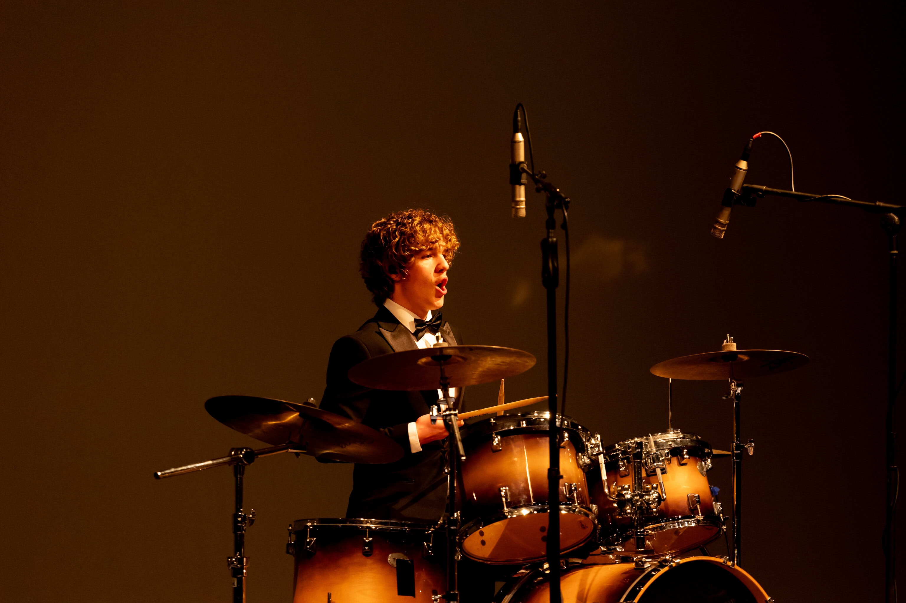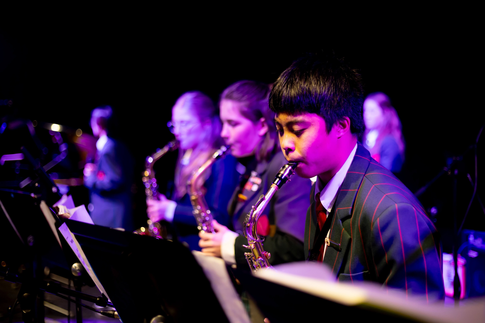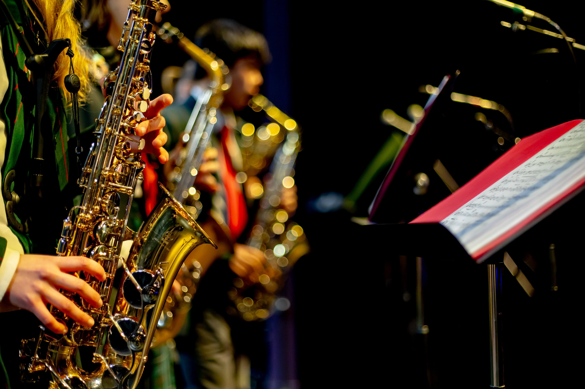

Jazz Fusion

## Jazz Fusion – Y7 -13

This group focuses on modern jazz influenced by funk, rock, and contemporary fusion. Repertoire ranges from artists like Snarky Puppy through to other current ensemble-driven works. Students develop improvisation, rhythmic awareness, and tight ensemble playing while working on music that is direct, detailed, and musically demanding. Suitable for players who want to engage with challenging contemporary jazz in a focused rehearsal setting.

**The Jazz Fusion leader is Mr Ben Townshend**

[Click here to email Mr Townshend](mailto:a.baker@middleton.school.nz)

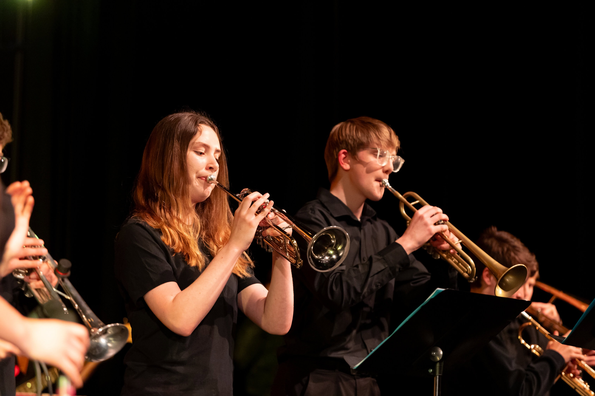

PerCo Band

## PerCo Band – Y11-13

### What we do

-   Weekly Rehearsal – Wednesdays 7.30am
-   Practice songs to perform for the school community
-   Support praise & worship within the school
-   Support House Singing Competition

### You will grow in

-   Performance Techniques
-   Working as a team
-   Discipline
-   Connection & Service

### Opportunities include

-   House Singing
-   School Assemblies
-   Prizegiving
-   Staff Meetings
-   Rock Night

**PerCo is run by Mr Aidan Baker**

[Click here to email Mr Baker](mailto:a.baker@middleton.school.nz)

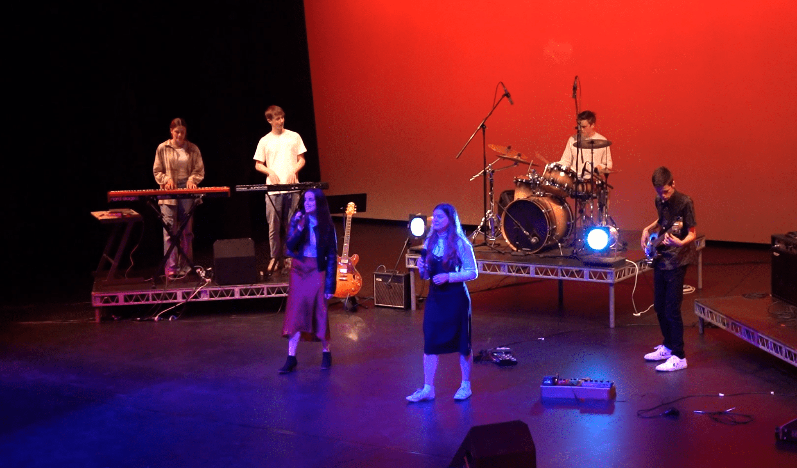

Y11 Worship

## Y11 Worship Band

### What we do

-   Weekly lunchtime rehearsal
-   Practice songs to perform for the school community
-   Support praise & worship within the school

### You will grow in

-   Performance Techniques
-   Working as a team
-   Discipline
-   Connection & Service

### Opportunities include

-   School Assemblies
-   Prizegivings

**Y11 Band is run by Mr Nick Lingley**

[Click here to email Mr Lignley](mailto:a.baker@middleton.school.nz)

Y9-10 Worship

## Y9-10 Worship Band

### What we do

-   Weekly lunchtime rehearsal
-   Practice songs to perform for the school community
-   Support praise & worship within the school

### You will grow in

-   Performance Techniques
-   Working as a team
-   Discipline
-   Connection & Service

### Opportunities include

-   School Assemblies
-   Prizegivings

**Y9/10 Band is run by Mr Aidan Baker**

[Click here to email Mr Baker](mailto:n.lingley@middleton.school.nz)

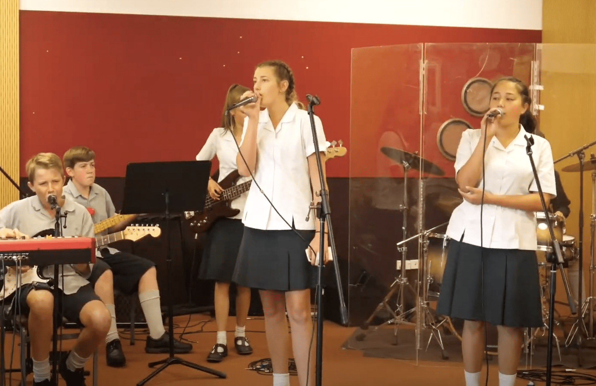

Y7-8 Worship

## Y7-8 Worship Band

### What we do

-   Weekly lunchtime rehearsal
-   Practice songs and support worship within the school

### You will grow in

-   Performance Techniques
-   Working as a team
-   Discipline
-   Connection

Senior Orchestra

## Senior Orchestra – Y9 -13

### What we do

-   Weekly Rehearsal – Monday Lunchtime
-   Practice songs to perform for the school community
-   Perform at local festivals & schools
-   Support school events

### You will grow in

-   Musical techniques
-   Performance techniques
-   Working as a team
-   Discipline & practice
-   Exposure to new music

### Opportunities include

-   Aurora Festival
-   School Tours
-   Prizegivings
-   Performing Arts Awards Evening

**Orchestra Conductor is Alex Morton  
Orchestra Manager is Nathan Horner**

[Click here to email Mr Horner](mailto:n.horner@middleton.school.nz)

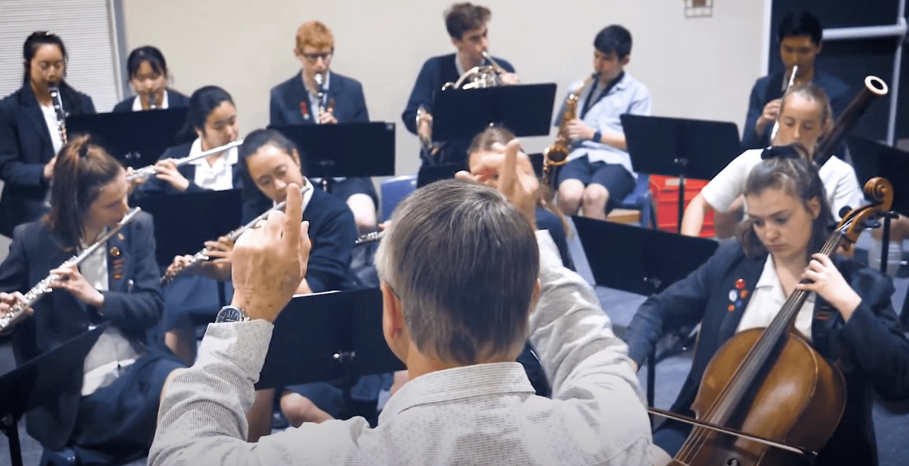

Chamber Music

## Chamber Music – Y9 -13

### What we do

-   Weekly Rehearsals leading up to Chamber Competition

### You will grow in

-   Musical techniques
-   Performance techniques
-   Working as a team
-   Discipline & practice

### Opportunities include

-   Chamber Competition
-   Cafe Acoustique
-   School Performances

**Chamber is run by Mr Aidan Baker**

[Click here to email Mr Baker](mailto:a.baker@middleton.school.nz)

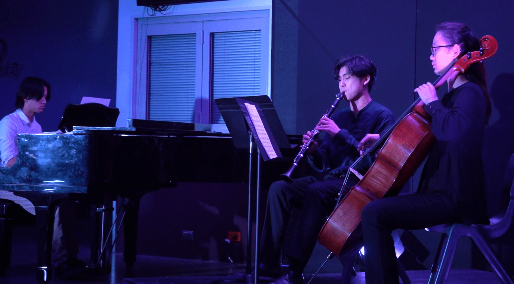

Junior Orchestra

## Junior Orchestra  
Years 4-8

### What we do

-   Weekly Rehearsal
-   Practice songs to perform for the school community

### You will grow in

-   Learning to play your instrument
-   Discipline and practice
-   Performance techniques
-   Working as a team

### Opportunities include

-   Aurora Festival
-   Winter Extraveganza
-   School Performances
-   Prizegivings

**Junior Orchestra is run by Jamiee Trethowan**

[Click here to email Mrs Trethowan](mailto:jamieetrethowan@live.com)

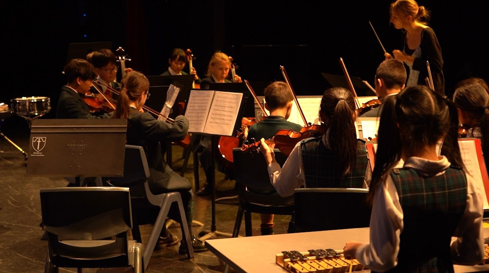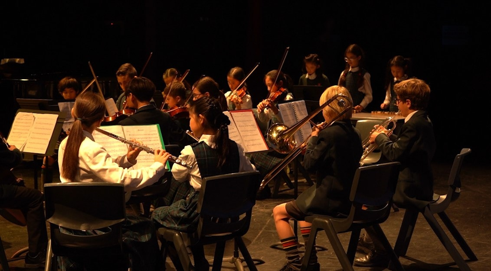

Senior Choir

## Senior Choir – Y9 -13

### What we do

-   Weekly Rehearsal – Thursdays 7.30am
-   Practice songs to perform for the school community
-   Develop vocal techniques
-   Compete in local and national competitions

### You will grow in

-   Vocal techniques
-   Discipline and practice
-   Performance techniques
-   Working as a team
-   Relationships with others

### Opportunities include

-   The Big Sing
-   Winter Extraveganza
-   School Performances
-   Prizegivings
-   Performing Arts Awards Evening

**The Senior Choir Leader is Nathaniel Alcorn**

[Click here to email Mr Alcon](mailto:n.alcorn@middleton.school.nz)

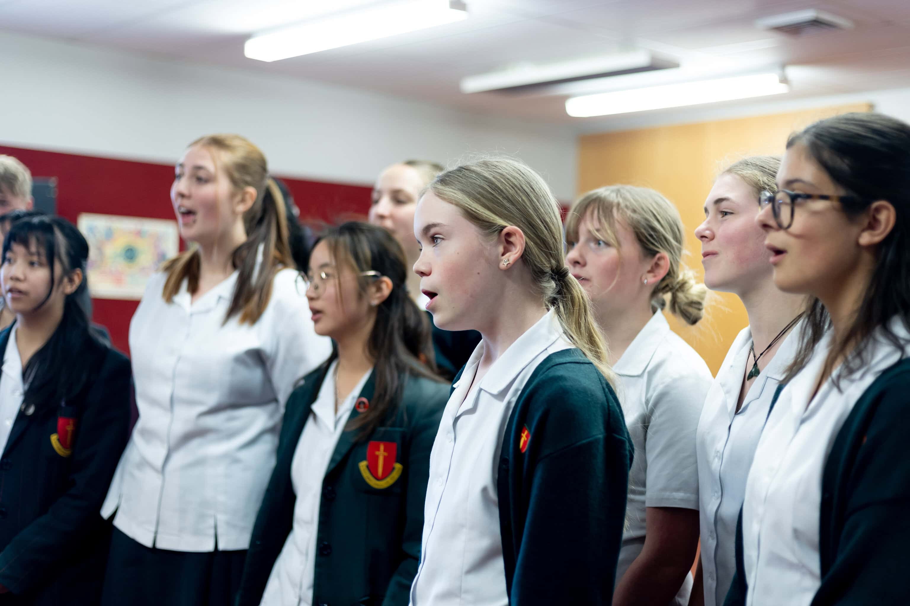

Y7-8 Choir

## Y7-8 Choir

### What we do

-   Weekly Rehearsal – Timetabled
-   Practice songs to perform for the school community
-   Compete in local and national competitions

### You will grow in

-   Vocal techniques
-   Discipline and practice
-   Performance techniques
-   Working as a team
-   Relationships with others

### Opportunities include

-   Christchurch Schools Music Festival
-   Winter Extraveganza
-   Prizegivings

**7/8 Choir is run by Mrs Cassandra Robb**

[Click here to email Mrs Robb](mailto:c.robb@middleton.school.nz)

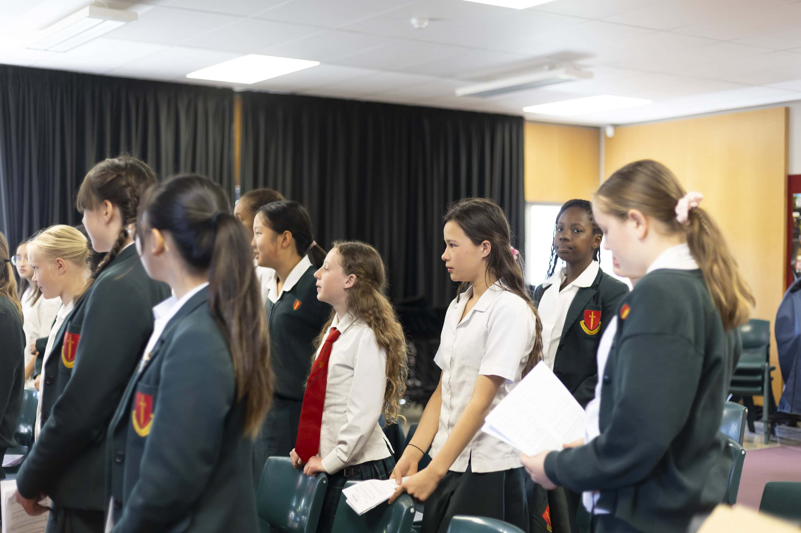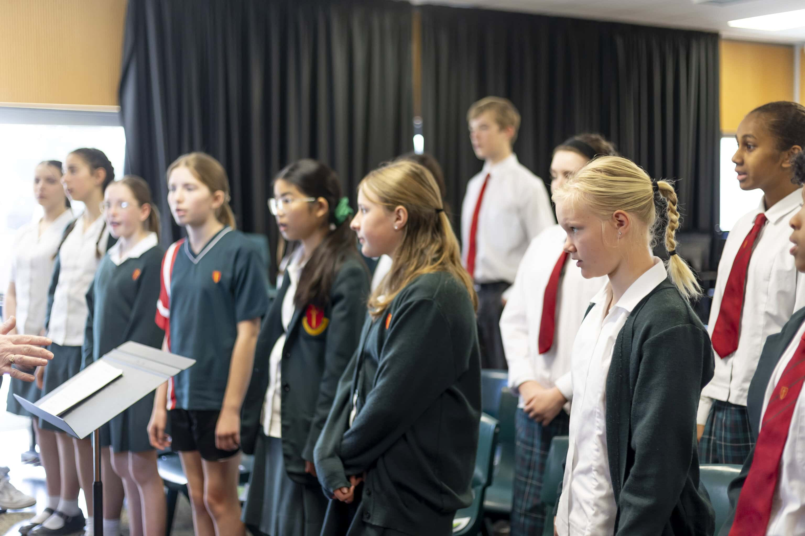

Y5-6 Choir

## Y5-6 Choir

### What we do

-   Rehearse together once a week
-   Practice songs to perform for the school community

### You will grow in

-   Learning to sing in a group
-   Practice
-   Working as a team

### Opportunities include

-   Christchurch Schools Music Festival
-   Winter Extraveganza
-   School Performances
-   Prizegivings

**Y5-6 Choir is run by Jamiee Trethowan**

[Click here to email Mrs Trethowan](mailto:jamieetrethowan@live.com)

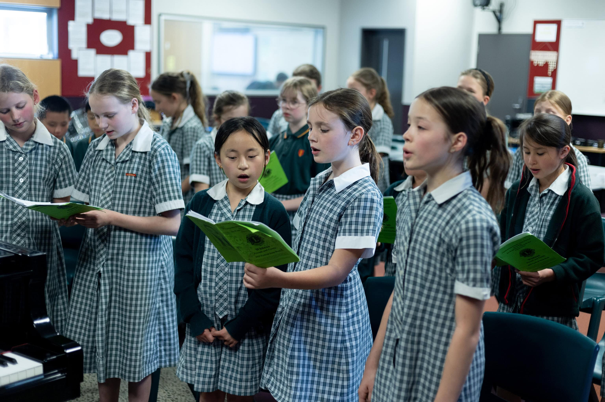

RockQuest

## Middleton Grange has a history of back to back success in the SmokeFree Rockquest Competition.

## Get your band together, write your songs and be part of one of the best musical opportunities NZ has to offer.

## [https://www.smokefreerockquest.co.nz/](https://www.smokefreerockquest.co.nz/)

## [Click here to email Mr Baker](mailto:s.baker@middleton.school.nz)  
for more information
