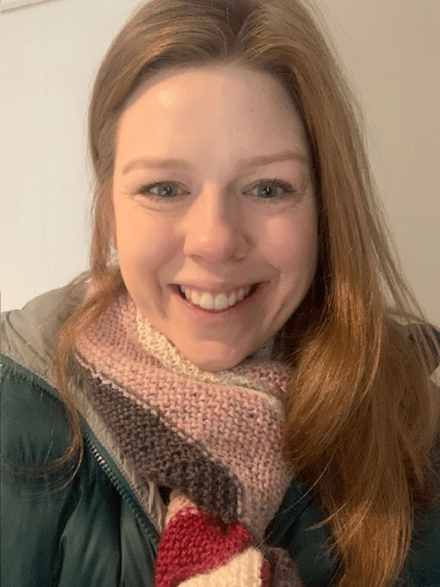

## Alumni Profile

# Natalie Fleming

-   Leaving Year: [2011](https://www.middleton.school.nz/tag/2011/)

Kia Ora Middleton Family. My name is Natalie, and I was a pupil at MGS from Year 0-13, 1998 until 2011.

I have many positive memories of my time at Middleton, and I am grateful to have completed my entire schooling there. The best memories I have all relate to people 🙂 We had teachers who genuinely cared for us as students and went the extra mile. Some of my nearest and dearest friends are amongst those I met during my time at Middleton Grange. It’s pretty rare to have friendships spanning 25 years at 31 years of age, but that’s just one blessing of being educated at Middleton.

I really enjoyed attending the reunion in October last year – it was a great opportunity to say thank you to many staff who made my experience at Middleton so positive.

One thing I treasure is how our teachers shared the Christian faith with us; how it had shaped and continues to shape their lives. I remember being prayed for before we had a test, which was such a blessing. It felt strange at University when we didn’t commence an exam with prayer!

After leaving school, I took a gap year to work at Canterbury Health Laboratories, before heading to Dunedin in the hope of getting into Med School. I gave it my all, but I didn’t make the cut. Proverbs 19v21 says it best: “Many are the plans in the mind of a man, but it is the purpose of the Lord that will stand.” He is not obligated to make the plans we have for ourselves happen, but we know that he works all things for our eternal good.

Instead, I studied pharmacy and headed to Hawke’s Bay to complete my registration. I then spent a couple of years at Tauranga Hospital before returning to Dunedin to pursue further study. Overall, I have found my work as a hospital pharmacist to be both challenging and rewarding.

Upon starting my initial PhD project, I ran into some conflicts between the way in which I saw the world, and the way I was being encouraged to think. After much wrestling, I realised I could not reconcile this conflict between a biblical world view and the postmodernism I was encouraged to embrace. I felt a bit despondent, but God in his kindness provided a job for me at Dunedin Hospital. Ultimately, my manager introduced me to my current PhD supervisor, and I feel as if I’ve been given a second chance at research. Doing postgrad has been tough financially, at times, but I can testify that God has always provided for me.

My church family in Dunedin is Hope Church (part of the Church of Confessing Anglicans Diocese), who love and encourage me to be faithful to the Lord Jesus and His gospel.

Mark 8:34-36: “If anyone would come after me, let him deny himself and take up his cross and follow me. For whoever would save his life will lose it, but whoever loses his life for my sake and the gospel’s will save it. For what does it profit a man to gain the whole world and forfeit his soul.”

In the words of the poet C.T. Studd: Only one life, ’twill soon be past, Only what’s done for Christ will last.”

[Back to Alumni](https://www.middleton.school.nz/alumni/)

### More Alumni Profiles

### [Stephanie Hunt (née Mathieson)](https://www.middleton.school.nz/stephanie-hunt-nee-mathieson/)

### [Caleb Croker](https://www.middleton.school.nz/caleb-croker/)

### [Ellen Paynter](https://www.middleton.school.nz/ellen-paynter/)

### [Elisha Nuttall](https://www.middleton.school.nz/elisha-nuttall/)

### [Frances Watson](https://www.middleton.school.nz/frances-watson/)

### [Geoff Wallis (Primary Teacher, 2016–2022)](https://www.middleton.school.nz/geoff-wallis-primary-teacher-2016-2022/)

[See all](https://www.middleton.school.nz/alumni-profiles/)
