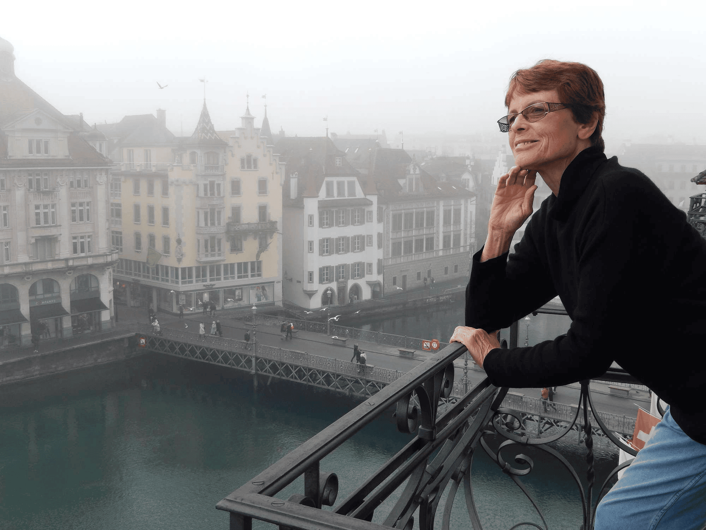

## Alumni Profile

# Pamela Brathwaite

I used to be sure that I would never become a teacher. I didn’t want to have to cope with naughty pupils. Pathetic, I know.

I chose the University subjects that I enjoyed, and was good at, because I felt that I should follow up the gifts God had given me, and then God could use them. I really enjoyed a part-time and holiday job I had working in the university library, and I thought I would become a librarian. But somehow ideas were working almost unnoticed in my brain, and just four days before the College of Education applications closed, I found I felt strongly that I was meant to be a teacher – and amazingly, I was excited about the idea! It was a huge rush getting my application papers together on time.

During my year at the College of Education, I went to a meeting run by Don Capill, at the time second-in-command at Middleton Grange, and I learned about the vision for interdenominational Christian education behind the school. Interesting! But when I applied for jobs, I don’t think MGS was advertising for an English teacher. The two jobs I was offered were both in Hawkes Bay, and so I began my teaching career at Iona College. This was exciting, because it was a Presbyterian girls’ boarding school, and a place where I could explore teaching as a Christian. I was there for three years, during which time I was invited to mark School Certificate exams, and also to join the District English Syllabus Committee, apparently because of a novel unit I developed and presented at an English teachers’ conference. Useful experience! I also directed two drama productions, presented by Form 6 (Year 12) pupils, and choreographed an original Christian musical written by a local lady. I was enjoying my time up there, was much involved in the local community, and had no plans to leave.

But when a job came up at Middleton, someone else got the application papers and sent them to me – and suddenly it seemed right. So I ended up here. Barrie McConnell was running the English department, and directing the school productions. He had put much deep thought into the Christian teaching of English, and wrote some valuable material on this. A very important part of Middleton’s ministry is helping pupils to learn to think as Christians, not as the world thinks – though that doesn’t mean inventing text themes that were not intended by the authors. Our team worked together very keenly, and we all became close friends.

I also set up Drama as a subject at various levels, and Dance started as a sport option, but later PerCo Dance (recently the Vision Dance Company under Robert Liebert) was established. What a treat it was to work with these pupils in both subjects! I had done quite a lot of drama and Theatre Sports training, and had also trained in several dance forms, mostly ballet, and was in a Christian dance group at my church. However, I decided I needed to update/extend my modern dance training, and went through the NZ Association of Modern Dance curriculum, eventually gaining my Solo Seal and meanwhile dancing in a small performance group that was great fun. I also choreographed the school productions. Meanwhile, Barrie McConnell had stepped down from directing these, and the very talented Michael McCormack took over. He and Richard Marrett wrote some wonderful original productions – great memories. Michael left the school for about eight years, during which time I directed the productions, and we also did two Stage Challenges in those years; we always put scenes into the Shakespeare Festival and the inter-school Dance festivals – and by then I had become Head of English, so it was a very busy time (understatement.) It was a relief when Michael came back and took over the Drama Department and the productions, though I had enjoyed doing them.

As an English teacher, I worked with a keen staff: pupils included some very talented writers and speakers, and with some who thought they were not good at English, but discovered that they were, once the immediate problem was dealt with. To all the pupils who lent me their favourite books, or recommended them, thank you – I had some great reads! I still have copies of the class punctuation serial booklets, which we created (and punctuated) together. I love catching up with ex-pupils, and we staff have worked and prayed together for decades for our shared vision, and we stay close. The school remains in our prayers.

After retiring, I carried on relief teaching for another eleven years, as did other old friends: it would have been hard to stop so suddenly. This also paid for some wonderful overseas trips: Tunisia and Italy in 2014; river cruising in Europe and a small bus trip in the south of England in 2017; Switzerland, Jordan and Israel in 2019. Highlights included riding a camel into the Sahara and camping (not glamping) overnight; visiting Petra; and visiting many Biblical sites. I am now trying to find enough time to read (or re-read) a vast pile of books so I can downsize my collection, but life still seems to be very busy . . .

[Back to Alumni](https://www.middleton.school.nz/alumni/)

### More Alumni Profiles

### [Stephanie Hunt (née Mathieson)](https://www.middleton.school.nz/stephanie-hunt-nee-mathieson/)

### [Caleb Croker](https://www.middleton.school.nz/caleb-croker/)

### [Ellen Paynter](https://www.middleton.school.nz/ellen-paynter/)

### [Elisha Nuttall](https://www.middleton.school.nz/elisha-nuttall/)

### [Frances Watson](https://www.middleton.school.nz/frances-watson/)

### [Geoff Wallis (Primary Teacher, 2016–2022)](https://www.middleton.school.nz/geoff-wallis-primary-teacher-2016-2022/)

[See all](https://www.middleton.school.nz/alumni-profiles/)
