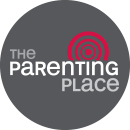
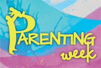

# Parenting Support

-   [Four Schools in One](https://www.middleton.school.nz/four-schools-in-one/)
-   [Primary School (Years 1-6)](https://www.middleton.school.nz/primary-school-years-1-6/)
-   [Middle School (Years 7-10)](https://www.middleton.school.nz/middle-school-years-7-10/)
-   [Senior College (Years 11-13)](https://www.middleton.school.nz/senior-college-years-11-13/)
-   [International College (Years 1-13)](https://www.middleton.school.nz/international/)
-   [Parenting Support](https://www.middleton.school.nz/parenting-support/)
-   [Be Involved](https://www.middleton.school.nz/be-involved/)
-   [Uniform](https://www.middleton.school.nz/uniform-code/)
-   [Stationery](https://www.middleton.school.nz/stationery/)
-   [Canteen](https://www.middleton.school.nz/canteen/)
-   [House Competition](https://www.middleton.school.nz/house-system/)
-   [Video Gallery](https://www.middleton.school.nz/video-gallery/)
-   [Employment](https://www.middleton.school.nz/employment/)

### ‘Social’ issues of our time

#### Conversations about Pornography

*Increasingly, our Pastoral Care Team is dealing with the negative impact pornography is having on our young people. While none of the following information is sourced from Christian organisations, we offer it as potential material to assist parents to have conversations with their children on what is a very challenging topic. The initial paragraph, from a Herald Article, leads onto information about **Netsafe**, **Keep it Real Online** and a recently released documentary **‘Our Kids Online-Porn, Predators and How to Keep Them Safe’**  produced by parents Rob Cope and Zareen Sheikh-Cope as a result of wanting to protect their own children. All websites are referenced as endnotes for easy access.*

 [\[i\]](#_edn1)One quarter \[of our children\] see porn before age 12. And it’s a world where, at the tap of a screen or click of a mouse, kids can find themselves in places where predators, sometimes posing as other children, may be lurking under the invisibility cloak of the internet. It’s also a world that’s on the radar of authorities, and there have been moves to keep kids safe online – among the most recent the six-week, $1.5 million advertising campaign [\[ii\]](#_edn2)**Keep It Real Online.** The Film Censor’s Office, Police, Internal Affairs, Ministry of Education and Network for Learning collaborated with [\[iii\]](#_edn3)**Netsafe** to put advice, including pornography and online grooming, on one site.

Any doubt of its need is promptly put to rest with a flick through the findings of a 2018 survey of 2000 Kiwi teens on how and why they view online porn. The Office of Film and Literature Classification research project found more than two-thirds of the 14- to 17-year-olds surveyed had been exposed to porn, a quarter before they turned 12. But the survey also found 71 per cent of those surveyed by the Office of Film and Literature Classification weren’t seeking out porn when they first saw it. Two-thirds hadn’t talked to a parent or caregiver about porn.

Young people had also told them they wanted restrictions around what they could watch and have access to, Chief Censor David Shanks wrote in the report’s introduction. “Their overwhelming consensus is that porn is not for kids.” Judge Andrew Becroft, former Children’s Commissioner, says “We have totally underestimated the avalanche of porn freely available to our children, uncensored and unregulated in New Zealand homes day and night.”

Kiwi parents Rob Cope and Zareen Sheikh-Cope have made a [\[iv\]](#_edn4)**documentary** on what our children watch online. Before any device was placed in small hands, the couple decided to research what their children, now aged between 10 and 15, might be able to find. What they discovered – that children were being exposed to violent, hardcore porn, and many were engaging with online predators, horrified them, Sheikh-Cope says. “When we spoke to other parents more than 90 per cent didn’t have filters in place or weren’t aware there was an issue.” One of the biggest challenges for parents is accepting their children, given the chance, will watch porn – she had to overcome the same feelings of denial herself.

[\[i\]](#_ednref1) [https://nzherald.co.nz/lifestyle/news/article.cfm?c\_id=6&objectid=12340958](https://nzherald.co.nz/lifestyle/news/article.cfm?c_id=6&objectid=12340958)

[\[ii\]](#_ednref2) [https://www.keepitrealonline.govt.nz/](https://www.keepitrealonline.govt.nz/)

[\[iii\]](#_ednref3) [https://www.netsafe.org.nz/porn-advice-parents/](https://www.netsafe.org.nz/porn-advice-parents/)

[\[iv\]](#_ednref4) [https://vimeo.com/ondemand/ourkidsonline](https://vimeo.com/ondemand/ourkidsonline)

#### Staying Ahead in the Technology Battle

Thanks to your Special Character donations we are able to bring **David and Katie Kobler** in to run separate girls’/boys’ seminars for our Senior pupils and a well-attended evening seminar to equip parents in dealing with the increasing pressures their teenagers are faced with. Read the [Parent Seminar Summary](../media/2018/10/2017-Kobler-Parent-Seminar-Summary.pdf) (pdf) and more about the [2017 Kobler Seminars](https://hail.to/middleton-grange/article/NRaWIbi).

What every parent needs to know about the [updated](https://braveparenting.net/instagram-wants-souls/) **[Instagram](https://braveparenting.net/instagram-wants-souls/).  
**

The **13 Reasons Why” Netflix series**, released in 2017 and viewed by thousands of young people, generated considerable controversy. Statistics remind us that teen suicide is a reality in NZ society and as a Christian community we cannot be bystanders on these important issues. 

-   Focus on the Family have a [booklet to guide parents](https://focusonthefamily.webconnex.com/co-13-reasons-why) through conversations that would be beneficial to have with their sons and daughters, including useful tips for addressing this sensitive issue and working through the disturbing nature of the movie’s content.
-   Nurture is an Australian magazine for ‘parents, teachers and kids’ from a Christian perspective. The June 2017 edition had an [opinion article](../media/2018/10/Nurture-June-2017-13-Reasons-Why-ChrisParker.pdf) regarding the Netflix series. 

**  
iBook ‘Keeping Your Child Safe in the Online Jungle”** by Shaun Brooker, Principal of Hamilton Christian School.can be downloaded [free from iTunes](https://itunes.apple.com/nz/book/keeping-your-child-safe-in/id965624540?mt=11).   

**Avoid predators – help your kids stay safe online**

Some things you can do to help your children stay safe online include:

-   install software on your computer that either blocks restricted content so your children cannot access certain sites, or monitors activity so you can review online behaviour
-   know who your children are contacting online. If they are not your children’s actual friends then question their cyber friendship
-   know which social networking sites your child is on and what they are posting
-   check that your children understand the dangers of posting personal information on social networking sites
-   do not allow your children to use the computer in private areas of your home
-   if you or your child becomes suspicious about a person online, stop contact immediately.
-   If you are concerned about a young person or someone’s online behaviour – contact your local police station to speak to an officer.
-   If you or someone you know is in danger – call 111 immediately.

  
For more information and safety tips visit:

Police: [email and internet safety online](http://www.police.govt.nz/advice/email-and-internet-safety/online-child-safety)

Netsafe: [online safety for parents](https://www.netsafe.org.nz/online-safety-for-parents/)

  
Loads of information to help stay safe online.  

**Parenting Skills & Practices**

  
Articles for all ages & stages.  

  
Seminars held August each year.  

### Encouraging Learning at Home

Findings from a study by Professor Iram Siraj published in the New Zealand Education Gazette 10 July 2017.

One particular finding in her longitudinal studies was that children were largely set on an achievement trajectory by the age of seven.

“In one large study, we started with a group of three year olds who all had different abilities and stages of development, but by the age of seven, we found they were largely set on a a particular trajectory – there were children achieving at the top, the middle and the bottom of the curve.  Any improvement between the trajectories happened before the children turned seven.

Iram believes good-quality ECE is not dictated by the type of provider, but rather whether it strives to provide for both the social an emotional development, and the cognitive development of a child.

“But the important thing for the child is the *process* quality.  This relates to things such as relationships and adult responsiveness.  Most important of all is the ability to communicate with the child, because high-quality interactions that engage a child will extend their language and thinking.

### Communication

-   **WITH GOD:** Rev Joshua Taylor writes of the struggles and triumphs to maintain a strong connection amidst the busyness of family life. [Read here](../media/2018/10/Intermission-Issue-32.pdf).*Used with permission*

### School life

Helpful information to assist you in

-   [Choosing the right school](https://www.middleton.school.nz/mgs/choosing-the-right-school/) for your child
-   Preparing your child for [starting school](https://www.middleton.school.nz/mgs/starting-school/) here at Middleton Grange
