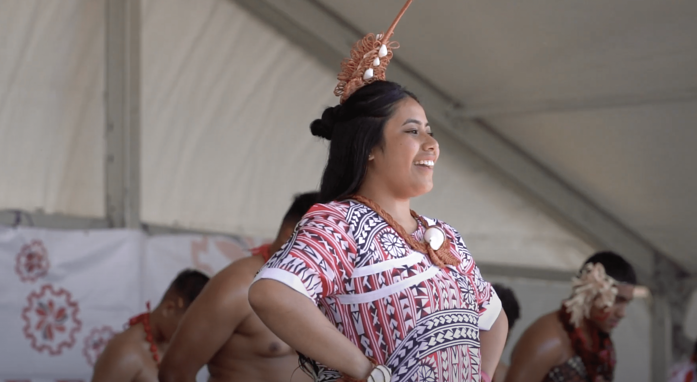
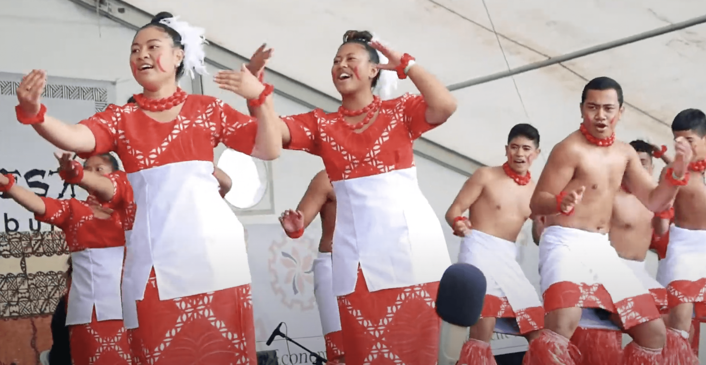
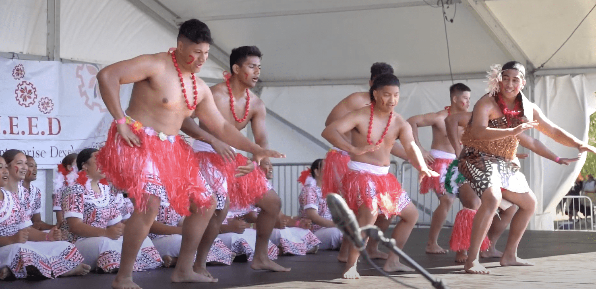
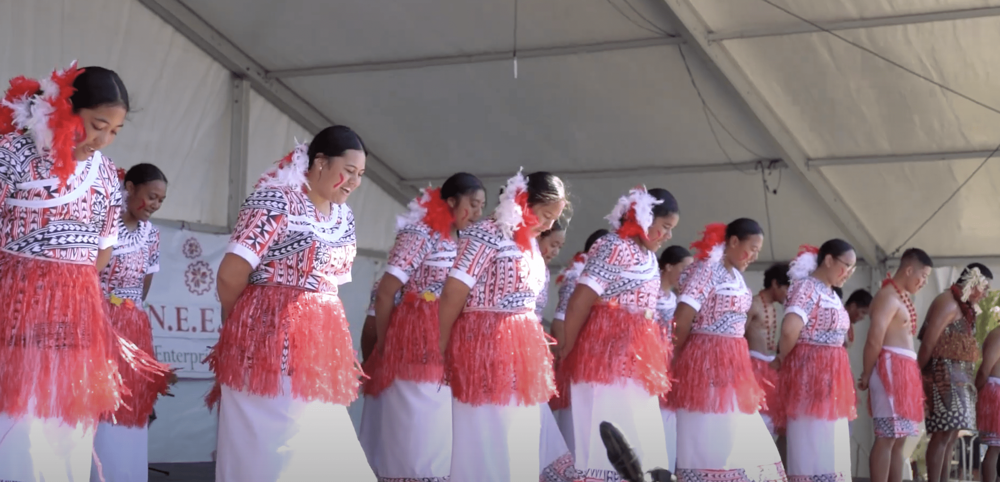

-   [Curriculum & Subjects](https://www.middleton.school.nz/curriculum-subjects/)
-   [Course Selection](https://www.middleton.school.nz/course-selection/)
-   [Careers Department](https://www.middleton.school.nz/careers-department/)
-   [Leadership](https://www.middleton.school.nz/leadership/)
-   [Service](https://www.middleton.school.nz/service/)
-   [Remote Learning](https://www.middleton.school.nz/remote-learning/)
-   [NCEA Information](https://www.middleton.school.nz/ncea-information/)
-   [Learning Support](https://www.middleton.school.nz/learning-support/)
-   [Fostering Strengths](https://www.middleton.school.nz/fostering-strengths/)
-   [Pastoral Care](https://www.middleton.school.nz/pastoral-care/)
-   [BYOD](https://www.middleton.school.nz/byod/)
-   [Library Dashboard](https://aiscloud.nz/MDD00/#!landingPage)
-   [Overseas Trips](https://www.middleton.school.nz/overseas-trips/)
-   [Sport](https://www.sporty.co.nz/middleton)
-   [Performing Arts](https://www.middleton.school.nz/performing-arts/)

## MGS Performing Arts

## PASIFIKA CULTURAL GROUP

### What we do

-   Intensive rehearsal schedule in Term 1 leading up to Polyfest
-   Times for rehearsals: Mon and Fri 3.30pm and Weds 2.30pm, Saturday 10am till 1pm in the Grange 
-   Occasional rehearsal the rest of the year
-   Various dance and singing items

### You will grow in

-   Relationships with each other
-   Knowledge &  Cultural History
-   Performance Techniques

### Opportunities include

-   Polyfest
-   FiaFia Night
-   Performances within School
-   Performing Arts Awards Evening

**Pasifika Co-ordinator is Nicole Bailey, Polyfest Leader is Sifa Mohi and Tutor is Annette Lai King**

## Y7-13

## Term 1 daily rehearsals

## (Ongoing relaxed practice post festival)

[Email Mrs Bailey to register interest](mailto:n.bailey@middleton.school.nz)
