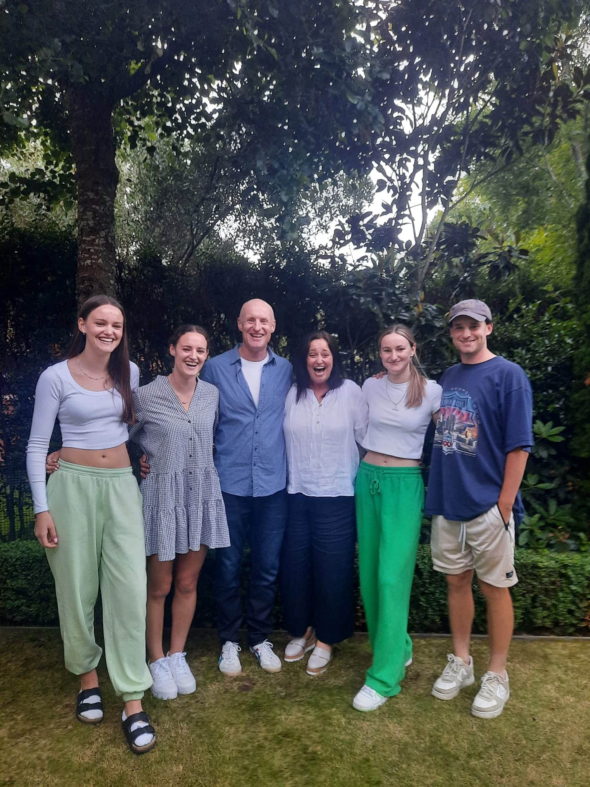

## Alumni Profile

# Paul Morrow

-   Leaving Year: [1989](https://www.middleton.school.nz/tag/1989/)

My name is Paul Morrow, and I am currently the chaplain at St Andrew’s College. I have been in this role since 2010. I have four children, Jack-23, Frankie-21, Maddie-18, and Molly-17. I am married to Jo, who is currently the Principal at Rochester and Rutherford Halls of Residence at the University of Canterbury. Jo and I have been married for 28 years.

My last year at Middleton Grange was in 1989 and my first year was in 1984 as a Year 8 or Form 2 student. My memories of Middleton Grange revolve around my struggles and highlights. I wasn’t particularly academic but worked diligently on my studies. It was the encouragement and extra support provided by teachers such as David Gillion that were key to me getting through school with sufficient grades to be able to attend university. This care also gave me the desire to be a teacher myself believing that I could make a difference for kids that struggled.

Sport was the highlight of my time at Middleton Grange, from playing rugby, basketball, volleyball and completing in athletics. I loved the friendships and the opportunity sport provided, opportunity and friendships that I continue to hold dear even today.

Another lasting memory was the scripture memorization we had to do as Heads of School with the then principal, Mr Dick Oliver. He would give Amanda Steel (now Montgomery) and I a scripture passage every Monday and we would have to have it memorized for our meeting with Mr Oliver the following week. This discipline, and many of the passages, have remained with me, encouraging me through difficult times.

In my first year away from Middleton Grange, I pursued a GAP year in England working in a preparatory boarding school north of Birmingham. This experience led me to apply for teacher’s college in Christchurch where I would train for the next three years. Over this three-year period, I committed much of my time to triathlon outside of teacher training. In 1993, I qualified for the World Age Group (20-24 years) Triathlon Championship in Manchester.

1994 I had my first job and teaching position at St Andrew’s College Preparatory School. I loved my primary school teaching experience and remained at St Andrew’s College until April 2004. In those 10 years I married Jo, we moved into the boarding houses, we had our first and second child, I committed to further study completing an Education Degree and post graduate diploma in Educational Management and I competed in two World Mountain Championship events, in Malaysia and Italy, as a member of the New Zealand Athletics Team.

During 2004, I felt a call and had an opportunity to work as the Children’s Pastor at Grace Vineyard Church and commenced work for Grace in April of 2004. Over time and as the church grew my role would extend to include the Life Groups Pastor. The six years at Grace Vineyard were most memorable, extended me and created some of our families’ greatest connections with incredible people.

When I left St Andrew’s College in 2004, I never believed I would be back there someday. An opportunity came up to work as the Assistant Chaplain, alongside and under the guidance of my mentor and close friend, Rev Hamish Galloway. He was the current chaplain and had been in this role when I was working in the preparatory school. Part way through 2010 Hamish Galloway responded to a call to minister at Hope Presbyterian Church and would leave St Andrew’s at the end of that year after 21 years of service to the College. While I applied for the role of Chaplain, I was not ordained in the Presbyterian Church. The successful applicant, an Ordained Presbyterian Minister, would later withdraw his acceptance of the position. This just before Christmas. As the school did not have time to readvertise the position before the new year, I was asked to be Acting Chaplain for the first few months of 2011. As everyone in Canterbury will remember, that was the year of our big earthquake and many lives were impacted. Our school community lost family members, many homes destroyed, and numerous staff put under considerable stressful circumstances. My role at Grace Vineyard had prepared me well in pastoral care, and with the support of some amazing people, we set about ministering to and caring for those most effected by the earthquake.

Three months later, the Rector of the College acknowledged several staff had commented about whether it necessary to seek a new chaplain as they expressed a confidence that I could sufficiently fill the role. This was humbling. After seeking the blessing of the local Presbytery, with the commitment I would pursue my theology degree via Otago University, and an application to be locally ordained at the appropriate time, I was commissioned Chaplain of St Andrew’s College.

In September 2019, after two years of probationary ordination training, I was Ordained as a Local Presbyterian Minister at the St Andrew’s College Centennial Chapel and in 2020 I graduated from Otago University with a Bachelor of Theology.

While not without its challenges and tragedies, the last 14 years at St Andrew’s College have been an incredible journey and one I have been so blessed to be a part of. My wife, Jo, has worked alongside me in chaplaincy while maintaining a role of managing girls boarding at St Andrew’s and our four children have been fortunate to experience the outstanding education the College offers. God has been so good to me and his faithfulness through all circumstances has been incredible.

My experience to share comes through a quote from the book, The GOOD Life. ‘Life, even when it’s good, is not easy. There is simply no way to make life perfect, and if there were, then it wouldn’t be good. Why? Because a rich life – a good life – is forged from precisely the things that make it hard.’ From my experience, how I have managed to work through difficult times has been made easier knowing God’s Grace in my life and the connections I have with family and friends. The scripture that I have relied on most and keep coming to is from Philippians 4:6-7

‘6 Do not be anxious about anything, but in every situation, by prayer and petition, with thanksgiving, present your requests to God. 7 And the peace of God, which transcends all understanding, will guard your hearts and your minds in Christ Jesus.’

God bless.

[Back to Alumni](https://www.middleton.school.nz/alumni/)

### More Alumni Profiles

### [Stephanie Hunt (née Mathieson)](https://www.middleton.school.nz/stephanie-hunt-nee-mathieson/)

### [Caleb Croker](https://www.middleton.school.nz/caleb-croker/)

### [Ellen Paynter](https://www.middleton.school.nz/ellen-paynter/)

### [Elisha Nuttall](https://www.middleton.school.nz/elisha-nuttall/)

### [Frances Watson](https://www.middleton.school.nz/frances-watson/)

### [Geoff Wallis (Primary Teacher, 2016–2022)](https://www.middleton.school.nz/geoff-wallis-primary-teacher-2016-2022/)

[See all](https://www.middleton.school.nz/alumni-profiles/)
